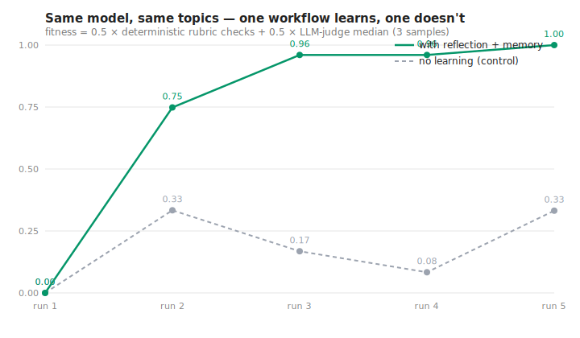

<div align="center">

# cycgraph

**Agent workflows that get smarter every run.**

[](https://www.npmjs.com/package/@cycgraph/orchestrator)
[](https://github.com/wmcmahan/cycgraph/actions/workflows/ci.yml)
[](LICENSE)
[](https://nodejs.org)
[](https://flattop.io)

[📚 Documentation](https://flattop.io) &nbsp;·&nbsp; [📈 Compound Learning Benchmark](./packages/evals/examples/compound-learning-benchmark/) &nbsp;·&nbsp; [🧪 Examples](./packages/orchestrator/examples/) &nbsp;·&nbsp; [🐛 Issues](https://github.com/wmcmahan/cycgraph/issues)

</div>

---

cycgraph is a TypeScript orchestration engine where workflows **learn from their own runs**. A `reflection` node distills each run's output into atomic lessons; a memory store persists them; and every future run retrieves them automatically into its prompts. The loop is measurable, reproducible, and guarded by production-safety primitives — per-node budgets, taint tracking, and human-in-the-loop gates — so letting a workflow improve itself doesn't mean letting it off the leash.

<div align="center">



</div>

Same model, same five topics, same order. The solid line is a `research → critique → reflect` workflow whose researcher retrieves accumulated lessons before every run; the dashed line is the identical researcher with the loop disabled. Fitness is scored *outside* the workflow — half deterministic rubric checks, half a multi-sample LLM judge — and the agents never see the rubric or their scores. In our first recorded run the learning workflow went **0.00 → 1.00 in five runs** while the control averaged 0.18. Reproduce it for under $1: [`packages/evals/examples/compound-learning-benchmark`](./packages/evals/examples/compound-learning-benchmark/).

> **Status:** `0.1.0-beta`. The API is stabilising; minor versions may still introduce breaking changes until 1.0. Core primitives (graph engine, durable execution, memory, MCP integration) are covered by 2,100+ tests and exercised by the runnable examples.

## How the learning loop works

```typescript
import { GraphRunner, createGraph, createWorkflowState } from '@cycgraph/orchestrator';

const graph = createGraph({
  name: 'Learning Research Agent',
  description: 'Researches a topic, reflects on lessons, compounds across runs',
  nodes: [
    {
      id: 'research',
      type: 'agent',
      agent_id: RESEARCHER,
      read_keys: ['goal'],
      write_keys: ['notes'],
      memory_query: { tags: ['lesson:research-v1'], max_facts: 20 },  // ← lessons in
      budget: { max_cost_usd: 0.10 },                                  // ← hard cost cap
    },
    {
      id: 'reflect',
      type: 'reflection',                                              // ← lessons out
      read_keys: ['notes'],
      write_keys: ['reflect_reflection'],
      reflection_config: {
        source_keys: ['notes'],
        extractor: { type: 'rule_based', min_sentence_length: 25 },
        tags: ['lesson', 'lesson:research-v1'],
      },
    },
  ],
  edges: [{ source: 'research', target: 'reflect' }],
  start_node: 'research',
  end_nodes: ['reflect'],
});

const runner = (goal: string) => new GraphRunner(
  graph,
  createWorkflowState({ workflow_id: graph.id, goal }),
  { memoryWriter, memoryRetriever },
);

await runner('Evaluating scientific source credibility').run();
await runner('Evaluating news source credibility').run();  // run 2 knows what run 1 learned
```

The `reflection` node distills run output into tagged facts via your `memoryWriter`; any node carrying a `memory_query` gets matching facts rendered into a `## Relevant Memory` section of its prompt before execution — zero manual injection. Full runnable version with the memory adapters: [`examples/learning-research-agent`](./packages/orchestrator/examples/learning-research-agent/).

## Guardrails that make self-improvement shippable

A workflow that changes its own behavior needs harder rails than one that doesn't. These are first-class, not middleware:

- **Per-node budgets** — `budget: { max_tokens, max_cost_usd }` on every node. A runaway agent can't drain the workflow.
- **Zero-trust state slicing** — `read_keys` / `write_keys` default to `[]`; every node sees only what it declares. The engine rejects undeclared writes.
- **Taint tracking** — every string from an external MCP tool is flagged in an append-only registry and propagates through derived values; strict mode rejects tainted data in routing conditions.
- **Fact sanitization** — a `factSanitizer` hook screens every reflection fact before it persists (PII redaction, policy filtering); fails closed by default.
- **Human-in-the-loop gates** — pause for approval and resume hours later from the exact checkpoint, surviving process restarts.
- **MCP server registry** — stdio transports restricted to an allowlist, http/sse URLs SSRF-guarded, schemas re-validated on every read/write.

## What makes cycgraph different

| | cycgraph | Most agent frameworks |
|---|---|---|
| **Compound learning across runs** | First-class `reflection` node + `MemoryWriter` + tag-scoped retrieval, with a [reproducible benchmark](./packages/evals/examples/compound-learning-benchmark/). Agents that ran yesterday inform agents that run today. | Usually a separate vector-store integration you wire yourself |
| **Per-node resource budgets** | `budget: { max_tokens, max_cost_usd }` on every node | Typically workflow-wide caps |
| **Zero-trust state slicing** | Every node declares `read_keys` / `write_keys`. Taint tracking on external data, MCP server allowlists, prompt-injection guards. | Often middleware or hand-wired |
| **Cyclic by design** | Loops, conditional routing, and nested subgraphs are native operations — not a DAG with backward-pointing edges bolted on. | DAG-shaped with workarounds |
| **TypeScript-first** | Zod schemas at every boundary, strict mode throughout, MCP-native tool integration. | Mostly Python ecosystems with TS as a port |
| **Durable execution** | Event-sourced replay, atomic state snapshots, saga compensation, HITL pauses that survive process restarts. | Varies by framework |

## Built-in patterns

Each pattern is a node type. Declarative, composable, and traced through OpenTelemetry.

| Pattern | Use it when |
|---|---|
| **[Reflection](https://flattop.io/patterns/reflection/)** | Distill run output into atomic facts that future runs retrieve |
| **[Evolution (DGM)](https://flattop.io/patterns/evolution/)** | Generate N candidates per generation, score fitness, breed the winners |
| **[Supervisor](https://flattop.io/patterns/supervisor/)** | An LLM decides which specialist worker should run next, iteratively |
| **[Swarm](https://flattop.io/patterns/swarm/)** | Peer agents hand off work to each other based on competence |
| **[Map-Reduce](https://flattop.io/patterns/map-reduce/)** | Fan out an array of items to parallel workers, then merge |
| **[Self-Annealing](https://flattop.io/patterns/self-annealing/)** | Iteratively refine a single output, dropping temperature each pass |
| **[Human-in-the-Loop](https://flattop.io/patterns/human-in-the-loop/)** | Pause for a human reviewer; resume hours later from the exact checkpoint |

Plus deterministic primitives: `verifier` (LLM-judge / filtrex expression / JSONPath assertion), `voting` (consensus across N voter agents), `subgraph` (nested workflows with isolated state).

## What you get

- **Compound learning across runs** — `reflection` node distills run output into atomic facts; future runs retrieve them via `memory_query` on any agent node. Backed by a temporal knowledge graph in `@cycgraph/memory`.
- **Production-safety primitives** — per-node `budget`, `factSanitizer` for PII redaction, taint tracking, zero-trust `read_keys`/`write_keys`, prompt-injection guards.
- **Cyclic graph engine** — loops, retries, conditional routing via [filtrex](https://github.com/joewalnes/filtrex), nested subgraphs, parallel fan-out/fan-in. **12 node types** — see the [Nodes reference](https://flattop.io/concepts/nodes/).
- **Durable execution** — event-sourced replay, atomic state snapshots, saga compensation, auto-compaction.
- **Streaming** — `stream()` async generator with real-time token deltas, tool-call events, and typed lifecycle events.
- **MCP tools** — built-in default servers (web search, fetch), tool manifest caching, per-tool circuit breakers.
- **Observability** — 17 lifecycle events, OpenTelemetry spans, Prometheus metrics, per-agent + per-workflow token/cost tracking.
- **Distributed execution** — `WorkflowWorker` + durable job queue for multi-process deployments, with crash recovery and run fencing (a reclaimed worker can't clobber the new owner).

## Quick start

**In your project:**

```bash
npm install @cycgraph/orchestrator
```

**Try a runnable example first (no project needed):**

```bash
git clone https://github.com/wmcmahan/cycgraph.git && cd cycgraph && npm install
ANTHROPIC_API_KEY=sk-ant-... npx tsx packages/orchestrator/examples/research-and-write/research-and-write.ts
```

See the [Quick Start guide](https://flattop.io/getting-started/quick-start/) for a complete walkthrough. The [`examples/`](./packages/orchestrator/examples/) directory has runnable scripts for every built-in pattern plus infrastructure setups (Postgres, Ollama, MCP) — the table below points at the most commonly searched-for ones.

## Examples by what you're trying to build

- **Proof the learning loop works (with charts)** → [`compound-learning-benchmark`](./packages/evals/examples/compound-learning-benchmark/)
- **A research agent that learns over runs** → [`learning-research-agent`](./packages/orchestrator/examples/learning-research-agent/)
- **Multi-specialist routing** → [`supervisor-routing`](./packages/orchestrator/examples/supervisor-routing/)
- **Quality loop until score ≥ N** → [`eval-loop`](./packages/orchestrator/examples/eval-loop/)
- **Parallel research workers + merge** → [`map-reduce`](./packages/orchestrator/examples/map-reduce/)
- **Verify-and-fix with deterministic gates** → [`verifier-fix-loop`](./packages/orchestrator/examples/verifier-fix-loop/)
- **Voting / consensus across N agents** → [`voting`](./packages/orchestrator/examples/voting/)
- **Evolutionary candidate breeding** → [`evolution`](./packages/orchestrator/examples/evolution/)
- **Pause for human review + resume** → [`human-in-the-loop`](./packages/orchestrator/examples/human-in-the-loop/)
- **MCP tools (web search, fetch)** → [`mcp-integration`](./packages/orchestrator/examples/mcp-integration/)
- **Local Ollama models** → [`ollama-local`](./packages/orchestrator/examples/ollama-local/)
- **Postgres durable execution** → [`postgres-persistence`](./packages/orchestrator/examples/postgres-persistence/)

## Packages

| Package | What it does |
|---|---|
| [`@cycgraph/orchestrator`](./packages/orchestrator) | Core graph engine. Zero infrastructure dependencies. |
| [`@cycgraph/memory`](./packages/memory) | Temporal knowledge graph + xMemory-inspired hierarchical retrieval (messages → episodes → facts → themes). |
| [`@cycgraph/context-engine`](./packages/context-engine) | Optional prompt compression pipeline — strips redundant facts, verbose serialisation, and stale reasoning traces from memory payloads. |
| [`@cycgraph/orchestrator-postgres`](./packages/orchestrator-postgres) | Postgres + pgvector adapter for durable state, event log, agent registry, and memory store. |
| [`@cycgraph/evals`](./packages/evals) | Regression-test harness for agent workflows with deterministic + LLM-as-judge assertions. |

## Documentation

The full documentation site lives at **[flattop.io](https://flattop.io)**:

- **[Quick Start](https://flattop.io/getting-started/quick-start/)** — your first workflow in 5 minutes
- **[Core Concepts](https://flattop.io/concepts/overview/)** — graphs, nodes, agents, state
- **[Patterns](https://flattop.io/patterns/supervisor/)** — runnable guides for each built-in pattern
- **[Troubleshooting](https://flattop.io/getting-started/troubleshooting/)** — common errors, fixes, and the gotchas that fail silently

## Contributing

Issues and PRs welcome. See [CONTRIBUTING.md](CONTRIBUTING.md) for development setup, coding standards, and the architecture decisions worth knowing before opening a PR. Security disclosures go through [SECURITY.md](SECURITY.md).

## License

[Apache 2.0](LICENSE).
