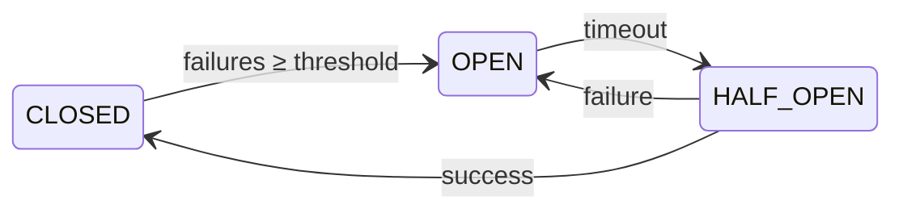
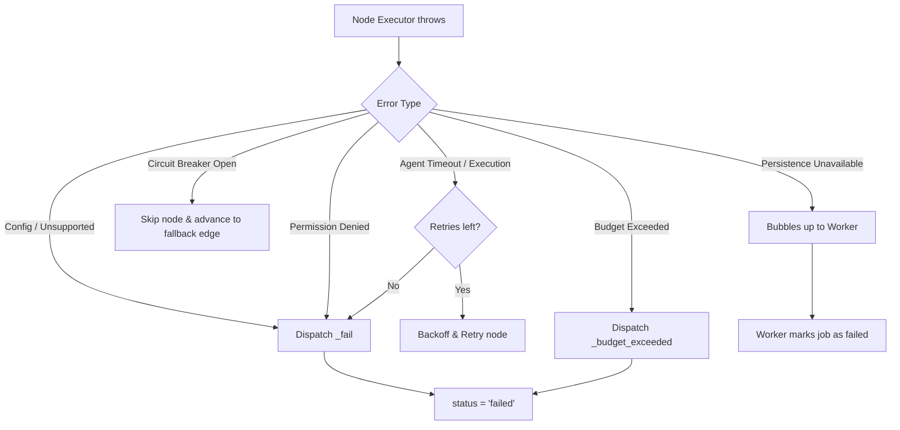

The orchestrator has a structured error hierarchy so that every failure mode has a clear type, category, and recovery path. Errors are never swallowed — they either trigger a retry, trip a circuit breaker, or terminate the run with a precise reason.

## Error class hierarchy

| Class | Module | Key Properties | When Thrown |
|-------|--------|---------------|------------|
| `BudgetExceededError` | `runner/errors` | `tokensUsed`, `budget` | Token budget exceeded during workflow |
| `WorkflowTimeoutError` | `runner/errors` | `workflowId`, `runId`, `elapsedMs` | Wall-clock time exceeded |
| `NodeConfigError` | `runner/errors` | `nodeId`, `nodeType`, `missingField` | Required config missing from a node |
| `CircuitBreakerOpenError` | `runner/errors` | `nodeId` | Node circuit breaker is open |
| `EventLogCorruptionError` | `runner/errors` | `runId` | Missing/corrupt events during recovery |
| `UnsupportedNodeTypeError` | `runner/errors` | `nodeType` | Unknown node type encountered |
| `PermissionDeniedError` | `agent-executor/errors` | — | Agent writes to unauthorized keys |
| `AgentTimeoutError` | `agent-executor/errors` | — | Agent LLM call exceeds timeout |
| `AgentExecutionError` | `agent-executor/errors` | `cause` | Agent LLM call fails (non-timeout) |
| `AgentNotFoundError` | `agent-factory/errors` | — | Agent ID not in registry |
| `AgentLoadError` | `agent-factory/errors` | `cause` | Registry lookup fails (transient) |
| `SupervisorConfigError` | `supervisor-executor/errors` | `supervisorId` | Supervisor missing config |
| `SupervisorRoutingError` | `supervisor-executor/errors` | `chosenNode`, `allowedNodes` | Supervisor routes to invalid node |
| `ArchitectError` | `architect/errors` | — | Graph generation fails after retries |
| `MCPGatewayError` | `mcp/errors` | — | MCP gateway unreachable |
| `MCPToolExecutionError` | `mcp/errors` | `toolName` | MCP tool returns error |
| `PersistenceUnavailableError` | `db/persistence-health` | — | Consecutive persistence failures exceed threshold |

All errors extend `Error` and set `this.name` to their class name, enabling reliable `switch(error.name)` handling across module boundaries.

## Categories

### Config errors — fix graph definition

- `NodeConfigError` — A node is missing required configuration (e.g. `agent_id`, `tool_id`, `approval_config`).
- `SupervisorConfigError` — Supervisor node is missing its `supervisor_config`.
- `UnsupportedNodeTypeError` — The graph references a node type the runner doesn't support.

### Runtime errors — retry or degrade

- `BudgetExceededError` — Token budget exhausted. Non-retryable within the same run.
- `WorkflowTimeoutError` — Execution exceeded wall-clock limit.
- `CircuitBreakerOpenError` — Node failures tripped the breaker. Automatically retries after timeout.
- `AgentTimeoutError` — Individual LLM call timed out. Retryable per `failure_policy`.
- `AgentExecutionError` — LLM call failed (API error, rate limit). Retryable per `failure_policy`.
- `MCPGatewayError` — MCP gateway unreachable. Tool adapter falls back to built-in tools.
- `MCPToolExecutionError` — Specific MCP tool failed. Retryable depending on tool.

### Data integrity errors — halt execution

- `EventLogCorruptionError` — Event log is missing or corrupt. Cannot safely recover.
- `PersistenceUnavailableError` — Database unreachable after consecutive failures. Halts to prevent data loss.

### Agent permission errors — security boundary

- `PermissionDeniedError` — Agent attempted to write to unauthorized memory keys.
- `SupervisorRoutingError` — Supervisor routed to a node outside its `managed_nodes`.

## Retryable vs fatal

| Error | Retryable? | Notes |
|-------|-----------|-------|
| `AgentTimeoutError` | Yes | Retried per `failure_policy.max_retries` |
| `AgentExecutionError` | Yes | With exponential backoff |
| `MCPGatewayError` | Yes | Tool adapter retries, then falls back |
| `MCPToolExecutionError` | Yes | Depends on tool semantics |
| `CircuitBreakerOpenError` | Auto | Transitions to half-open after timeout |
| `NodeConfigError` | No | Fix the graph definition |
| `UnsupportedNodeTypeError` | No | Fix the graph definition |
| `BudgetExceededError` | No | Budget is exhausted for the run |
| `WorkflowTimeoutError` | No | Max execution time reached |
| `EventLogCorruptionError` | No | Manual intervention required |
| `PersistenceUnavailableError` | No | Halts to prevent data loss |
| `PermissionDeniedError` | No | Security violation — fix agent permissions |
| `SupervisorRoutingError` | No | Supervisor bug — fix agent prompt or managed_nodes |

## Recovery patterns

### Node execution — retry with backoff

`GraphRunner.executeNodeWithRetry()` handles this automatically:
1. Catch error from node executor
2. Check retry count against `failure_policy.max_retries`
3. If retryable: backoff → retry
4. If exhausted or fatal: dispatch `_fail` action

### Circuit breaker — automatic recovery

`CircuitBreakerManager` handles the state machine:

`CircuitBreakerOpenError` is thrown when the breaker is `OPEN` and timeout hasn't elapsed. After timeout, one probe attempt is allowed (`HALF-OPEN` state).

### Persistence degradation — progressive failure

`persistWorkflow()` tracks consecutive failures:
1. 1st failure: log warning, continue
2. 2nd failure: log warning, continue
3. 3rd failure (threshold): throw `PersistenceUnavailableError` → halt workflow

Any success resets the counter to 0.

### Event log recovery

`GraphRunner.recoverFromEventLog()` replays events:
1. Check for checkpoint (fast path)
2. If no checkpoint: load all events
3. If no events: throw `EventLogCorruptionError`
4. If no `_init` event: throw `EventLogCorruptionError`
5. Replay events through reducers to reconstruct state

## Error propagation flow

## Next steps

- [Workflow State](/concepts/workflow-state/) — the shared state that errors affect
- [Security](/security/) — how write_keys and taint tracking enforce zero trust
- [Tracing](/observability/tracing/) — correlating errors with distributed traces
