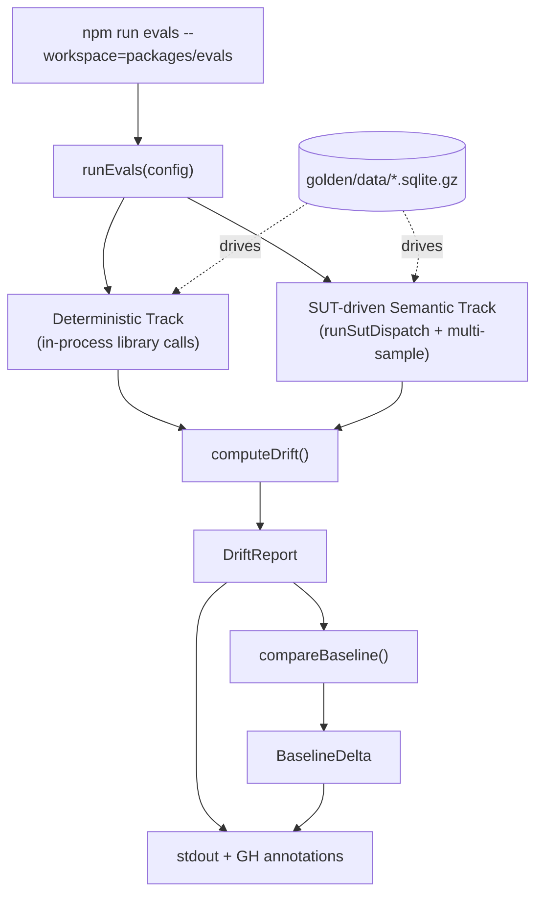

The **Eval Harness** (`@cycgraph/evals`) is the regression-detection layer for the project. It runs golden trajectories through the real `@cycgraph/orchestrator`, `@cycgraph/memory`, and `@cycgraph/context-engine` packages, captures observable behavior, and tells you whether a change in one package silently broke another.

It's distinct from the orchestrator's lightweight built-in [`runEval`](/observability/evals/) (which is a per-graph assertion framework). `@cycgraph/evals` operates one level up — it gates whole-package behavior across release cycles.

## When to reach for this package

- You shipped a change to one package and want to know if it altered observable behavior elsewhere
- You want a stable signal for "did the LLM judge actually regress, or was it a flaky sample?"
- You want to detect drift that hides under your absolute gate (e.g., a suite going from 0% to 4% drift while the ceiling is 5%)
- You need a record of what the system *actually does* on a tagged commit so future regressions are attributable

## Architecture

### Two tracks, one gate

- **Deterministic track** — pure library calls in-process, no LLM. Fast (<1s), free, and produces sharp signal: segmentation, dedup, budget allocation, subgraph extraction, conflict detection, etc.
- **Semantic track** — SUT-driven: each trajectory is dispatched through the real package code via `runSutDispatch`, and the LLM judge grades the observed output against the recorded golden. Configurable provider (Ollama locally, GPT-4o in CI) and configurable sample count for stability.

Both tracks feed into a single `DriftReport` aggregated by `computeDrift()`. The gate triggers when aggregate drift exceeds the configured ceiling.

### Goldens are recorded, not authored

Originally the goldens were hand-authored — expected outputs the team thought the libraries *should* produce. The current generation are **recorded** from real System-Under-Test runs at tagged commits. That means drift % has an anchor: a regression is whatever differs from what the code actually did on commit X with model Y.

See [Recording Goldens](/guides/recording-goldens/) for the full flow.

### Multi-sample stability

LLM judges are non-deterministic. A single low-scoring run can tank the gate; a single high-scoring run can mask a real regression. The semantic track defaults to **3 samples per metric in CI**, using a majority-vote outcome and surfacing tests with inconsistent results as **flaky** — distinct from drift failure.

See [Drift & Baselines](/concepts/drift-and-baselines/) for how flaky-vs-regressed is distinguished in the report.

## Package layout

| Path | Purpose |
|------|---------|
| `src/assertions/` | The four assertion families (structural, deterministic, semantic, reference-free) |
| `src/baseline/` | Snapshot persistence + delta comparison |
| `src/dataset/` | SQLite-backed golden dataset (loader, writer, schema, migration) |
| `src/providers/` | Eval-provider adapters (Ollama / OpenAI) |
| `src/runner/` | Top-level runner, drift calculator, reporter, multi-sample wrapper |
| `src/suites/` | Per-package suites (`orchestrator`, `memory`, `context-engine`, `integration`) |
| `src/sut/` | System-Under-Test wrappers, reference graphs, fixtures, recording planner |
| `scripts/` | One-shot CLIs (`record-goldens.ts`, `migrate-golden.ts`, `seed-golden-v2.ts`) |
| `golden/` | Versioned SQLite trajectories + manifest + (gitignored) baselines |

## What this is not

- **Not** the orchestrator's per-graph assertion framework. That lives in `@cycgraph/orchestrator/src/evals` and is documented under [Evaluations](/observability/evals/). It's for asserting that a specific graph reaches an expected final state. The eval harness operates at the package level for cross-cutting regression detection.
- **Not** a benchmark suite. Trajectories are recorded from internal behavior, not external benchmarks. (A future `source: 'webarena'` is reserved in the schema but not yet implemented.)
- **Not** wired into CI yet. The harness ships standalone and is runnable locally; the workflow files to gate PRs and run nightly are deferred. See the package README for the current state.

## Related

- [Eval Assertions](/concepts/eval-assertions/) — the four assertion families and when to use each
- [Drift & Baselines](/concepts/drift-and-baselines/) — what the drift metric means and how baselines extend it
- [Running Evals](/guides/running-eval-harness/) — CLI usage end to end
- [Recording Goldens](/guides/recording-goldens/) — re-record from real SUT runs
- [Adding an Eval Suite](/guides/adding-eval-suite/) — build a new suite from scratch
- [Adding a SUT Handler](/guides/adding-sut-handler/) — extend the SUT to cover a new tag family
