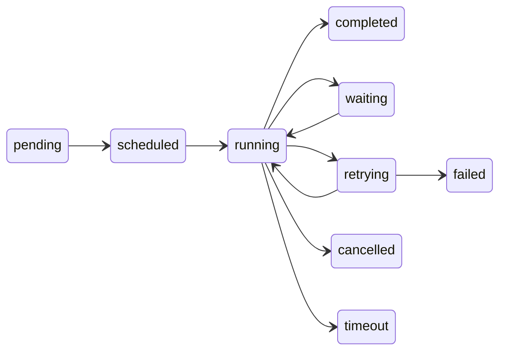

The **WorkflowState** is the single source of truth for a running workflow. Every node reads from it, writes to it, and the engine persists it after each step for crash recovery.

## Creating state

```typescript
import { createWorkflowState } from '@mcai/orchestrator';

const state = createWorkflowState({
  workflow_id: graph.id,
  goal: 'Research and summarize quantum computing',
  constraints: ['Under 500 words'],
  max_execution_time_ms: 120_000,
});
```

## Schema reference

### Identity and input

| Field | Type | Default | Description |
|-------|------|---------|-------------|
| `workflow_id` | `string` (UUID) | *required* | Graph definition this run belongs to. |
| `run_id` | `string` (UUID) | auto-generated | Unique identifier for this execution. |
| `goal` | `string` | *required* | High-level objective for the workflow. |
| `constraints` | `string[]` | `[]` | Rules the workflow must respect. |

### Control flow

| Field | Type | Default | Description |
|-------|------|---------|-------------|
| `status` | `WorkflowStatus` | `'pending'` | Current lifecycle status. |
| `current_node` | `string` | — | Node currently being executed. |
| `iteration_count` | `number` | `0` | Total reducer dispatches so far (loop guard). |
| `max_iterations` | `number` | `50` | Hard cap — the run fails if exceeded. |
| `started_at` | `Date` | — | When `run()` was first invoked. |
| `max_execution_time_ms` | `number` | `3600000` (1h) | Wall-clock timeout for the entire run. |

### Retry and resilience

| Field | Type | Default | Description |
|-------|------|---------|-------------|
| `retry_count` | `number` | `0` | Retries on the current node so far. |
| `max_retries` | `number` | `3` | Maximum retries before the node fails permanently. |
| `last_error` | `string` | — | Error message from the most recent failure. |
| `compensation_stack` | `CompensationEntry[]` | `[]` | Stack of compensating actions for saga rollback. |

### Waiting (human-in-the-loop)

| Field | Type | Default | Description |
|-------|------|---------|-------------|
| `waiting_for` | `WaitingReason` | — | Why the workflow is paused (e.g. `'human_approval'`). |
| `waiting_since` | `Date` | — | When the workflow entered the waiting state. |
| `waiting_timeout_at` | `Date` | — | Deadline after which the wait times out. |

### Cost and token tracking

| Field | Type | Default | Description |
|-------|------|---------|-------------|
| `total_tokens_used` | `number` | `0` | Cumulative tokens consumed across all LLM calls. |
| `max_token_budget` | `number` | — | If set, the run fails when token usage exceeds this. |
| `total_cost_usd` | `number` | `0` | Cumulative estimated cost in USD. |
| `budget_usd` | `number` | — | Per-run cost budget (run fails when exceeded). |

### Memory and tracking

| Field | Type | Default | Description |
|-------|------|---------|-------------|
| `memory` | `Record<string, unknown>` | `{}` | Shared key-value store. See [Memory](#memory) below. |
| `visited_nodes` | `string[]` | `[]` | Node IDs visited in execution order. |
| `supervisor_history` | `object[]` | `[]` | Routing decisions made by supervisor nodes (for debugging). |
| `created_at` | `Date` | now | When this run was created. |
| `updated_at` | `Date` | now | Last state mutation timestamp. |

### Status lifecycle

The workflow status transitions denote the lifecycle of a workflow. All terminal states (`completed`, `failed`, `cancelled`, `timeout`) are final.



---

## Memory

The `memory` object is the primary data exchange between nodes. It's an arbitrary key-value store — you define the keys based on your workflow's needs. Agents write to it via the built-in `save_to_memory` tool and read from it via their filtered state view (controlled by `read_keys` on the node).

- **Use descriptive keys** — `research_notes` is better than `data` or `result`
- **Reference, don't store** — avoid large blobs in memory; store them externally and keep a reference
- **Keep it flat** — deeply nested objects are harder to debug

### Memory layers

| Layer | Scope | Persistence | Purpose |
|-------|-------|-------------|---------|
| **Graph State** | Shared across all nodes | Persisted after every step | Source of truth — goal, results, artifacts |
| **Thread Context** | Local to a single agent | Ephemeral | Raw LLM conversation for the current agent |

**Graph State** is the `memory` object. It's persisted after every node execution, enabling crash recovery and time-travel debugging.

**Thread Context** is the raw LLM conversation history within a single agent execution. Each agent has its own thread — agents don't see each other's raw messages. The agent extracts what matters via `save_to_memory`, and the thread is discarded.

## Action types

Actions dispatched to the reducer use a discriminated union type `ActionTypeSchema`. Valid action types are:

| Action Type | Purpose |
|-------------|---------|
| `update_memory` | Write key-value pairs to the memory object |
| `set_status` | Transition the workflow status |
| `goto_node` | Override the next node in the graph |
| `handoff` | Transfer control to another agent/workflow |
| `request_human_input` | Pause for human-in-the-loop approval |
| `resume_from_human` | Inject human response and resume |
| `merge_parallel_results` | Combine results from parallel node execution |

Invalid action types are rejected at parse time via Zod validation. Internal engine actions (prefixed with `_`, such as `_fail`, `_init`, `_budget_exceeded`) bypass this validation and are reserved for the engine.

## Taint tracking

Data entering the system from external tools (web search, file reads) is flagged as **tainted**. Taint propagates automatically — if a node reads tainted data and writes to state, the output key inherits the taint flag. This lets downstream nodes make trust decisions about their inputs.

## Next steps

- [Agents](/concepts/agents/) — how agents read and write state
- [Nodes](/concepts/nodes/) — node types and configuration
