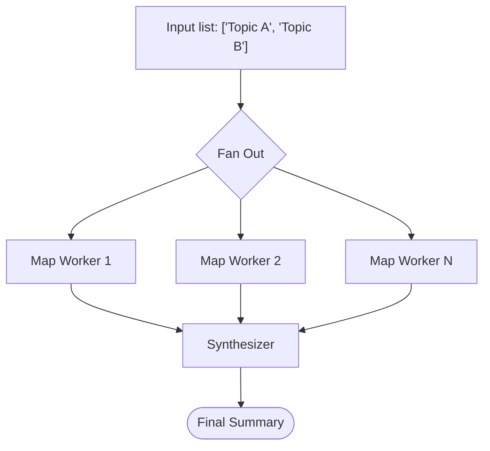

The **Map-Reduce** pattern is built for scale. It processes a massive collection of items by distributing the workload across a fleet of parallel worker nodes, and then aggregates their individual results via a final synthesizer node.

This cleanly bypasses the context window limits and slow latency of trying to process large lists sequentially.

## How it works



1. **Input**: A list of data items (documents, URLs, sub-topics) is present in the workflow's state memory.
2. **Fan Out (Map)**: The orchestrator launches a parallel worker agent for *each* item in the array simultaneously. Each worker receives just a single item injected into its state context as `_map_item`.
3. **Wait**: The map node halts workflow progression until every single parallel task has either completed or timed out.
4. **Aggregation (Synthesize)**: All the outputs from the workers are collected into a `mapper_results` array. A Synthesizer node reads this array and merges the fragments into a final, cohesive output.

## When to use this pattern

- **Document processing at scale** — summarize, classify, or extract from hundreds of documents that won't fit in a single context window.
- **Research fan-out** — break a broad topic into sub-topics and assign one researcher per sub-topic in parallel.
- **Bulk transformation** — translate, reformat, or annotate a list of items where each item is independent of the others.
- **Anything embarrassingly parallel** — if the work is naturally per-item and the items don't depend on each other, Map-Reduce is faster and cheaper than processing them sequentially in a loop.

## Implementation example

This example demonstrates a map-reduce pipeline where a Splitter breaks a broad topic into sub-topics, a Map node executes parallel Researchers for each sub-topic, and a Synthesizer merges the results. 

See the [full runnable code](https://github.com/wmcmahan/cycgraph/tree/main/packages/orchestrator/examples/map-reduce/map-reduce.ts).

### 1. The Worker and Synthesizer Agents

First, define the agent that will process individual items, and the agent that will merge the results. Notice the specific variables injected into their prompts and read keys.

```typescript
import { InMemoryAgentRegistry } from '@cycgraph/orchestrator';

const registry = new InMemoryAgentRegistry();

const RESEARCHER_ID = registry.register({
  name: 'Researcher Agent',
  model: 'claude-sonnet-4-20250514',
  provider: 'anthropic',
  system_prompt: [
    'You are a research specialist focused on a single sub-topic.',
    'Your assigned sub-topic is provided in _map_item.',
    'Produce concise, factual research notes about your specific sub-topic.',
  ].join(' '),
  temperature: 0.5,
  tools: [],
  // We explicitly grant access to the injected _map_item variable
  permissions: { read_keys: ['_map_item', 'goal'], write_keys: ['research'] },
});

const SYNTHESIZER_ID = registry.register({
  name: 'Synthesizer Agent',
  model: 'claude-sonnet-4-20250514',
  provider: 'anthropic',
  system_prompt: [
    'You are a synthesis specialist.',
    'You receive parallel research results in mapper_results (an array of objects).',
    'Combine all research into a single, coherent summary that covers every sub-topic.',
  ].join(' '),
  temperature: 0.4,
  tools: [],
  // We explicitly grant access to the array of mapped outputs
  permissions: { read_keys: ['goal', 'mapper_results'], write_keys: ['summary'] },
});
```

### 2. The Map-Reduce Graph

Next, configure the graph combining the `map` and `synthesizer` node types. 

```typescript
import { createGraph } from '@cycgraph/orchestrator';

const graph = createGraph({
  name: 'Fan-Out Map-Reduce',
  nodes: [
    // ... splitter agent node that outputs a JSON array to memory.topics ...
    {
      id: 'mapper',
      type: 'map',
      read_keys: ['*'],
      write_keys: ['mapper_results', 'mapper_errors', 'mapper_count', 'mapper_error_count'],
      map_reduce_config: {
        worker_node_id: 'researcher',       // The ID of the node to fan out to
        items_path: '$.memory.topics',      // JSONPath to the input array
        max_concurrency: 5,                 // Parallel execution limit
        error_strategy: 'best_effort',      // Continue to synthesis even if some fail
      },
    },
    // The worker node definition (targeted by worker_node_id)
    {
      id: 'researcher',
      type: 'agent',
      agent_id: RESEARCHER_ID,
      read_keys: ['_map_item', 'goal'],
      write_keys: ['research'],
    },
    // The synthesizer node definition
    {
      id: 'synthesizer',
      type: 'synthesizer',
      agent_id: SYNTHESIZER_ID,
      read_keys: ['goal', 'mapper_results'],
      write_keys: ['summary'],
    },
  ],
  edges: [
    { source: 'splitter', target: 'mapper' },
    { source: 'mapper', target: 'synthesizer' },
  ],
  start_node: 'splitter',
  end_nodes: ['synthesizer'],
});
```

## Core concepts

### Understanding map variables
When the map node launches your parallel workers, it intercepts their memory view and forcibly injects specific metadata variables into their scope. You must explicitly request these in your `read_keys` to make them visible to the LLM:
- `_map_item`: The specific string, object, or number being processed by this worker.
- `_map_index`: Which position in the array this item occupies (e.g. `0`, `1`, `2`).
- `_map_total`: The total size of the input array.

### Model cost efficiency

Pair the right LLM tier with the right node.

- **The worker (Map)** fans out potentially hundreds of tasks simultaneously, so it should use the fastest, cheapest model available (e.g. `claude-haiku-4-5-20251001` or `gpt-4o-mini`). Workers do focused, narrow work — complex reasoning is rarely required.
- **The synthesizer (Reduce)** receives the full array of outputs and *does* need heavy reasoning to deduplicate and find patterns across fragments. Use a frontier model (e.g. `claude-sonnet-4-20250514` or `gpt-4o`).
