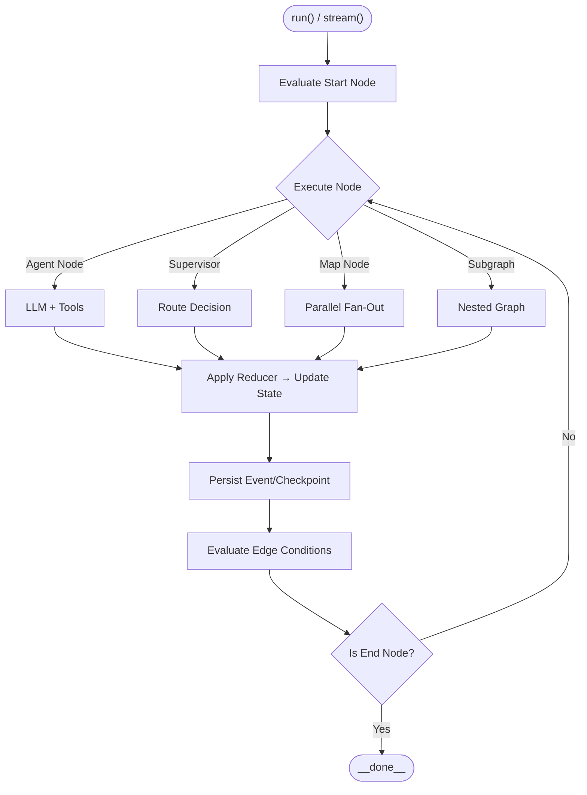

MC-AI is an **agentic orchestration engine** built on a Cyclic State Graph architecture. It empowers you to build complex, fault-tolerant, multi-step AI workflows reliably in production.

## Why use MC-AI?

Most AI orchestration frameworks model workflows as linear chains or strict DAGs (Directed Acyclic Graphs) — agent A calls agent B, which calls agent C. This works well for simple pipelines, but falls apart when you need:

- An agent to **loop back** and try again based on validation feedback.
- A supervisor to **dynamically route** work based on real-time findings.
- Multiple candidates to **evolve in parallel** across generations to find the absolute best solution.
- A workflow to **pause for human review**, and resume safely hours later without context loss.

MC-AI solves this by using a **Cyclic State Graph**. Nodes in the graph can loop, revisit previous nodes, and make runtime routing decisions by examining a shared state blackboard.

## Core mental model

Everything in MC-AI revolves around four core concepts:

| Concept | What it is |
|---------|-----------| 
| **Graph** | Your workflow definition — a set of nodes connected by edges. |
| **Node** | A unit of work: an Agent, an MCP Tool, a Supervisor, or a Subgraph. |
| **State** | A shared blackboard. All nodes read from and write to this state. |
| **Reducer** | A pure function that takes the current state and an action, and returns the new state. |

Agents never talk directly to each other. They read from the shared state, do their work, and emit actions. Reducers apply those actions to produce a new state. This guarantees that **every state transition is auditable**, eliminates race conditions in swarms, and enables features like time-travel debugging and workflow rollbacks.

## Architecture overview

Here is how the underlying `GraphRunner` executes your workflows:

Because the `GraphRunner` is a lightweight TypeScript library, there's no heavy control plane to spin up. You can embed it directly in your Fastify/Express server, execute it in a background queue like BullMQ, or run it in a serverless function.

## What MC-AI is not

- **Not a chatbot UI builder** — MC-AI is a backend workflow engine.
- **Not a low-code tool** — Workflows are defined in TypeScript with full type safety, not a drag-and-drop builder.
- **Not tied to a specific model** — We use the Vercel AI SDK under the hood, so you can use Anthropic, OpenAI, Groq, local models, or any other compatible provider.

## Next steps

- [Quick Start](/getting-started/quick-start/) — install the library and run a workflow in under 5 minutes.
- [Core Concepts](/concepts/overview/) — dive deeper into the graph model.
