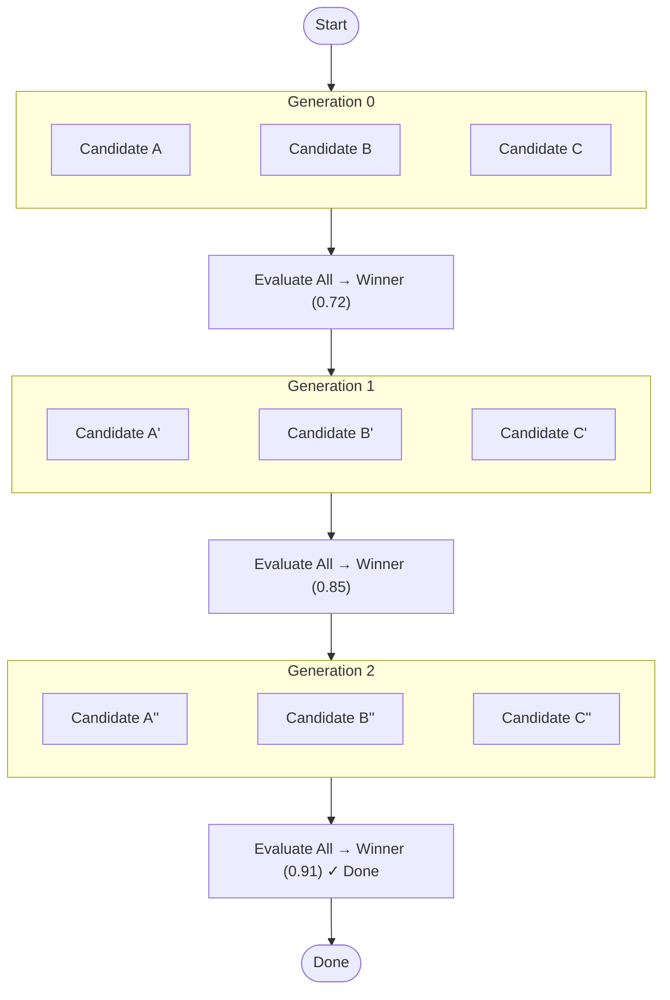

The **Evolution** pattern—inspired by Darwin Godel Machines—runs multiple candidate solutions in parallel, scores each with a fitness evaluator, selects the best, and "breeds" the next generation using the winner's output as context. 

This process continues across multiple generations until a specific fitness threshold is met or a stagnation condition is reached. Here, the LLM acts as the mutation operator: by supplying the winning parent as context alongside a calculated temperature, its stochastic creativity produces deliberate variation.

## How it works



Each generation follows a strict loop:
1. N candidates run in parallel (fan-out).
2. Each candidate receives the previous generation's winner injected into its prompt.
3. A fitness evaluator agent scores each candidate on a 0–1 scale.
4. The highest-scoring candidate becomes the parent for the next generation.
5. Temperature decreases linearly (moving from broad exploration to focused exploitation).
6. Execution halts when the fitness threshold is met, stagnation is detected, or max generations are reached.

## When to use this pattern

- **Creative problem solving**: When there are many wildly different valid approaches and you want to explore the landscape simultaneously.
- **Prompt optimization**: Allowing an LLM to rewrite its own prompt instructions iteratively to find the highest-performing variant.
- **Out-of-the-box solutions**: Finding non-obvious solutions where a single, sequential self-annealing agent might get stuck in a local maximum.

*(Note: Evolution is resource intensive. If you only need to iteratively refine a single output until it hits a quality bar, use [Self-Annealing](/patterns/self-annealing/) instead.)*

## Configuration

The pattern requires you to pair a "candidate" generator agent with an "evaluator" agent.

```yaml
id: evolve
type: evolution
evolution_config:
  candidate_agent_id: writer-agent
  evaluator_agent_id: critic-agent
  population_size: 5
  max_generations: 10
  fitness_threshold: 0.9
  stagnation_generations: 3
  selection_strategy: rank
  initial_temperature: 1.0
  final_temperature: 0.3
read_keys: ['*']
write_keys: ['*']
```

| Setting | Purpose |
|---------|---------|
| `population_size` | How many parallel paths are explored in each generation. |
| `selection_strategy` | Determines how the parent is chosen: `rank` (always the highest score), `tournament` (random subset compete), or `roulette` (probabilistic selection). |
| `stagnation_generations` | Failsafe to exit the loop early if the top score hasn't improved for N generations. |

## Core concepts

### Prompt Context Injection
Each candidate receives the previous generation's winner automatically in its state view. Your candidate agent's system prompt should explicitly reference these variables:

> "If `_evolution_parent` is provided, use it as a starting point. The parent scored `_evolution_parent_fitness`—aim to do better. Current generation: `_evolution_generation`."

### Cost Considerations
Evolution executes a massive amount of LLM calls. With a population size of 5 and max generations of 10, you are triggering up to 50 candidate executions plus 50 evaluations. 
You can use `error_strategy: 'best_effort'` to gracefully handle occasional downstream API timeouts without failing the entire generation. Always set a conservative `fitness_threshold` so the loop exits as early as possible.
