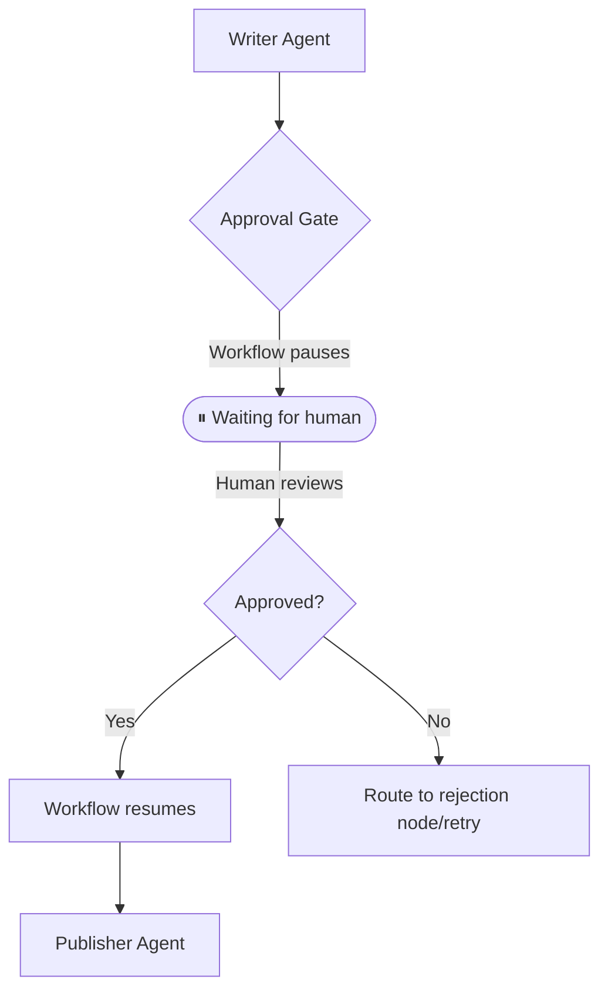

The **Human-in-the-Loop (HITL)** pattern allows workflows to pause mid-execution, wait for human input or approval, and resume exactly where they left off without losing state or context.

## How it works



1. **Execution**: A workflow proceeds normally until it hits a node of type `approval`.
2. **Pause**: The orchestrator completely halts execution, persists the current state to the database, and emits a `workflow:waiting` event.
3. **Review**: The system waits. Human operators can take seconds or days to review the data via a UI or ChatOps integration.
4. **Resume**: An API call is made back to the orchestrator supplying the human's decision (e.g., approved/rejected) and optional feedback.
5. **Continuation**: The workflow wakes up, injects the human's response into the state memory, and traverses the next edge.

## Implementation example

This example demonstrates a classic approval gate: A Writer agent drafts an article, execution pauses for a human to review the draft, and then upon approval, a Publisher agent finalizes it.

See the [full runnable code](https://github.com/wmcmahan/mc-ai/tree/main/packages/orchestrator/examples/human-in-the-loop/human-in-the-loop.ts).

### 1. The Approval Node

Instead of managing complex pausing logic in code, you simply declare an `approval` node in your `createGraph` definition.

```typescript
import { createGraph } from '@mcai/orchestrator';

const graph = createGraph({
  name: 'Human-in-the-Loop',
  nodes: [
    // ... writer agent node ...
    {
      id: 'review',
      type: 'approval',
      read_keys: ['*'],
      write_keys: ['*', 'control_flow'],
      approval_config: {
        approval_type: 'human_review',
        prompt_message: 'Please review the draft before publication.',
        review_keys: ['draft'], // The specific memory keys the human needs to see
        timeout_ms: 300_000,    // Hard timeout if the human never responds
      },
    },
    // ... publisher agent node ...
  ],
  edges: [
    { source: 'write', target: 'review' },
    { source: 'review', target: 'publish' },
  ],
  start_node: 'write',
  end_nodes: ['publish'],
});
```

### 2. The Initial Run

When you execute the workflow, it will automatically pause when it reaches the `review` node.

```typescript
const runner1 = new GraphRunner(graph, initialState, {
  persistStateFn: async (s) => persistence.saveWorkflowState(s),
});

// The run() promise resolves early with a 'waiting' status
const pausedState = await runner1.run();

if (pausedState.status === 'waiting') {
  const pending = pausedState.memory._pending_approval;
  
  // E.g. Send to Slack: 
  // "Please review the draft before publication."
  // "\nDraft content: " + pending.review_data.draft
  console.log(pending.prompt_message);
  console.log(pending.review_data.draft);
}
```

### 3. Resuming the Workflow

Later, when your user clicks "Approve" or "Reject" in your UI, you instantiate a new `GraphRunner` with the persisted state, apply their response, and run it again.

```typescript
// 1. Fetch the paused state from your DB
const stateFromDB = await persistence.getWorkflowState(workflowId);

// 2. Create a fresh runner
const runner2 = new GraphRunner(graph, stateFromDB, {
  persistStateFn: async (s) => persistence.saveWorkflowState(s),
});

// 3. Inject the human's decision
runner2.applyHumanResponse({
  decision: 'approved',
  data: 'Looks great, but make the headline punchier.', // Optional feedback
});

// 4. Resume execution
const finalState = await runner2.run();
```

When the workflow resumes:
- The human's `decision` string is saved to state memory under `human_decision`.
- The human's `data` string is saved to state memory under `human_response`.
- The downstream agents (like the Publisher) can read these fields to incorporate the feedback into their final output.

## When to use this pattern

- **High-stakes actions**: An agent proposes a production deployment, financial transaction, or email blast, but a human must sign off before execution.
- **Content publication**: A writer agent produces a draft article, and a human editor reviews and approves it before publishing.
- **Compliance & Auditing**: Automated analysis that requires a mandatory human compliance review before proceeding.
- **Iterative feedback**: A human provides specific, nuanced feedback during the pause, which is fed back to the agent for revision (creating a Human-in-the-Loop + [Self-Annealing](/patterns/self-annealing/) hybrid).
