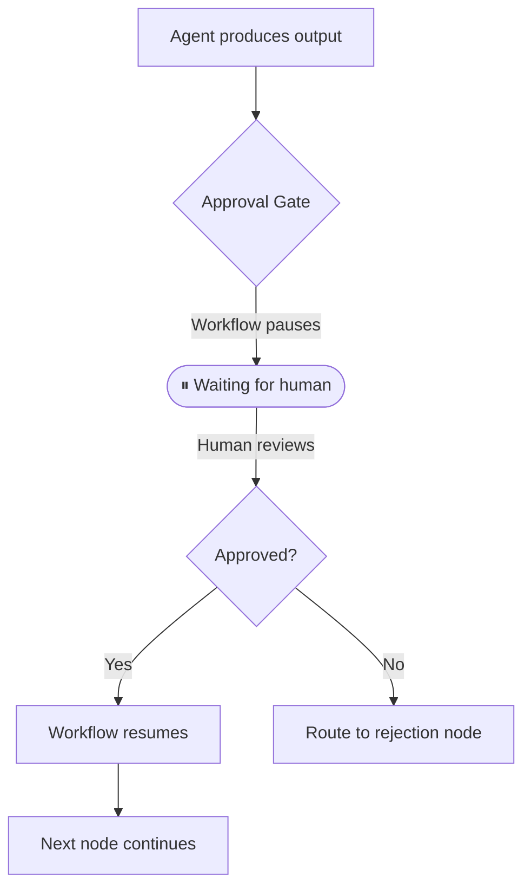

The **Human-in-the-Loop (HITL)** pattern allows workflows to pause mid-execution, wait for human input or approval, and resume exactly where they left off without losing state or context.

## How it works



When a workflow reaches an approval node, it doesn't just sleep — it completely halts execution and persists its state to a database with a `waiting` status. 

This mechanism allows human operators to take as much time as needed to review the output, whether that's minutes, hours, or days. Once the review is complete, the workflow is resumed with the human's decision, allowing the orchestrator to route the graph accordingly.

## When to use this pattern

- **High-stakes actions**: An agent proposes a production deployment, financial transaction, or email blast, but a human must sign off before execution.
- **Content publication**: A writer agent produces a draft article, and a human editor reviews and approves it before publishing.
- **Compliance & Auditing**: Automated analysis that requires a mandatory human compliance review before proceeding.
- **Iterative feedback**: A human provides specific, nuanced feedback during the pause, which is fed back to the agent for revision.

## Configuration

Instead of managing complex pausing logic, you simply add an **approval** node to your graph and route your agent to it.

```yaml
id: review
type: approval
approval_config:
  approval_type: human_review
  prompt_message: Please review the draft and approve or reject.
  review_keys: [draft]
  timeout_ms: 86400000  # 24-hour timeout
read_keys: ['*']
write_keys: ['*']
```

| Setting | Purpose |
|---------|---------|
| `prompt_message` | Instructions shown to the human reviewer in your UI. |
| `review_keys` | Specific memory keys (like `draft`) the reviewer needs to examine to make their decision. |
| `timeout_ms` | How long the workflow will wait in a paused state before automatically timing out. |

## Core concepts

### Resuming paused workflows
When the workflow pauses, it emits a `workflow:waiting` event. Your application can listen for this event and alert the relevant human operator via Slack, email, or a dashboard. 
To continue, your application simply calls the orchestrator's resume method with the human's decision (e.g., approved or rejected) and any optional feedback. The `GraphRunner` will load the persisted state, inject the human's decision, and traverse the appropriate outgoing edge.

### Safe fallbacks
Because human reviewers might forget to respond, the `timeout_ms` property ensures workflows don't sit in a `waiting` state infinitely. The orchestrator will surface this as a timeout error if the threshold is breached, allowing you to clean up or alert a fallback reviewer.
