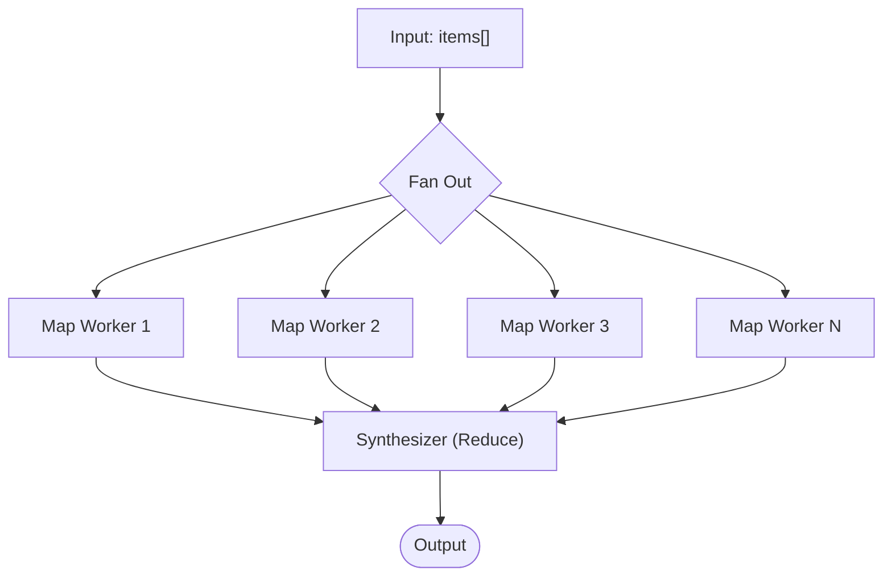

The **Map-Reduce** pattern is built for scale. It processes a massive collection of items by distributing the workload across a fleet of parallel worker nodes, and then aggregates their individual results with a final synthesizer node.

This cleanly bypasses the context window limits and slow latency of trying to process large lists sequentially.

## How it works



1. **Input**: A list of data items (documents, URLs, user records) is present in the workflow's state memory.
2. **Fan Out (Map)**: The orchestrator launches a parallel worker agent for *each* item in the array simultaneously. Each worker receives just a single item injected into its scope as `_map_item`.
3. **Wait**: The map node halts workflow progression until every single parallel task has either completed or timed out.
4. **Aggregation (Reduce)**: All the outputs are collected into an array and fed into the `_map_results` state memory of a Synthesizer node. The Synthesizer merges the fragments into a final, cohesive output.

## When to use this pattern

- **Batch Document Analysis**: Analyzing a folder of 100 separate PDFs (e.g., quarterly earnings reports) and generating an overall sentiment summary.
- **Large Dataset Extraction**: Parsing a massive structured dataset piece by piece before an LLM synthesizes a conclusive finding.
- **Embarrassingly Parallel Tasks**: When a dataset can be cleanly divided into independent units of work with no dependencies between items.

## Configuration

Add a `map` node to your graph definition. You point it at the state memory key containing your array, the agent that will process each item, and the agent that will synthesize the results.

```yaml
id: process_documents
type: map
map_reduce_config:
  items_path: raw_reports
  worker_node_id: fast_analyzer
  synthesizer_node_id: deep_summarizer
  max_concurrency: 5
  error_strategy: best_effort
read_keys: [raw_reports]
write_keys: [final_summary]
```

| Setting | Purpose |
|---------|---------|
| `items_path` | The specific state memory key containing the array to map over. |
| `max_concurrency` | How many map workers run simultaneously. Important for respecting your LLM provider's rate limits (e.g., max concurrent requests). |
| `error_strategy` | When set to `best_effort`, if 2 out of 100 documents fail to process, the synthesizer still receives the 98 successful results rather than failing the entire workflow. |

## Core concepts

### Model Cost Efficiency
Optimizing Map-Reduce requires pairing the right LLM tier with the right node.

- **The Worker (Map)**: Because you are fanning out potentially hundreds of tasks simultaneously, the map worker should use the fastest, cheapest model available (e.g., Claude 3.5 Haiku or GPT-4o-mini). These agents are doing focused, narrow work—complex reasoning is rarely required.
- **The Synthesizer (Reduce)**: The node receiving the array of outputs *does* require heavy reasoning to deduplicate and find patterns across the fragments. This agent should utilize a frontier reasoning model (e.g., Claude 3.5 Sonnet or GPT-4o).
