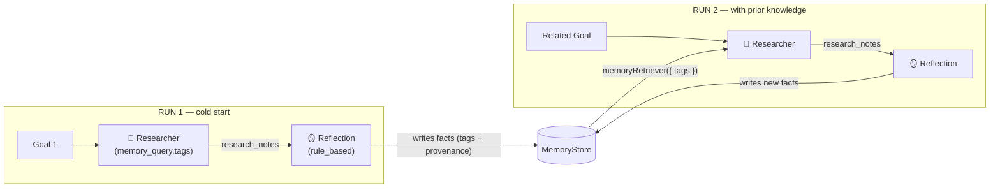

The **Reflection** pattern closes the compound-learning loop. After productive work in a graph, a `reflection` node distills source memory keys (notes, drafts, observations) into atomic `SemanticFacts` and persists them to your memory store via an injected `MemoryWriter`. Future runs retrieve those facts (filtered by tags) through `memoryRetriever` and feed them into agent prompts as a `## Relevant Memory` section.

The infrastructure under reflection — `@cycgraph/memory`'s temporal knowledge graph and the orchestrator's `memoryWriter` / `memoryRetriever` adapters — is the same. What reflection adds is the **node** that ties the workflow's runtime output to that store at the right point in the graph.

## How it works



Each run follows the same loop:
1. Productive nodes (research, write, analyse) produce output into workflow state.
2. The reflection node reads `source_keys` from state, extracts facts, attaches tags + provenance, and calls `memoryWriter`.
3. On the next run, agents whose nodes declare `memory_query: { tags: [...] }` have those facts rendered into a `## Relevant Memory` section in their system prompt.

## When to use this pattern

- **Long-running research agents** that should improve as they accumulate domain knowledge.
- **Support / triage workflows** where lessons from past tickets should inform new ones.
- **Compounding pipelines** where every run adds vetted facts to a shared knowledge graph.
- **Domain bootstrapping** — extract a corpus of starter facts from a seed conversation, then have agents query that corpus.

*(If you only need ephemeral per-run memory, just use `WorkflowState.memory` — no reflection node required. If you want cross-run learning specifically, this is the pattern.)*

## Implementation example

Reflection requires two pieces of infrastructure outside the graph: a memory store (where facts live) and a `MemoryWriter` adapter the runner calls. The graph itself just declares a `reflection` node.

### 1. Memory store + writer + retriever

```typescript
import {
  InMemoryMemoryStore,
  InMemoryMemoryIndex,
  retrieveMemory,
} from '@cycgraph/memory';
import type {
  MemoryWriter,
  MemoryRetriever,
} from '@cycgraph/orchestrator';

const memoryStore = new InMemoryMemoryStore();
const memoryIndex = new InMemoryMemoryIndex();

const LESSON_TAG = 'graph:research-v1';

const memoryWriter: MemoryWriter = async (facts) => {
  const ids: string[] = [];
  for (const fact of facts) {
    const stored = {
      id: crypto.randomUUID(),
      content: fact.content,
      source_episode_ids: [],
      entity_ids: [],
      provenance: {
        source: fact.provenance.source,
        created_at: new Date(),
        run_id: fact.provenance.run_id,
        node_id: fact.provenance.node_id,
      },
      valid_from: new Date(),
      tags: fact.tags,
    };
    await memoryStore.putFact(stored);
    ids.push(stored.id);
  }
  return { fact_ids: ids };
};

const memoryRetriever: MemoryRetriever = async (query, options) => {
  const result = await retrieveMemory(memoryStore, memoryIndex, {
    tags: query.tags ?? [],
    max_hops: 0,
    limit: options?.maxFacts ?? 20,
    min_similarity: 0,
    include_invalidated: false,
  });
  return {
    facts: result.facts.map((f) => ({ content: f.content, validFrom: f.valid_from })),
    entities: result.entities.map((e) => ({ name: e.name, type: e.entity_type })),
    themes: result.themes.map((t) => ({ label: t.label })),
  };
};
```

### 2. The graph

The researcher node carries `memory_query: { tags: [LESSON_TAG] }` so the retriever fires before its prompt. The reflection node lives after it and writes back with the same tag.

```typescript
import { createGraph, GraphRunner } from '@cycgraph/orchestrator';

const graph = createGraph({
  name: 'Learning Research Agent',
  description: 'Research with compound learning across runs',
  nodes: [
    {
      id: 'research',
      type: 'agent',
      agent_id: RESEARCHER_ID,
      read_keys: ['goal', 'constraints'],
      write_keys: ['research_notes'],
      memory_query: { tags: [LESSON_TAG], max_facts: 20 },
    },
    {
      id: 'reflect',
      type: 'reflection',
      read_keys: ['research_notes'],
      write_keys: ['research_notes_reflection'],
      reflection_config: {
        source_keys: ['research_notes'],
        extractor: { type: 'rule_based', min_sentence_length: 25 },
        tags: ['lesson', LESSON_TAG],
      },
    },
  ],
  edges: [{ source: 'research', target: 'reflect' }],
  start_node: 'research',
  end_nodes: ['reflect'],
});

const runner = new GraphRunner(graph, state, { memoryWriter, memoryRetriever });
```

## Extractor variants

The `extractor` discriminator on `reflection_config` picks the strategy:

### `rule_based`

Deterministic sentence-level extraction. Splits the concatenated source memory values into sentences, filters by `min_sentence_length`, dedupes (case-insensitive), emits one fact per unique sentence. **No LLM call** — free and predictable.

```typescript
extractor: { type: 'rule_based', min_sentence_length: 25 }
```

Use when source content is already structured as discrete sentences (agent notes, bullet lists).

### `llm`

Calls an extractor agent that distills the source into a bounded list of atomic, generalisable lessons. Each fact lands with `provenance.source === 'agent'`.

```typescript
extractor: {
  type: 'llm',
  agent_id: REFLECTOR_ID,
  max_facts: 5,
  instruction: 'Extract methodology lessons only.',  // optional override
}
```

Use when source content is freeform prose, or when you need the LLM to filter what's worth keeping.

## Core concepts

### Tags scope retrieval

The `tags` field on `reflection_config` is applied to every fact written by the node. When a downstream node declares `memory_query: { tags: [...] }`, only facts carrying at least one matching tag come back. Namespace tags by graph (`graph:research-v1`), category (`methodology`, `failure`), or both. This lets multiple graphs share a memory store without polluting each other's retrieval.

### Entities and the knowledge graph

`reflection_config.entity_keys` declares memory keys whose values name entities the produced facts relate to. The reflection executor reads those values and includes them as entity references on each written fact so the lesson stays reachable via entity-driven retrieval (`memory_query: { entity_ids: [...] }`).

### Cost considerations

- `rule_based` extraction is free (no LLM call). It's the right default for most reflection use cases.
- `llm` extraction costs one extractor call per run. Cap `max_facts` (default 10) to bound output token cost.
- The retriever side is free if your memory store is in-process. Production stores (`DrizzleMemoryStore`) cost a single Postgres + pgvector query per node-with-`memory_query`.

### Production swap

The example uses `InMemoryMemoryStore`. Swap to the Postgres-backed adapter when lessons need to survive process restarts:

```typescript
import { DrizzleMemoryStore, DrizzleMemoryIndex } from '@cycgraph/orchestrator-postgres';

const memoryStore = new DrizzleMemoryStore(db);
const memoryIndex = new DrizzleMemoryIndex(db);
// memoryWriter and memoryRetriever stay identical
```

The Postgres schema has a `tags jsonb` column on `memory_facts` (migration `0013_add_fact_tags`) and uses tag intersection for retrieval.

## Runnable example

See `packages/orchestrator/examples/learning-research-agent/` for the full demo: a research workflow that runs twice on related goals and prints a side-by-side comparison of lessons injected / extracted / tokens / cost / duration. Run with `ANTHROPIC_API_KEY=sk-ant-... npx tsx examples/learning-research-agent/learning-research-agent.ts`.
