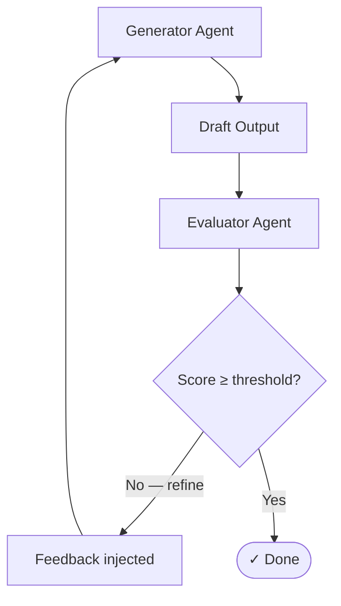

The **Self-Annealing (Evaluator-Optimizer)** pattern runs a single agent through a continuous loop of generation and evaluation until the output meets a strict quality threshold. 

Unlike [Evolution](/patterns/evolution/), there is no "population" of candidates — just one piece of work that gets refined, iteration by iteration, steadily improving its score.

## How it works



1. A **Generator** agent produces an initial draft.
2. An **Evaluator** agent (often using a smarter, stricter model) scores the draft against a rubric and generates actionable feedback.
3. If the score is below the required threshold, the feedback is injected back into the Generator's prompt.
4. The Generator produces a new, refined draft.
5. This cycle repeats until the threshold is met or a safety limit (max iterations) is reached.

## When to use this pattern

- **Code generation & review**: An agent writes code, and an evaluator agent runs static analysis or reviews the logic. If bugs are found, the generator tries again.
- **Content refinement**: Writing, editing, and translation where the output must meet a strict brand voice or formatting standard.
- **Data extraction validation**: Extracting unstructured data into strict JSON, where an evaluator checks for missing fields or hallucinations and forces a retry.
- **Any task where one output must meet a rigid quality bar**. (If you want to explore multiple distinct creative approaches simultaneously, use [Evolution](/patterns/evolution/) instead.)

## Configuration

The pattern relies on two complementary agents paired together in a routing loop.

### 1. The Evaluator Agent
The evaluator needs explicit instructions on how to score the output and what feedback to provide.

```json
{
  "id": "critic-agent",
  "model": "claude-sonnet-4-20250514",
  "temperature": 0.1,
  "system": "Assess the draft and output a JSON object with: score (0.0-1.0) and feedback. Be specific. Only give a score > 0.85 if the draft is genuinely ready."
}
```

### 2. The Generator Agent
The generator must be instructed to listen to previous feedback.

```json
{
  "id": "writer-agent",
  "model": "claude-sonnet-4-20250514",
  "temperature": 0.7,
  "system": "Write a blog post. If evaluation_feedback is present in the context, this is a revision loop — incorporate all feedback to improve the draft."
}
```

### 3. The Routing Logic
The magic happens in the graph edges. You simply route back to the generator if the score is too low:

```yaml
# Edge: Evaluator → Generator (Loop back)
condition:
  type: expression
  expression: state.memory.quality_score < 0.85

# Edge: Evaluator → Done (Success)
condition:
  type: expression
  expression: state.memory.quality_score >= 0.85
```

## Core concepts

### Breaking infinite loops
Because LLMs can get stuck failing to fix a problem, the Self-Annealing loop needs a safety valve. The `iteration_count` in the workflow's state increments on every node execution. Combined with a `max_iterations` limit on the graph definition, you ensure that the graph will eventually halt and throw an error if the agent simply cannot meet the threshold, preventing runaway API costs.
