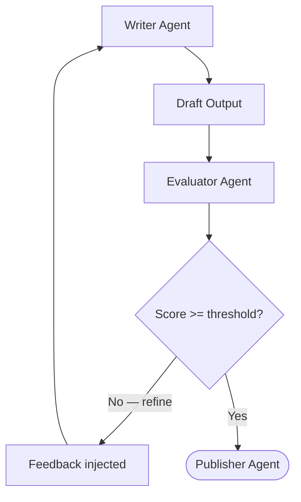

The **Self-Annealing (Evaluator-Optimizer)** pattern runs a single agent through a continuous loop of generation and evaluation until the output meets a strict quality threshold. 

Unlike [Evolution](/patterns/evolution/), there is no "population" of candidates — just one piece of work that gets refined, iteration by iteration, steadily improving its score.

## How it works



1. A **Writer** agent produces an initial draft based on the goal.
2. An **Evaluator** agent (often using a smarter, stricter model or prompt) scores the draft against a rubric and generates actionable feedback and specific suggestions.
3. If the score is below the required threshold, the feedback is injected back into the Writer's state. The Writer revises its previous output.
4. This cycle repeats until the threshold is met or a safety limit (max iterations) is reached.
5. Once the threshold is met, control moves forward (e.g. to a Publisher node).

## Implementation example

This example demonstrates a self-annealing loop where a Writer drafts content, an Evaluator scores it, and the loop repeats until the score hits `0.8` or higher, before passing the approved draft to a Publisher. 

See the [full runnable code](https://github.com/wmcmahan/mc-ai/tree/main/packages/orchestrator/examples/eval-loop/eval-loop.ts).

### 1. The Agents

The pattern relies on pairing two complementing agents: one instructed to listen to feedback, and the other instructed to provide ruthless, structured feedback.

```typescript
import { InMemoryAgentRegistry } from '@mcai/orchestrator';

const registry = new InMemoryAgentRegistry();

const WRITER_ID = registry.register({
  name: 'Writer Agent',
  model: 'claude-sonnet-4-20250514',
  provider: 'anthropic',
  system_prompt: [
    'You are a skilled writer.',
    'Your task: write a concise, engaging explanation of the given topic for a general audience.',
    'If memory.feedback and memory.suggestions are present, you are revising a previous draft — use that feedback to improve.',
    'If no feedback exists, write from scratch.',
  ].join(' '),
  temperature: 0.7,
  tools: [],
  permissions: {
    read_keys: ['goal', 'constraints', 'feedback', 'suggestions', 'draft'],
    write_keys: ['draft'],
  },
});

const EVALUATOR_ID = registry.register({
  name: 'Evaluator Agent',
  model: 'claude-sonnet-4-20250514',
  provider: 'anthropic',
  system_prompt: [
    'You are a writing evaluator.',
    'Read the draft and score it on clarity, accuracy, engagement, and conciseness.',
    'You MUST call save_to_memory THREE times:',
    '1. key "score" — a single number between 0 and 1 (e.g. 0.72).',
    '2. key "feedback" — a brief paragraph explaining what works and what does not.',
    '3. key "suggestions" — a bullet list of specific improvements.',
    'A draft that meets all constraints should score 0.8 or above.',
  ].join(' '),
  // Keep temperature low for deterministic evaluating
  temperature: 0.3,
  tools: [],
  permissions: {
    read_keys: ['goal', 'constraints', 'draft'],
    write_keys: ['score', 'feedback', 'suggestions'],
  },
});
```

### 2. The Routing Logic

The magic happens in the graph edges. By using `conditional` edges based on the `memory.score` value produced by the Evaluator, we can dynamically loop backward or break out of the cycle.

```typescript
import { createGraph } from '@mcai/orchestrator';

const graph = createGraph({
  name: 'Eval Loop',
  description: 'Cyclic write-evaluate-revise loop with conditional quality gate',
  nodes: [
    {
      id: 'writer',
      type: 'agent',
      agent_id: WRITER_ID,
      read_keys: ['goal', 'constraints', 'feedback', 'suggestions', 'draft'],
      write_keys: ['draft'],
    },
    {
      id: 'evaluator',
      type: 'agent',
      agent_id: EVALUATOR_ID,
      read_keys: ['goal', 'constraints', 'draft'],
      write_keys: ['score', 'feedback', 'suggestions'],
    },
    // ... define 'publisher' node ...
  ],
  edges: [
    // writer always goes to evaluator
    {
      id: 'writer-to-evaluator',
      source: 'writer',
      target: 'evaluator',
      condition: { type: 'always' },
    },
    // Loop back: evaluator → writer when score < 0.8
    {
      id: 'evaluator-to-writer',
      source: 'evaluator',
      target: 'writer',
      condition: { type: 'conditional', condition: 'number(memory.score) < 0.8' },
    },
    // Quality gate: evaluator → publisher when score >= 0.8
    {
      id: 'evaluator-to-publisher',
      source: 'evaluator',
      target: 'publisher',
      condition: { type: 'conditional', condition: 'number(memory.score) >= 0.8' },
    },
  ],
  start_node: 'writer',
  end_nodes: ['publisher'],
});
```

## When to use this pattern

- **Code generation & review**: An agent writes code, and an evaluator agent runs static analysis or reviews the logic. If bugs are found, the generator tries again.
- **Content refinement**: Writing, editing, and translation where the output must meet a strict brand voice or formatting standard.
- **Data extraction validation**: Extracting unstructured data into strict JSON, where an evaluator checks for missing fields or hallucinations and forces a retry.
- **Any task where one output must meet a rigid quality bar**. (If you want to explore multiple distinct creative approaches simultaneously, use [Evolution](/patterns/evolution/) instead.)

## Core concepts

### Breaking infinite loops

Because LLMs can get stuck failing to fix a problem, the Self-Annealing loop needs a safety valve. 

Pass a `max_iterations` limit when creating the initial `WorkflowState` object (e.g. `max_iterations: 20`). The state automatically tracks the `iteration_count` across the entire workflow. If the loop causes the workflow to exceed this limit, the orchestrator will safely halt and throw an `ExceededMaxIterationsError` to prevent runaway API costs.
