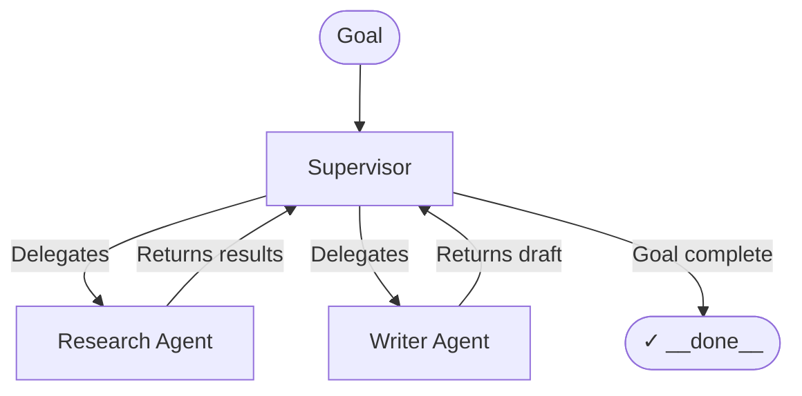

The **Supervisor** pattern introduces an LLM as the "brain" of your workflow, capable of making dynamic routing decisions on the fly. 

Unlike traditional static workflows where every step is hardcoded, the Supervisor pattern allows the orchestrator to act iteratively—delegating subtasks, reviewing the results, and deciding what needs to happen next until the overarching goal is fully achieved.

## How it works



1. **Initial Goal**: The workflow receives a complex, open-ended goal (e.g., "Write a comprehensive research report on AI agents").
2. **First Routing Decision**: The Supervisor reads the goal and decides the first step: "I need research data before I can write." It delegates the task to the `researcher` node.
3. **Execution & Return**: The `researcher` executes the task, saves the data to memory, and control returns directly to the Supervisor.
4. **Subsequent Routing**: The Supervisor reviews the new state of the memory. "I have the research data now. The next step is drafting." It delegates to the `writer` node.
5. **Completion**: Once the `writer` returns a draft, the Supervisor reviews it and concludes the goal is met. It routes the final execution to `__done__`, terminating the graph.

## When to use this pattern

- **Unknown execution paths**: When the number of steps required to complete a task isn't known in advance.
- **Complex, multi-step goals**: Tasks that require a sequence of distinct specialized skills (e.g., research → compile → format → review).
- **Data-dependent routing**: When the next step depends entirely on the output of the previous step. For simple conditional logic, use a static router node instead.

## Configuration

A Supervisor node requires an LLM agent capable of structured output to make the routing decisions, and an explicitly defined list of sibling nodes it is permitted to dispatch work to.

```yaml
id: manager
type: supervisor
supervisor_config:
  agent_id: router-agent
  managed_nodes: 
    - researcher
    - writer
  max_iterations: 10
read_keys: ['*']
write_keys: ['*']
```

| Setting | Purpose |
|---------|---------|
| `agent_id` | The ID of the LLM agent tasked with making the routing decisions. This agent uses `generateObject` under the hood to output a strict routing target and reasoning. |
| `managed_nodes` | An allow-list of node IDs this supervisor is permitted to delegate to. It cannot route to unmanaged nodes. |
| `max_iterations` | A safety threshold. If the supervisor loops back to itself this many times, it fails to prevent infinite runtime and cost loops. |

## Core concepts

### The Supervisor Agent Prompt
The agent powering the supervisor should be instructed to act as a project manager, not an executor. It should only evaluate the current state of memory against the goal, and identify the single best next worker to delegate to.

### Nested Delegation
Because Supervisors are just nodes in a graph, they can be configured to manage other Supervisors. This allows for hierarchical delegation—for instance, a "Product Director" supervisor that delegates high-level milestones to "Engineering Manager" and "Marketing Manager" supervisors, who each manage their own team of specialist worker agents.
