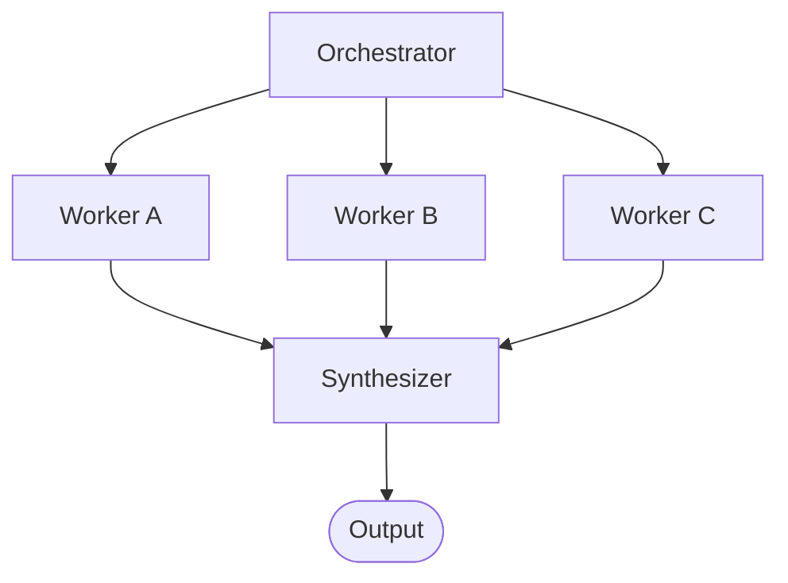

The **Swarm** pattern divides a complex task across multiple, specialized agents running simultaneously in parallel, before synthesizing their disparate outputs into a single, cohesive final result.

This is highly effective when tasks are too large for a single context window, or when attacking a problem from multiple independent perspectives yields a better outcome than a single sequential approach.

## How it works



1. **Orchestration**: A lead agent (or simply static static routing configuration) analyzes the goal and divides the work into distinct sub-tasks.
2. **Parallel Execution**: Multiple worker agents spin up simultaneously. Worker A investigates topic X, Worker B investigates topic Y, and Worker C investigates topic Z.
3. **Synthesis**: The graph converges on a single Synthesizer node. It waits until all prerequisite workers have completed, then an LLM reads all the parallel outputs and weaves them together into a unified format.

## When to use this pattern

- **Comprehensive coverage**: When researching a topic where multiple perspectives or sources are critical (e.g., pulling reports from three different competitors simultaneously).
- **Latency reduction**: When a task can be cleanly divided into independent sub-tasks, parallel execution dramatically lowers the total wall-clock time compared to sequential processing.
- **Context management**: When analyzing a dataset that exceeds the context token limits of an LLM.

*(Note: If you are processing a massive list of identical items, like mapping over hundreds of DB records, the [Map-Reduce](/patterns/map-reduce/) pattern is more appropriate.)*

## Configuration

Setting up a Swarm involves a few architectural components. First, the fan-out from the orchestrator to the workers. Next, the synthesizer node that merges the outputs.

```yaml
id: synthesizer
type: synthesizer
agent_id: merge-agent
read_keys: 
  - result_a
  - result_b
  - result_c
write_keys: 
  - final_report
```

In your graph edges definition, you simply point all the parallel workers at the `synthesizer` node. The orchestrator engine automatically handles the dependency resolution: the synthesizer will not fire until every single upstream node targeting it has finished its execution.

## Core concepts

### The Synthesizer's Role
The synthesizer node goes beyond simply concatenating text. Because it is powered by an LLM, its true value lies in intelligent aggregation:
- **Deduplication**: Removing overlapping findings discovered independently by multiple workers.
- **Conflict Resolution**: Identifying contradictions between workers and either resolving them or surfacing the discrepancy explicitly.
- **Formatting**: Stitching fragmented research notes into a cohesive, fluid narrative or standardized JSON output.

### Peer Delegation
While swarms are often managed top-down, worker agents in a swarm can dynamically delegate to peers by including `_peer_delegation` commands in their output payloads. This enables horizontal task redistribution on the fly without requiring a central orchestrator to intervene.
