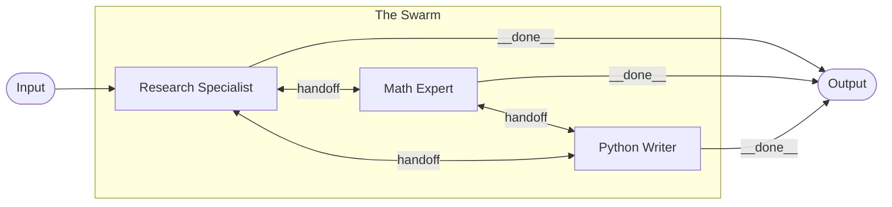

The **Swarm** pattern enables a network of highly specialized, independent agents to collaborate on a task by dynamically handing off control to one another based on who is best suited for the next step.

Unlike the [Supervisor](/patterns/supervisor/) pattern—where a central manager dictates routing—the Swarm operates horizontally. Each agent evaluates its own capabilities against the remaining goal; if another agent in the swarm is better equipped to handle the next phase, the current agent seamlessly transfers execution to its peer.

## How it works



1. **Initialization**: The workflow enters the `swarm` node and triggers the first agent.
2. **Peer Evaluation**: The active agent uses its tools and logic to progress the task. When it reaches the limit of its specialization, it looks at the list of available `peer_nodes` in the Swarm.
3. **Handoff**: The agent calls a built-in handoff tool, suspending its own execution and transferring control—along with the current state memory—to a peer (e.g., passing control from the Researcher to the Math Expert to crunch the numbers).
4. **Completion**: The peers continue passing the baton until one of them determines the overarching goal is fully achieved, at which point it hands off to the `__done__` sentinel, terminating the Swarm.

## When to use this pattern

- **Highly diverse toolsets**: When you have many specialized tools (UI interactions, database queries, code execution) that would overwhelm a single LLM's context window. Instead, create specialized agents for each domain.
- **Complex, unstructured workflows**: When the problem requires fluid back-and-forth collaboration rather than a strict linear pipeline or a rigid managerial hierarchy.
- **Autonomous troubleshooting**: A "Triage" agent can hand off to a "Database Config" agent, who realizes it's actually an infrastructure issue and hands off to the "DevOps" agent.

## Implementation example

The `swarm` node relies on an intelligent routing definition. You define the network of peers, and the orchestrator automatically handles the dynamic state transfers between them by injecting handoff capabilities into their prompts.

### 1. The Specialized Agents

First, register the independent specialists that will make up the swarm network.

```typescript
import { InMemoryAgentRegistry } from '@mcai/orchestrator';

const registry = new InMemoryAgentRegistry();

const RESEARCHER_ID = registry.register({
  name: 'Research Expert',
  model: 'claude-sonnet-4-20250514',
  provider: 'anthropic',
  system_prompt: 'You specialize in fetching information and summarizing facts. When calculation is needed, hand off to the Math Expert.',
  temperature: 0.3,
  tools: [{ type: 'mcp', server_id: 'web-search' }],
  permissions: { read_keys: ['*'], write_keys: ['*'] },
});

const MATH_ID = registry.register({
  name: 'Math Expert',
  model: 'claude-sonnet-4-20250514',
  provider: 'anthropic',
  system_prompt: 'You specialize in complex arithmetic and logic. You cannot read the web. Receive data, calculate the result, and hand off to the Python Writer if scripting is needed, or finish the task if the goal is met.',
  temperature: 0.0, // Absolute precision
  tools: [{ type: 'mcp', server_id: 'calculator' }],
  permissions: { read_keys: ['*'], write_keys: ['*'] },
});

const C முறை_ID = registry.register({
  name: 'Python Writer',
  model: 'claude-sonnet-4-20250514',
  provider: 'anthropic',
  system_prompt: 'You write and execute Python scripts to process data. You do not search the web.',
  temperature: 0.1,
  tools: [{ type: 'mcp', server_id: 'code-sandbox' }],
  permissions: { read_keys: ['*'], write_keys: ['*'] },
});
```

### 2. The Swarm Node

Next, map those agents as standard nodes in the graph, and weave them together using a `swarm` parent node.

```typescript
import { createGraph } from '@mcai/orchestrator';

const graph = createGraph({
  name: 'Data Analysis Swarm',
  description: 'Peer-to-peer swarm solving complex data questions',
  nodes: [
    {
      id: 'analysis_swarm',
      type: 'swarm',
      read_keys: ['*'],
      write_keys: ['*'],
      swarm_config: {
        peer_nodes: ['researcher', 'math_wiz', 'python_dev'],
        handoff_mode: 'agent_choice', // Agents use LLM reasoning to pick the next peer
        max_handoffs: 15,             // Prevent infinite handoff loops
      },
    },
    // The individual peers must still be defined as nodes in the graph
    // so the orchestrator knows how to execute them
    {
      id: 'researcher',
      type: 'agent',
      agent_id: RESEARCHER_ID,
      read_keys: ['*'], write_keys: ['*'],
    },
    {
      id: 'math_wiz',
      type: 'agent',
      agent_id: MATH_ID,
      read_keys: ['*'], write_keys: ['*'],
    },
    {
      id: 'python_dev',
      type: 'agent',
      agent_id: C_ID,
      read_keys: ['*'], write_keys: ['*'],
    },
  ],
  edges: [],
  start_node: 'analysis_swarm',
  end_nodes: ['analysis_swarm'], // Swarm nodes resolve internally
});
```

## Core concepts

### Handoff Tool Injection
When an agent is part of a `swarm` node, the orchestrator automatically intercepts its execution and injects a dynamic tool into its context (e.g., `handoff_to_peer`). The tool definition contains the IDs and descriptions of all available `peer_nodes`, allowing the LLM natively to decide when and who to pass control to. 

### Max Handoffs Limit
Swarm behavior is highly emergent, which means it can easily derail into infinite handoff loops if two agents continually pass a problem back and forth without resolving it. The `max_handoffs` configuration acts as a hard circuit-breaker: if the swarm exceeds this number of transitions, the orchestrator forcibly halts the run to protect your API budget.
