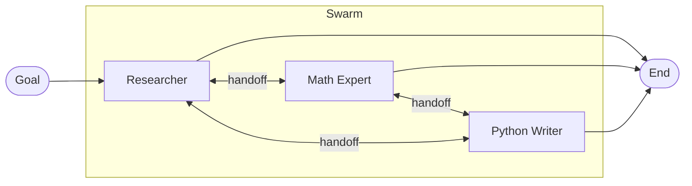

The **Swarm** pattern lets a network of specialized agents collaborate by handing control off to one another based on which peer is best suited for the next step.

Unlike the [Supervisor](/patterns/supervisor/) pattern, where a central manager dictates routing, Swarm operates horizontally. Each agent decides whether to continue working or hand off to a peer. The orchestrator validates handoffs against the agent's declared `peer_nodes` and enforces a `max_handoffs` circuit breaker to prevent infinite delegation loops.

## How it works



1. **Entry.** The workflow enters at one peer — whichever node is the graph's `start_node`.
2. **Peer evaluation.** The active agent reads its goal alongside `_swarm_config.peer_nodes`, which the orchestrator injects into the agent's state view so it knows who else is available.
3. **Handoff.** When the agent decides another peer is better suited, it writes `_peer_delegation: { peer_node_id, reason }` to memory. The orchestrator validates the target is in `peer_nodes`, then dispatches a `handoff` action that routes execution to that peer. The agent's other memory updates are preserved across the handoff.
4. **Continuation or completion.** If the agent does not delegate, normal graph edges run. The workflow ends when execution reaches an `end_node` without a pending handoff.

## When to use this pattern

- **Highly diverse toolsets** — many specialized tools (UI interactions, database queries, code execution) that would overwhelm a single LLM's context. Split them across specialists, one per domain.
- **Unpredictable execution order** — problems where the next best step depends on prior results, not a fixed pipeline.
- **Autonomous troubleshooting** — a "Triage" agent hands off to "Database Config", which realizes it's actually an infrastructure issue and hands off to "DevOps".

## Implementation example

A swarm node is just an `agent` node with `swarm_config` attached. There is no separate `swarm` node type. Each peer is its own `agent` node, and each declares its own `swarm_config` listing the *other* peers it can delegate to.

### 1. The specialist agents

```typescript
import { InMemoryAgentRegistry } from '@cycgraph/orchestrator';

const registry = new InMemoryAgentRegistry();

const RESEARCHER_ID = registry.register({
  name: 'Research Expert',
  model: 'claude-sonnet-4-20250514',
  provider: 'anthropic',
  system_prompt: [
    'You specialize in fetching information and summarizing facts.',
    'When the goal requires calculation, hand off to the Math Expert by writing',
    '`_peer_delegation: { peer_node_id: "math_wiz", reason: "..." }` to memory.',
    'When code execution is needed, hand off to the Python Writer.',
  ].join(' '),
  temperature: 0.3,
  tools: [{ type: 'mcp', server_id: 'web-search' }],
  permissions: { read_keys: ['*'], write_keys: ['*'] },
});

const MATH_ID = registry.register({
  name: 'Math Expert',
  model: 'claude-sonnet-4-20250514',
  provider: 'anthropic',
  system_prompt:
    'You specialize in arithmetic and logic. Receive data, calculate the result, and hand off to the Python Writer if scripting is needed.',
  temperature: 0.0,
  tools: [{ type: 'mcp', server_id: 'calculator' }],
  permissions: { read_keys: ['*'], write_keys: ['*'] },
});

const PYTHON_WRITER_ID = registry.register({
  name: 'Python Writer',
  model: 'claude-sonnet-4-20250514',
  provider: 'anthropic',
  system_prompt:
    'You write and execute Python scripts to process data. You do not search the web.',
  temperature: 0.1,
  tools: [{ type: 'mcp', server_id: 'code-sandbox' }],
  permissions: { read_keys: ['*'], write_keys: ['*'] },
});
```

### 2. The swarm graph

Each peer is a standard `agent` node with `swarm_config` listing the other peers it can hand off to. Edges define what happens when no handoff is requested — typically a default forward path or a route to a terminal node.

```typescript
import { createGraph } from '@cycgraph/orchestrator';

const graph = createGraph({
  name: 'Data Analysis Swarm',
  description: 'Peer-to-peer agents collaborating on data questions.',
  nodes: [
    {
      id: 'researcher',
      type: 'agent',
      agent_id: RESEARCHER_ID,
      swarm_config: {
        peer_nodes: ['math_wiz', 'python_dev'],
        max_handoffs: 10,
        handoff_mode: 'agent_choice',
      },
      read_keys: ['*'],
      write_keys: ['*'],
    },
    {
      id: 'math_wiz',
      type: 'agent',
      agent_id: MATH_ID,
      swarm_config: {
        peer_nodes: ['researcher', 'python_dev'],
        max_handoffs: 10,
        handoff_mode: 'agent_choice',
      },
      read_keys: ['*'],
      write_keys: ['*'],
    },
    {
      id: 'python_dev',
      type: 'agent',
      agent_id: PYTHON_WRITER_ID,
      swarm_config: {
        peer_nodes: ['researcher', 'math_wiz'],
        max_handoffs: 10,
        handoff_mode: 'agent_choice',
      },
      read_keys: ['*'],
      write_keys: ['*'],
    },
  ],
  // Edges fire when an agent does NOT delegate. Use them to define a
  // default forward path or a route to a terminal node.
  edges: [
    { source: 'researcher', target: 'python_dev' },
    { source: 'math_wiz', target: 'python_dev' },
  ],
  start_node: 'researcher',
  end_nodes: ['python_dev'],
});
```

## Core concepts

### Handoff via `_peer_delegation`

A swarm-mode agent hands off by writing a `_peer_delegation` object to memory:

```ts
{
  peer_node_id: 'math_wiz',     // must be in this node's swarm_config.peer_nodes
  reason: 'Numerical breakdown required',
  context?: unknown,             // optional — passed through to the peer
}
```

The orchestrator strips this key, validates `peer_node_id`, and emits a `handoff` action that re-routes execution. The agent's other memory updates are preserved across the handoff.

If the agent attempts to hand off to a node not in `peer_nodes`, the runner throws `NodeConfigError`.

### Visibility into peers

Before each call, the orchestrator injects a `_swarm_config` object into the agent's state view so it can see who's available and how much budget is left:

```ts
{
  peer_nodes: ['math_wiz', 'python_dev'],
  max_handoffs: 10,
  handoff_count: 2,
}
```

Agents can reference this in their reasoning to decide whether further handoff is warranted.

### Max handoffs (circuit breaker)

Swarms can derail into infinite ping-pong if two agents keep handing the same problem back. `max_handoffs` halts further delegation once `_swarm_handoff_count` reaches the limit. After that, any `_peer_delegation` requests are silently dropped and the agent's other memory updates flow through normal graph edges.
