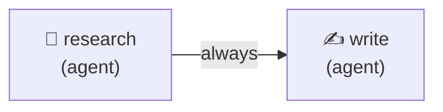
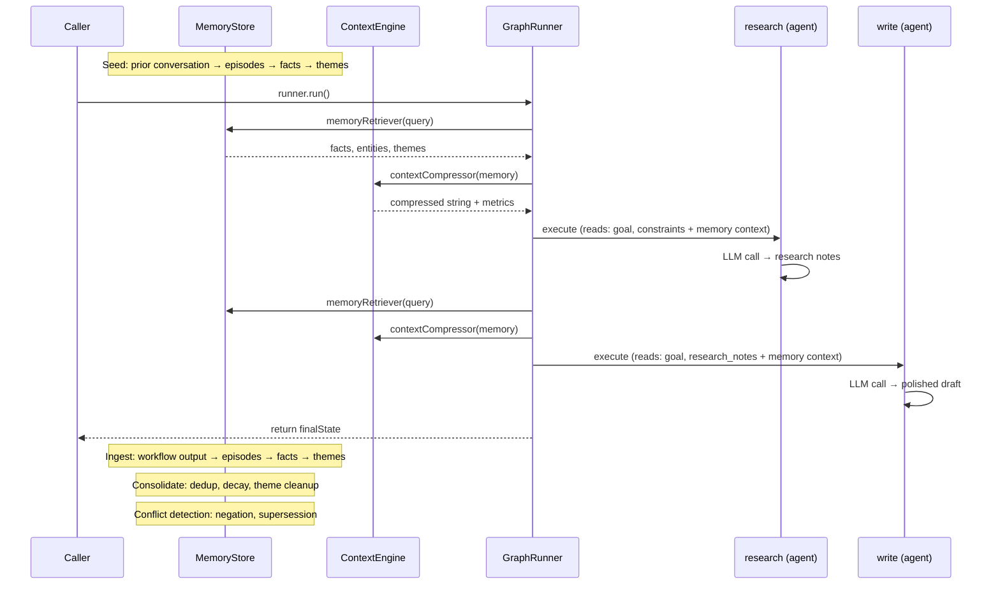

# Context Engine + Memory

A 2-node linear workflow that integrates persistent memory (`@mcai/memory`) and context compression (`@mcai/context-engine`) with the orchestrator. Demonstrates the full memory lifecycle: seed prior knowledge, run a workflow with memory-augmented prompts, ingest output back into memory, consolidate duplicates, and detect conflicts.

## Graph



Both nodes receive relevant memory facts via `memoryRetriever` and compressed context via `contextCompressor`.

## Lifecycle & State



## What it demonstrates

### Memory system (`@mcai/memory`)

| Feature | Where |
|---------|-------|
| `SimpleEpisodeSegmenter` | Groups messages into topic-coherent episodes by time gap |
| `RuleBasedExtractor` | Extracts atomic facts, entities (person, org, concept), and relationships from episodes |
| `ConsolidatingThemeClusterer` | Clusters facts into themes with merge pass to prevent proliferation |
| `retrieveMemory` | Hierarchical top-down retrieval: themes → facts → episodes → entities |
| `MemoryConsolidator` | Deduplicates near-identical facts, decays old facts, cascades to themes |
| `ConflictDetector` | Detects negation, supersession, and semantic contradiction between facts |

### Context engine (`@mcai/context-engine`)

| Feature | Where |
|---------|-------|
| `createIncrementalPipeline` | Caches unchanged segments between turns; tracks per-segment output hashes |
| `createFormatStage` | Auto-detects data shape and serializes to token-efficient format |
| `createExactDedupStage` | Hash-based identical content removal |
| `createFuzzyDedupStage` | Trigram Jaccard similarity with MinHash LSH pre-filter |
| `createAllocatorStage` | Priority-weighted token budget distribution |
| `PipelineLogger` | Structured logging for warnings and debug output |
| `timeoutMs` | Pipeline-level timeout to bound compression latency |

### Orchestrator integration

| Adapter | Purpose |
|---------|---------|
| `contextCompressor` | Compresses serialized memory before prompt injection; falls back to `JSON.stringify` if absent |
| `memoryRetriever` | Retrieves relevant facts from the knowledge graph for prompt augmentation |

## Run

```bash
cd packages/orchestrator
ANTHROPIC_API_KEY=sk-ant-... npx tsx examples/context-and-memory/context-and-memory.ts
```

## Expected Output

```
═══ Context Engine + Memory Example ═══

Step 1: Seeding memory from prior conversation...
  Seeded memory with 4 messages from a prior conversation
  Facts extracted: 8
  Entities detected: 5
  Themes clustered: 3

Step 2: Running research-and-write workflow...
  contextCompressor: incremental pipeline (format + dedup + allocator)
  memoryRetriever: hierarchical top-down retrieval

  Node started: research (agent)
  Context compressed: 32.4% reduction (3ms)
  Node complete: research (2450ms)
  Node started: write (agent)
  Context compressed: 28.1% reduction (1ms)
  Node complete: write (1920ms)

Step 3: Ingesting workflow output into memory...

Step 4: Running memory consolidation...
  Deduped: 2, Decayed: 0, Themes cleaned: 1

Step 5: Running conflict detection...
  Conflicts found: 0

═══ Research Notes ═══
• Transformers use self-attention to process sequences in parallel ...

═══ Final Draft ═══
Large language models are AI systems trained on vast amounts of text ...

═══ Memory System State ═══
  Active facts:    14
  Entities:        9
  Themes:          4

═══ Workflow Stats ═══
  Tokens used:     1680
  Cost (USD):      $0.0101
```
