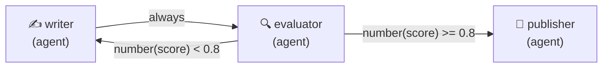
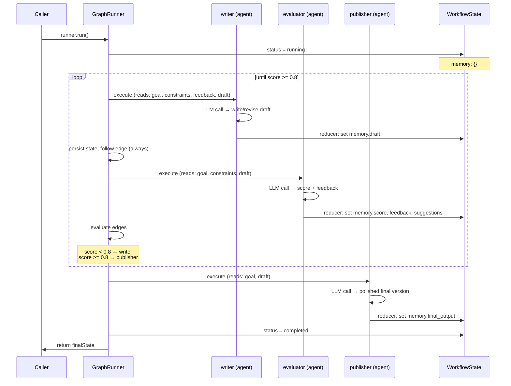
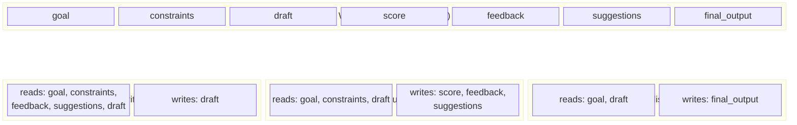

# Eval Loop

A 3-node cyclic workflow demonstrating **conditional edges** and **iterative refinement**. A Writer drafts content, an Evaluator scores it, and the graph either loops back for revision or forwards to a Publisher once quality is met.

Unlike the built-in annealing node (which encapsulates the loop internally), this example uses explicit nodes connected by conditional edges — making the cycle visible in the graph topology.

## Graph



## Lifecycle & State



## Conditional Edges

The cycle is driven by two conditional edges from the evaluator:

| Edge | Condition | Behavior |
|------|-----------|----------|
| `evaluator → writer` | `number(memory.score) < 0.8` | Loop back — draft needs improvement |
| `evaluator → publisher` | `number(memory.score) >= 0.8` | Quality gate passed — publish |

Conditions are [filtrex](https://github.com/joewalnes/filtrex) expressions evaluated against `WorkflowState`. Edge order matters: the runner takes the first matching edge, so the loop-back edge is listed before the exit edge.

The `number()` wrapper coerces the score to a numeric type. This is important because `save_to_memory` uses `z.unknown()` and LLMs often serialize numbers as strings — without coercion, filtrex's strict mode rejects the comparison.

## State Slicing



## Run

```bash
cd packages/orchestrator
ANTHROPIC_API_KEY=sk-ant-... npx tsx examples/eval-loop/eval-loop.ts
```

## Expected Output

```
[INFO] Starting eval-loop workflow...
[INFO] Workflow started: <run-id>
[INFO]   Node started: writer (agent)
[INFO]   Node complete: writer (2100ms)
[INFO]   Node started: evaluator (agent)
[INFO]   Node complete: evaluator (1800ms)
[INFO]   Node started: writer (agent)
[INFO]   Node complete: writer (2400ms)
[INFO]   Node started: evaluator (agent)
[INFO]   Node complete: evaluator (1600ms)
[INFO]   Node started: publisher (agent)
[INFO]   Node complete: publisher (1500ms)
[INFO] Workflow complete: <run-id> (9400ms)

═══ Results ═══
  Iterations: 2 evaluation round(s)
  Final score: 0.85
  Path: writer → evaluator → writer → evaluator → publisher

═══ Evaluator Feedback (last round) ═══
The draft effectively covers qubits, superposition, and entanglement ...

═══ Published Output ═══
Quantum computing is a revolutionary approach to computation ...

═══ Stats ═══
  Tokens used: 4210
  Cost (USD):  $0.0253
```
