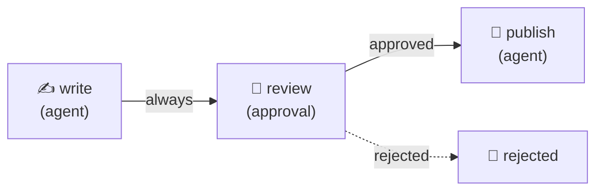
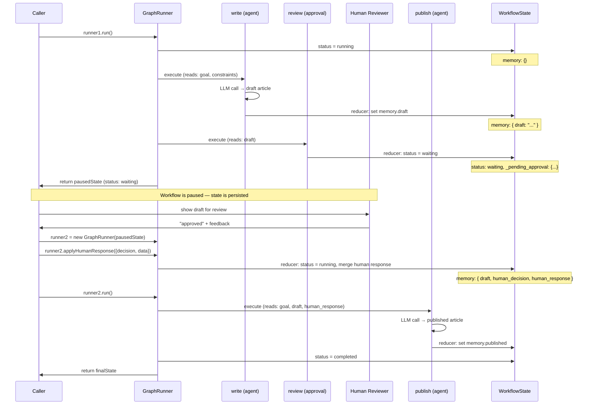
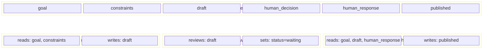

# Human-in-the-Loop

A 3-node linear workflow with an approval gate that pauses execution for human review. A Writer agent produces a draft, the workflow pauses at an approval gate for human review, and upon approval a Publisher agent finalizes the article. Demonstrates approval gates, workflow pausing/resuming, review data filtering, and the HITL resume flow.

## Graph



## Lifecycle & State



## Resume Flow

The HITL pattern uses a two-phase execution model:

1. **Phase 1 — Run to gate**: `runner.run()` executes nodes until the approval gate. The gate emits a `request_human_input` action, the reducer sets `status: 'waiting'`, and `run()` returns the paused state.

2. **Phase 2 — Resume after review**: Create a new `GraphRunner` with the paused state, call `applyHumanResponse()` to merge the human's decision, then call `run()` to continue from where it left off.

```typescript
// Phase 1: Run until approval gate
const runner1 = new GraphRunner(graph, initialState, opts);
const pausedState = await runner1.run();
// pausedState.status === 'waiting'

// Phase 2: Resume with human decision
const runner2 = new GraphRunner(graph, pausedState, opts);
runner2.applyHumanResponse({ decision: 'approved', data: 'LGTM' });
const finalState = await runner2.run();
// finalState.status === 'completed'
```

In production, the paused state is persisted to Postgres between phases. The worker loads the state, applies the human response, and resumes execution — which may happen minutes, hours, or days later.

## State Slicing

Each node only sees the keys it declares — the engine enforces zero-trust boundaries:



## Run

```bash
cd packages/orchestrator
ANTHROPIC_API_KEY=sk-ant-... npx tsx examples/human-in-the-loop/human-in-the-loop.ts
```

The example prompts interactively in the terminal for approve/reject.

## Expected Output

```
[INFO] Starting human-in-the-loop workflow...
[INFO] Workflow started: <run-id>
[INFO]   Node started: write (agent)
[INFO]   Node complete: write (2100ms)
[INFO]   Node started: review (approval)
[INFO]   Node complete: review (1ms)
[INFO] Workflow paused — waiting for: human_approval

Approval gate prompt: "Please review the draft before publication."

╔══════════════════════════════════════════╗
║     HUMAN REVIEW REQUIRED                ║
╚══════════════════════════════════════════╝

Draft for review:

Open-source software has become a cornerstone of modern innovation ...

──────────────────────────────────────────

Approve this draft? (yes/no): yes
Any feedback for the publisher? (press Enter to skip): Add a stronger conclusion

Reviewer decision: approved

[INFO] Workflow started: <run-id>
[INFO]   Node started: publish (agent)
[INFO]   Node complete: publish (1850ms)
[INFO] Workflow complete: <run-id> (1851ms)

═══ Draft (pre-review) ═══
Open-source software has become a cornerstone of modern innovation ...

═══ Human Decision ═══
approved
Feedback: Add a stronger conclusion

═══ Published Article ═══
# Why Open-Source Software Matters for Innovation
Open-source software has become a cornerstone of modern innovation ...

═══ Stats ═══
  Nodes visited:  write → review → publish
  Tokens used:    2847
  Cost (USD):     $0.0171
```
