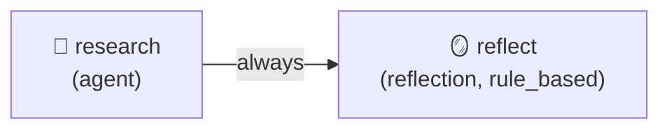
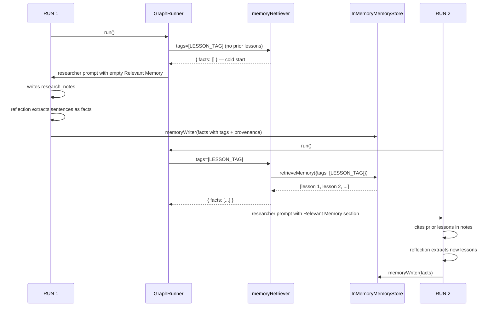

# Learning Research Agent

A 2-node workflow that gets **measurably smarter on its second run**. Demonstrates the `reflection` node + `MemoryWriter` adapter — the cycgraph primitives that close the compound-learning loop.

## What this proves

> The orchestrator architecture promises agents that improve over time. This example is the smallest workflow where that's literally true: run 1 produces research notes, the reflection node distills them into atomic lessons, the memory store retains them, and on run 2 those lessons feed back into the researcher's prompt. The agent acts on its own past work.

## Graph



## Cross-run flow



## Run

```bash
cd packages/orchestrator
ANTHROPIC_API_KEY=sk-ant-... npx tsx examples/learning-research-agent/learning-research-agent.ts
```

You'll see two complete runs printed side by side, then a comparison table:

```
═══ RUN 1 (no prior knowledge) ═══
Lessons injected:   0
Lessons extracted:  6
...

═══ RUN 2 (with lessons from run 1) ═══
Lessons injected:   6
Lessons extracted:  5
...

═══ Comparison ═══
Lessons injected:    run1=0  run2=6
Lessons extracted:   run1=6  run2=5
Tokens used:         run1=...  run2=...
```

The expected pattern is that run 2's notes reference the run-1 lessons in parentheses ("(applying: cite primary sources)"). The exact lessons depend on what the LLM writes for run 1 — that's the point: the system extracts whatever generalisable knowledge run 1 produced and feeds it forward.

## How it works

1. **InMemoryMemoryStore + InMemoryMemoryIndex** from `@cycgraph/memory` hold the lessons.
2. **`memoryWriter`** is a small adapter that maps cycgraph's `MemoryWriterFact` shape onto `SemanticFact` and calls `memoryStore.putFact`.
3. **The reflection node** uses the `rule_based` extractor — splits `research_notes` into sentences, filters by length, dedupes, emits one fact per unique sentence tagged with `lesson` and `graph:learning-research-v1`.
4. **The researcher node declares `memory_query: { tags: [LESSON_TAG], max_facts: 20 }`.** Before building the agent prompt, the runner calls `memoryRetriever` with that query and renders the returned facts into a `## Relevant Memory` section ahead of the regular `<data>` block. Zero manual injection.
5. **`memoryRetriever`** is a small adapter that calls `retrieveMemory(store, index, { tags, ... })` and reshapes the result for the orchestrator.

## Production swap

Replace the in-memory store with the Postgres-backed adapter and lessons survive restarts and accumulate across thousands of runs:

```typescript
import { DrizzleMemoryStore, DrizzleMemoryIndex } from '@cycgraph/orchestrator-postgres';

const memoryStore = new DrizzleMemoryStore(db);
const memoryIndex = new DrizzleMemoryIndex(db);
// memoryWriter and the retrieval call stay identical
```

## Try this next

- Run the demo 5+ times with different but related goals. Watch the lesson store grow and how much overlaps across runs.
- Swap the extractor to `{ type: 'llm', agent_id: REFLECTOR_ID, max_facts: 5 }` to have an LLM distill structured lessons instead of using the sentence-splitter. Tag-based retrieval works the same way.
- Add a second reflection node with a different `tags` namespace to capture a different *kind* of lesson (e.g., `failures` vs `methodology`).
