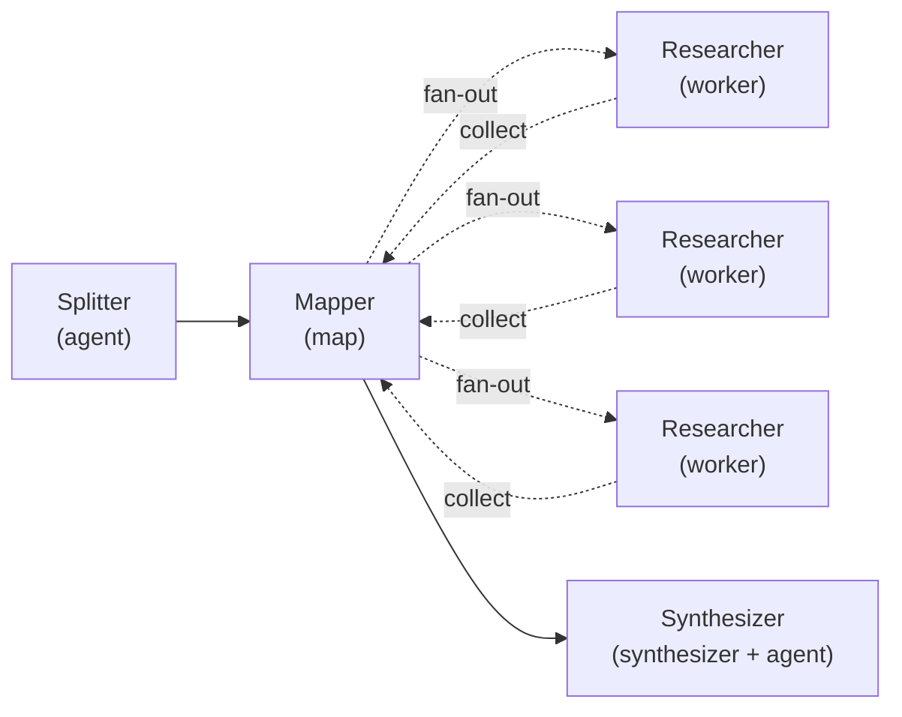
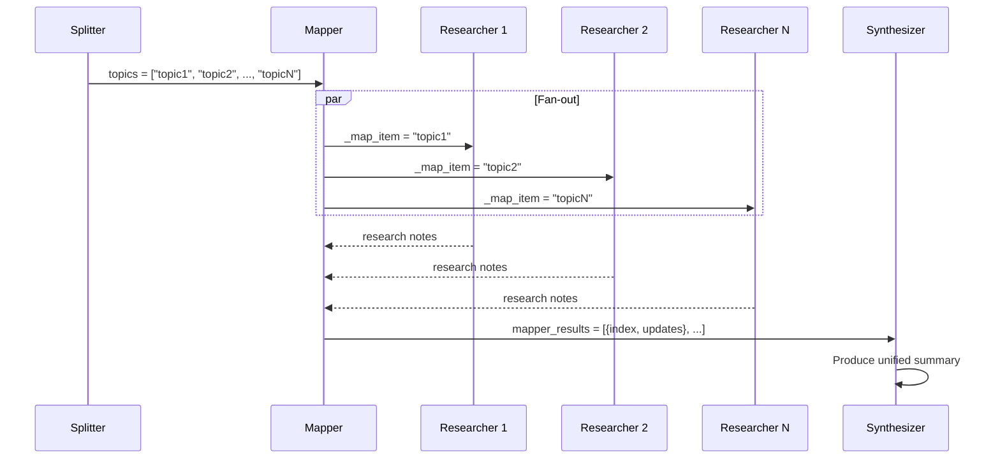

# Fan-Out Map-Reduce

Parallel research with LLM-powered synthesis. A Splitter decomposes a topic, a Map node fans out to parallel Researcher workers, and a Synthesizer merges everything into a unified summary.

## Graph Topology



## Sequence Diagram



## State Flow

```
┌─────────────┐     ┌──────────────────────────────────────┐     ┌──────────────┐
│  Splitter    │     │  Map Node (internal fan-out)          │     │  Synthesizer  │
│             │     │                                      │     │              │
│ reads:      │     │  items_path: $.memory.topics         │     │ reads:       │
│  goal       │     │                                      │     │  goal        │
│  constraints│     │  ┌────────┐ ┌────────┐ ┌────────┐   │     │  mapper_     │
│             │     │  │Worker 1│ │Worker 2│ │Worker N│   │     │   results    │
│ writes:     │     │  │        │ │        │ │        │   │     │              │
│  topics     │     │  │_map_   │ │_map_   │ │_map_   │   │     │ writes:      │
│  (array)    │     │  │ item   │ │ item   │ │ item   │   │     │  summary     │
└──────┬──────┘     │  │_map_   │ │_map_   │ │_map_   │   │     └──────────────┘
       │            │  │ index  │ │ index  │ │ index  │   │
       └───────────>│  └────────┘ └────────┘ └────────┘   │
                    │                                      │
                    │  writes: mapper_results, mapper_count│
                    └──────────────┬───────────────────────┘
                                   │
                                   └──────────────────────>
```

## Agents

| Agent | Model | Temp | Reads | Writes |
|-------|-------|------|-------|--------|
| Splitter | claude-sonnet-4 | 0.5 | `goal`, `constraints` | `topics` |
| Researcher | claude-sonnet-4 | 0.5 | `_map_item`, `_map_index`, `_map_total`, `goal` | `research` |
| Synthesizer | claude-sonnet-4 | 0.4 | `goal`, `mapper_results`, `mapper_count` | `summary` |

## Run

```bash
cd packages/orchestrator
ANTHROPIC_API_KEY=sk-ant-... npx tsx examples/map-reduce/map-reduce.ts
```

## Key Concepts

- **Map node**: Resolves items via JSONPath (`$.memory.topics`), fans out to a worker node in parallel
- **Worker injection**: Each worker receives `_map_item`, `_map_index`, `_map_total` in its state view
- **Results convention**: Map stores results as `mapper_results` (array), `mapper_count`, `mapper_errors`, `mapper_error_count`
- **Synthesizer + agent_id**: Delegates to an LLM agent for intelligent synthesis (vs. simple concatenation)
- **Error strategy**: `best_effort` — partial failures don't block the overall workflow
