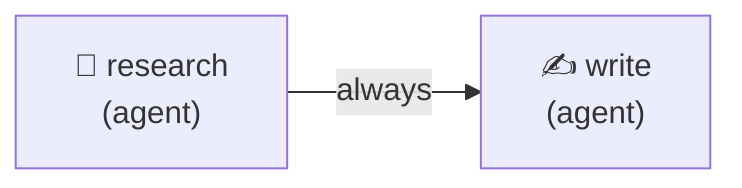
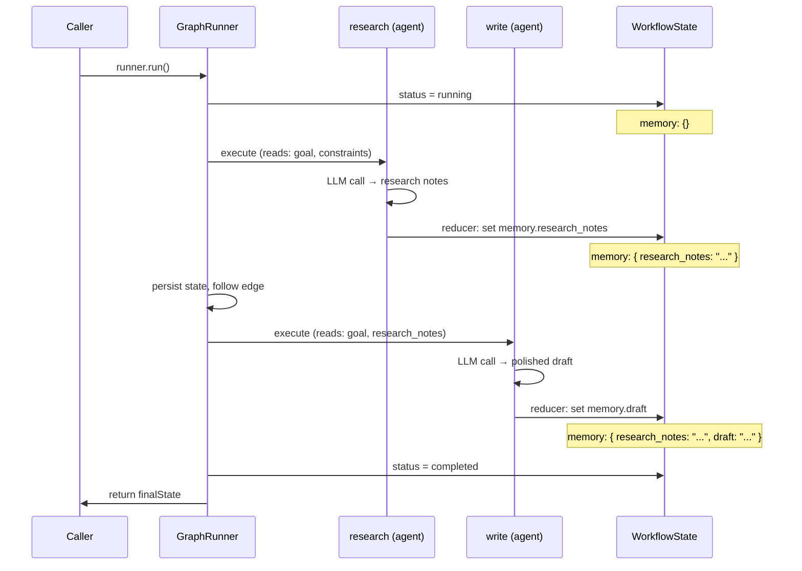
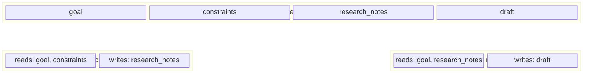

# Research & Write

A 2-node linear workflow where a Researcher agent gathers notes on a topic and a Writer agent produces a polished summary. Demonstrates agent-as-config, zero-trust state slicing, graph definition, in-memory persistence, and event listeners.

## Graph



## Lifecycle & State



## State Slicing

Each node only sees the keys it declares — the engine enforces zero-trust boundaries:



## Run

```bash
cd packages/orchestrator
ANTHROPIC_API_KEY=sk-ant-... npx tsx examples/research-and-write/research-and-write.ts
```

## Expected Output

```
[INFO] Starting research-and-write workflow...
[INFO] Workflow started: <run-id>
[INFO]   Node started: research (agent)
[INFO]   Node complete: research (2340ms)
[INFO]   Node started: write (agent)
[INFO]   Node complete: write (1820ms)
[INFO] Workflow complete: <run-id> (4160ms)

═══ Research Notes ═══
• Transformers use self-attention to process sequences in parallel ...

═══ Final Draft ═══
Large language models are AI systems trained on vast amounts of text ...

═══ Stats ═══
  Tokens used: 1523
  Cost (USD):  $0.0091
```
