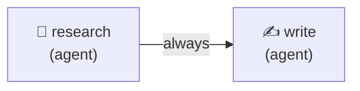
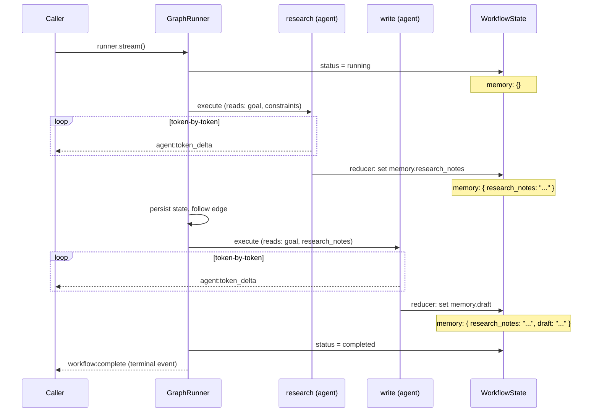
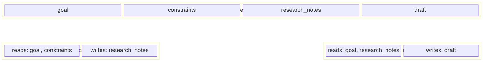

# Streaming

A 2-node linear workflow consumed via `stream()` instead of `run()`. Demonstrates real-time event handling including token-by-token output, typed event discrimination, and the `isTerminalEvent()` type guard.

## Graph



## Lifecycle & State



## Stream Events

The `stream()` method yields typed `StreamEvent` objects. This example handles every event type:

| Event | When | Payload Highlights |
|-------|------|--------------------|
| `workflow:start` | Workflow begins | `run_id` |
| `node:start` | A node begins execution | `node_id`, `node_type` |
| `agent:token_delta` | Each token arrives from the LLM | `token` |
| `node:complete` | A node finishes | `node_id`, `duration_ms` |
| `action:applied` | A state reducer fires | `action_type`, `node_id` |
| `state:persisted` | State saved to persistence | `iteration` |
| `node:retry` | A node retries after failure | `node_id`, `attempt`, `backoff_ms` |
| `budget:threshold_reached` | Cost crosses a budget threshold | `threshold_pct`, `budget_usd` |
| `workflow:complete` | Workflow finishes successfully | `state` (terminal) |
| `workflow:failed` | Workflow fails | `state`, `error` (terminal) |

Terminal events are detected with the `isTerminalEvent()` type guard, which narrows the event type to `workflow:complete | workflow:failed`.

## State Slicing



## Run

```bash
cd packages/orchestrator
ANTHROPIC_API_KEY=sk-ant-... npx tsx examples/streaming/streaming.ts
```

## Expected Output

```
Starting streaming workflow...

[workflow:start] run_id=<run-id>

[node:start] research (agent)
• LLMs are neural networks trained on massive text corpora ...
[node:complete] research (2340ms)
[action:applied] set_memory on research
[state:persisted] iteration=1

[node:start] write (agent)
Large language models are AI systems that have ...
[node:complete] write (1820ms)
[action:applied] set_memory on write
[state:persisted] iteration=2

[workflow:complete] Final status: completed

═══ Research Notes ═══
• Transformers use self-attention to process sequences in parallel ...

═══ Final Draft ═══
Large language models are AI systems trained on vast amounts of text ...

═══ Stats ═══
  Tokens used: 1523
  Cost (USD):  $0.0091
```

## Key Concepts

- **`stream()` vs `run()`**: `run()` returns the final state; `stream()` yields every event as an `AsyncGenerator<StreamEvent>`, enabling real-time UIs, progress bars, and token-by-token rendering
- **Token streaming**: `agent:token_delta` events deliver each token as it arrives from the LLM — write directly to `stdout` for a typewriter effect
- **Typed event discrimination**: Use a `switch` on `event.type` to handle each event with full TypeScript narrowing
- **`isTerminalEvent()` guard**: A type guard that narrows `StreamEvent` to terminal variants, making it safe to access `event.state` and detect completion or failure
- **Same graph, different consumption**: The graph definition is identical to the `research-and-write` example — only the runner call changes from `run()` to `stream()`
