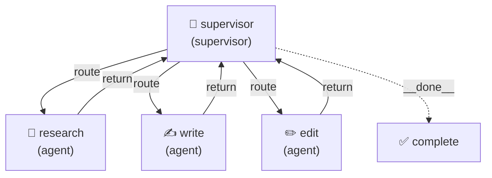
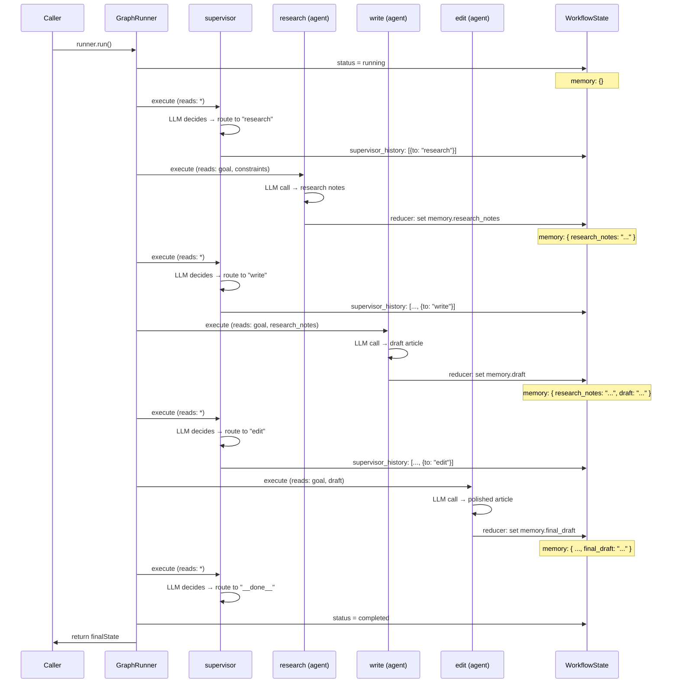
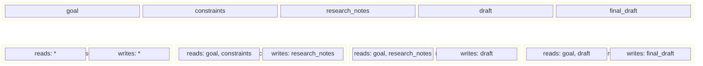

# Supervisor Routing

A 4-node cyclic hub-and-spoke workflow where a Supervisor agent dynamically routes work between Research, Write, and Edit specialists using LLM-powered decisions. Demonstrates the supervisor pattern, cyclic graphs, dynamic routing, and the `__done__` sentinel for termination.

## Graph



## Lifecycle & State



## State Slicing

Each node only sees the keys it declares — the engine enforces zero-trust boundaries. The supervisor has full visibility to make routing decisions.



## Run

```bash
cd packages/orchestrator
ANTHROPIC_API_KEY=sk-ant-... npx tsx examples/supervisor-routing/supervisor-routing.ts
```

## Expected Output

```
[INFO] Starting supervisor-routing workflow...
[INFO] Workflow started: <run-id>
[INFO]   Node started: supervisor (supervisor)
[INFO]   Node complete: supervisor (1200ms)
[INFO]   Node started: research (agent)
[INFO]   Node complete: research (2340ms)
[INFO]   Node started: supervisor (supervisor)
[INFO]   Node complete: supervisor (980ms)
[INFO]   Node started: write (agent)
[INFO]   Node complete: write (2100ms)
[INFO]   Node started: supervisor (supervisor)
[INFO]   Node complete: supervisor (870ms)
[INFO]   Node started: edit (agent)
[INFO]   Node complete: edit (1950ms)
[INFO]   Node started: supervisor (supervisor)
[INFO]   Node complete: supervisor (650ms)
[INFO] Workflow complete: <run-id> (10090ms)

═══ Supervisor Routing History ═══
  [iter 0] → research (Need factual research before writing)
  [iter 2] → write (Research complete, ready to draft)
  [iter 4] → edit (Draft needs polish)
  → __done__ (workflow completed)

═══ Research Notes ═══
• Solar energy capacity grew 26% globally in 2024 ...

═══ Draft ═══
The global power grid is undergoing a historic transformation ...

═══ Final Draft ═══
The way the world generates electricity is changing faster than ...

═══ Stats ═══
  Nodes visited:  supervisor → research → supervisor → write → supervisor → edit → supervisor
  Tokens used:    4821
  Cost (USD):     $0.0289
```
