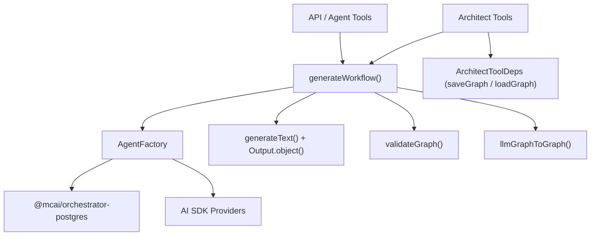
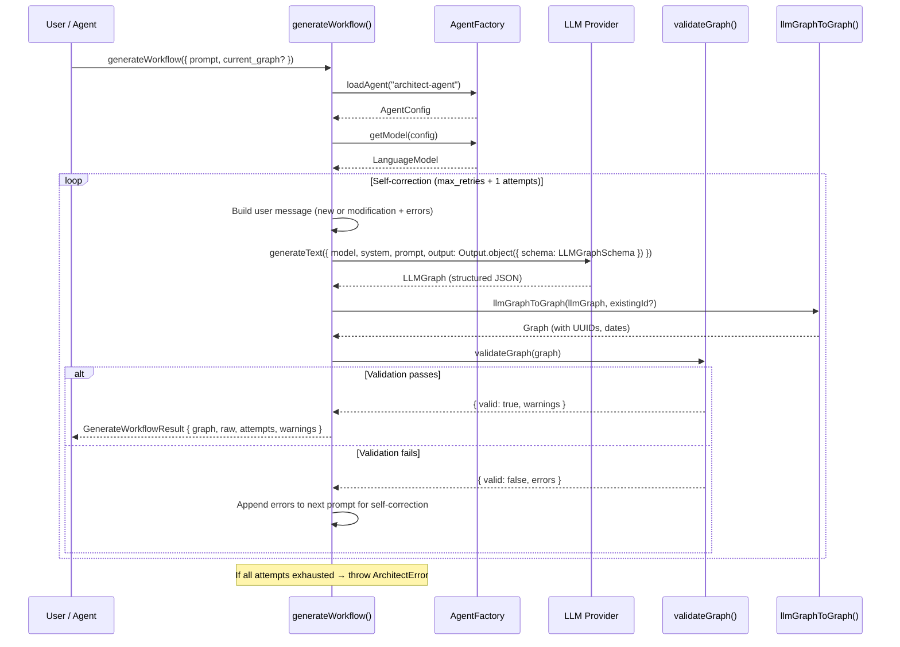
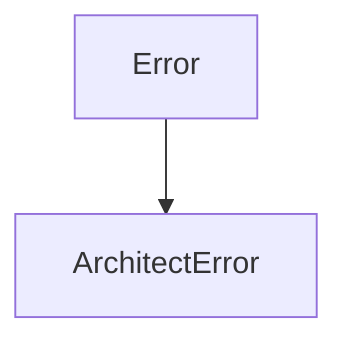

# Architect System — Technical Reference

> **Scope**: This document covers the internal architecture of the architect subsystem in `@mcai/orchestrator`. It is intended for contributors modifying workflow generation, architect tools, schema definitions, or the self-correction loop.

---

## Table of Contents

1. [System Overview](#1-system-overview)
2. [Component Roles](#2-component-roles)
3. [Lifecycle: From Prompt to Graph](#3-lifecycle-from-prompt-to-graph)
4. [generateWorkflow()](#4-generateworkflow)
5. [Schemas](#5-schemas)
6. [Prompt Engineering](#6-prompt-engineering)
7. [Conversion Utilities](#7-conversion-utilities)
8. [Architect Tools](#8-architect-tools)
9. [Graph Validation](#9-graph-validation)
10. [Type System](#10-type-system)
11. [Error Taxonomy](#11-error-taxonomy)
12. [Observability](#12-observability)

---

## 1. System Overview

The architect subsystem translates **natural language prompts** into **executable Graph definitions**. It is the bridge between a user's intent ("Create a research pipeline") and the structured `Graph` objects consumed by the `GraphRunner`. The subsystem enforces a **human-in-the-loop** design — generated graphs are never executed automatically; they must be explicitly published.

| Component | File | Purpose |
|-----------|------|---------|
| **generateWorkflow** | `index.ts` | Core generation loop: prompt → LLM → validation → self-correction → `Graph` |
| **Schemas** | `schemas.ts` | Zod schemas defining the LLM's structured output format |
| **Prompts** | `prompts.ts` | System prompt with graph design rules, examples, and modification guidelines |
| **Tool Definitions** | `tools.ts` | Built-in tools allowing agents to draft, publish, and fetch workflows |
| **Utilities** | `utils.ts` | Bidirectional converters between `Graph` and `LLMGraph` formats |
| **Errors** | `errors.ts` | `ArchitectError` class for generation failures |

### Dependency Graph



The architect reuses the **AgentFactory** from the agent subsystem for model configuration and instantiation. It does not have its own factory — it loads a config for `architect-agent` (or a custom agent ID) from the same DB and cache.

---

## 2. Component Roles

### generateWorkflow — "How are graphs born?"

The core function that orchestrates the full generation pipeline:
1. Loads an LLM model via `AgentFactory`
2. Constructs a context-aware prompt (new graph or modification of existing)
3. Calls `generateText()` with `Output.object()` for schema-constrained structured output
4. Validates the result with `validateGraph()` (referential integrity checks)
5. On validation failure, feeds errors back to the LLM for **self-correction**
6. Returns a validated `Graph` ready for human review

### Schemas — "What can the LLM output?"

Zod schemas that define the exact JSON shape the LLM must produce. The LLM's output is structurally constrained via the AI SDK's `Output.object({ schema })` — it cannot produce free-form text, only valid `LLMGraph` objects.

### Prompts — "How does the LLM know graph rules?"

A comprehensive system prompt that teaches the LLM:
- Graph structural rules (nodes need IDs, edges must reference existing nodes)
- Workflow patterns (linear vs. supervisor-driven hierarchical)
- Naming conventions (kebab-case node IDs, sequential edge IDs)
- Modification mode behavior (preserve existing structure, output the complete graph)

### Architect Tools — "How do agents create workflows?"

Three built-in tools that allow other agents to autonomously manage workflows:
- `architect_draft_workflow` — Generate or modify a graph
- `architect_publish_workflow` — Save a graph to the registry
- `architect_get_workflow` — Fetch a published graph by ID

### Utilities — "How do formats convert?"

Bidirectional converters between the full `Graph` type (with UUIDs, dates, version) and the `LLMGraph` type (lightweight, LLM-friendly). The LLM never sees system-generated fields like `id`, `created_at`, or `version`.

---

## 3. Lifecycle: From Prompt to Graph



### Key Lifecycle Points

| Phase | What Happens | Failure Mode |
|-------|-------------|--------------|
| **Config Load** | `AgentFactory.loadAgent("architect-agent")` loads model config | Falls back to default config if agent not in DB |
| **Model Create** | `AgentFactory.getModel(config)` returns cached or new `LanguageModel` | Missing API key → hard `Error` |
| **Prompt Build** | New graph prompt or modification prompt with existing graph snapshot | — |
| **LLM Call** | `generateText()` with `Output.object()` for structured output | SDK error caught → retry or `ArchitectError` |
| **Conversion** | `llmGraphToGraph()` adds UUIDs, timestamps, version | — |
| **Validation** | `validateGraph()` checks referential integrity, duplicates, reachability | Errors → self-correction loop |
| **Self-Correction** | Validation errors appended to next prompt | Max retries exceeded → `ArchitectError` |

---

## 4. generateWorkflow()

### Function: `generateWorkflow()` ([index.ts](index.ts))

```typescript
export async function generateWorkflow(
  options: GenerateWorkflowOptions
): Promise<GenerateWorkflowResult>
```

**Options:**

| Parameter | Type | Default | Purpose |
|-----------|------|---------|---------|
| `prompt` | `string` | *required* | Natural language description of the desired workflow |
| `current_graph` | `Graph?` | `undefined` | Existing graph to modify (enables modification mode) |
| `architect_agent_id` | `string?` | `"architect-agent"` | Agent ID whose model config to use for the LLM call |
| `max_retries` | `number?` | `2` | Max self-correction attempts on validation failure |

**Returns: `GenerateWorkflowResult`**

| Field | Type | Purpose |
|-------|------|---------|
| `graph` | `Graph` | Validated Graph object, ready for human review |
| `raw` | `LLMGraph` | Raw LLM output before conversion (for debugging) |
| `attempts` | `number` | Number of generation attempts (1 = first try, 2+ = self-corrected) |
| `warnings` | `string[]` | Non-fatal warnings from graph validation |
| `is_modification` | `boolean` | Whether this was a modification of an existing graph |

### Self-Correction Loop

The self-correction mechanism is the architect's primary quality assurance strategy. Instead of simply failing on invalid output, validation errors are fed back to the LLM as additional context:

```
1. Attempt 1: LLM generates graph from prompt
   └─ Validation fails: "Edge 'e3': target node 'analyzer' not found"
2. Attempt 2: LLM sees original prompt + error message
   └─ LLM fixes the dangling edge reference
   └─ Validation passes → return result
```

**Algorithm:**

```
for attempt = 0 to max_retries:
  1. Build user message:
     ├─ New graph: "Design a workflow graph for: {prompt}"
     └─ Modification: "Here is the EXISTING workflow graph:
                        {graphSnapshot}
                        The user wants to modify it: {prompt}
                        Output the COMPLETE modified graph."
  2. If previous attempt had errors:
     └─ Append: "Your previous output had validation errors. Fix them: {errors}"
  3. Call generateText({ model, output: Output.object({ schema: LLMGraphSchema }), system, prompt })
  4. Convert LLM output → Graph (add IDs, dates)
  5. Validate:
     ├─ Valid → return GenerateWorkflowResult
     └─ Invalid → store errors, continue loop

If all attempts exhausted → throw ArchitectError
```

### Modification Mode

When `current_graph` is provided, the architect enters modification mode:

1. The existing graph is converted to an `LLMGraph` snapshot via `graphToLLMSnapshot()` — stripping system fields (ID, dates, version)
2. The snapshot is included in the user message so the LLM sees the full current structure
3. The LLM is instructed to output the **complete** modified graph (not a diff)
4. The original graph's `id` is preserved in the output via `llmGraphToGraph(llm, current_graph.id)`

**Why full graph output instead of diffs:** Diffs are ambiguous and error-prone with LLMs. Outputting the complete graph ensures referential integrity can be validated end-to-end, and avoids the complexity of a merge algorithm.

### LLM Call Configuration

```typescript
const { output: llmGraph } = await generateText({
  model,                                          // From AgentFactory
  output: Output.object({ schema: LLMGraphSchema }), // Structured output
  system: ARCHITECT_SYSTEM_PROMPT,                // Graph design rules
  prompt: userMessage,                            // New or modification prompt
  temperature: 0.3,                               // Low temp for deterministic structure
});
```

**Why `Output.object()` instead of `generateObject()`:** The AI SDK's `Output.object()` with `generateText()` provides schema-constrained structured output while maintaining access to the full `generateText` response shape.

**Why temperature 0.3:** Graph generation requires structural correctness (valid node references, proper edge wiring). A low temperature reduces creative variance in favor of consistent, well-formed output. This is intentionally lower than the agent executor's default of 0.7.

---

## 5. Schemas

### File: [schemas.ts](schemas.ts)

The schema hierarchy mirrors the `Graph` type but is simplified for LLM output — no UUIDs, no timestamps, sensible defaults for optional fields.

### `LLMGraphSchema`

The top-level schema given to the LLM via `Output.object()`:

```typescript
{
  name: string,           // "Research & Write"
  description: string,    // "A pipeline that researches a topic and writes a report"
  nodes: LLMGraphNodeSchema[],
  edges: LLMGraphEdgeSchema[],
  start_node: string,     // "research"
  end_nodes: string[],    // ["writer"] or [] for supervisor-driven
}
```

### `LLMGraphNodeSchema`

```typescript
{
  id: string,                              // "research", "writer", "supervisor"
  type: 'agent' | 'tool' | 'subgraph' | 'synthesizer' | 'router' |
        'supervisor' | 'map' | 'voting' | 'approval' | 'evolution',
  agent_id?: string,                       // Required for agent/supervisor nodes
  tool_id?: string,                        // For tool nodes
  supervisor_config?: {
    agent_id: string,                      // Supervisor agent's config ID
    managed_nodes: string[],               // IDs of worker nodes
    max_iterations: number,                // Default: 10
    completion_condition?: string,         // Optional expression
  },
  read_keys: string[],                     // Default: ["*"]
  write_keys: string[],                    // Default: []
  failure_policy: {
    max_retries: number,                   // Default: 3
    backoff_strategy: 'linear' | 'exponential' | 'fixed',  // Default: 'exponential'
    initial_backoff_ms: number,            // Default: 1000
    max_backoff_ms: number,                // Default: 60000
  },
  requires_compensation: boolean,          // Default: false
}
```

**Why generous defaults:** The LLM should focus on the graph's logical structure — nodes, edges, data flow — not boilerplate config. Defaults like `read_keys: ["*"]` and `failure_policy: { max_retries: 3, backoff_strategy: "exponential" }` ensure usable graphs even when the LLM omits optional fields.

### `LLMGraphEdgeSchema`

```typescript
{
  id: string,                              // "e1", "e2"
  source: string,                          // Source node ID
  target: string,                          // Target node ID
  condition: {
    type: 'always' | 'conditional' | 'map',  // Default: 'always'
    condition?: string,                    // Expression (for conditional edges)
  },
}
```

---

## 6. Prompt Engineering

### File: [prompts.ts](prompts.ts)

The `ARCHITECT_SYSTEM_PROMPT` is a comprehensive instruction set that teaches the LLM how to design valid workflow graphs.

### Prompt Structure

```
1. Role: "You are a Workflow Architect"
2. Structural Rules (8 rules):
   - Every graph needs nodes + valid edges
   - Edge references must be valid
   - Linear workflow pattern (agent nodes + "always" edges)
   - Supervisor workflow pattern (bidirectional edges, empty end_nodes)
   - Naming conventions (kebab-case IDs, sequential edge IDs)
   - Agent nodes need agent_id
   - write_keys for each node
3. Modification Mode Rules:
   - Preserve existing structure unless explicitly asked to change
   - Output the COMPLETE graph
4. Example: Linear Workflow (2-node Research & Write)
5. Example: Supervisor Workflow (supervisor + 2 workers)
```

### Design Decisions

**Why two full examples in the prompt:** LLMs learn patterns from examples more reliably than from abstract rules. The two examples cover the two primary workflow patterns:
- **Linear:** Sequential node execution with `"always"` edge conditions
- **Supervisor:** Hierarchical routing with bidirectional edges and the `__done__` convention

**Why the modification mode rules are explicit:** Without clear instructions to preserve existing nodes and output the complete graph, LLMs tend to generate partial graphs or drop existing nodes when modifying workflows.

---

## 7. Conversion Utilities

### File: [utils.ts](utils.ts)

Two functions handle the bidirectional conversion between the system's `Graph` type and the LLM-friendly `LLMGraph` type.

### `llmGraphToGraph(llm: LLMGraph, existingId?: string): Graph`

Converts LLM output to a full `Graph` object by adding system-generated fields:

| Added Field | Source | Purpose |
|-------------|--------|---------|
| `id` | `existingId` or `uuidv4()` | Preserves ID in modification mode; new UUID otherwise |
| `version` | Hardcoded `"1.0.0"` | Graph versioning |
| `created_at` | `new Date()` | Creation timestamp |
| `updated_at` | `new Date()` | Last modification timestamp |

**Node mapping:** Spreads LLM node fields and explicitly maps `failure_policy` and `requires_compensation` to ensure all fields are present (Zod defaults are resolved at parse time, but the spread ensures no fields are lost).

**Edge mapping:** Explicitly casts `condition.type` to the union type `'always' | 'conditional' | 'map'` because the Zod enum output type is narrower than the `Graph` type's expected union.

### `graphToLLMSnapshot(graph: Graph): LLMGraph`

Converts a full `Graph` back to the LLM-friendly format by stripping system fields:

| Stripped Field | Why |
|----------------|-----|
| `id` | The LLM doesn't need to know the graph's UUID |
| `version` | System-managed, not an LLM concern |
| `created_at` | Dates are noise for the LLM |
| `updated_at` | Dates are noise for the LLM |

**Why explicit field mapping instead of destructuring:** The `Graph` type may evolve to include additional fields. Explicit mapping ensures only the intended fields reach the LLM, preventing accidental leakage of internal metadata.

---

## 8. Architect Tools

### File: [tools.ts](tools.ts)

The architect tools allow other agents (e.g., a high-level orchestrator agent) to autonomously create and manage workflows. They are registered as built-in tools alongside `save_to_memory` in the tool adapter.

### Tool Definitions

#### `architect_draft_workflow`

| Parameter | Type | Purpose |
|-----------|------|---------|
| `prompt` | `string` | Natural language description of the workflow to create or modification to make |
| `current_graph` | `Record<string, unknown>?` | Optional existing graph JSON to modify |

**Returns:** `{ graph, is_modification, attempts, warnings }`

Delegates to `generateWorkflow()` internally.

#### `architect_publish_workflow`

| Parameter | Type | Purpose |
|-----------|------|---------|
| `graph` | `Record<string, unknown>` | The complete graph JSON to publish |
| `overwrite` | `boolean` | Whether to overwrite an existing graph (default: `false`) |

**Returns:** `{ graph_id, name, status: 'published' | 'updated' }` or `{ error, graph_id }` if the graph already exists and `overwrite` is false.

**Guards:**
- Checks for existing graph before publishing
- Returns a descriptive error (not a throw) if the graph exists and `overwrite` is false — this allows the calling agent to decide how to handle the conflict

#### `architect_get_workflow`

| Parameter | Type | Purpose |
|-----------|------|---------|
| `graph_id` | `string` | The ID of the graph to fetch |

**Returns:** `{ graph }` or `{ error, graph_id }` if not found.

### Dependency Injection: `ArchitectToolDeps`

The publish and get tools require persistence, but the orchestrator library does not own the database layer. Persistence is injected at startup:

```typescript
export interface ArchitectToolDeps {
  saveGraph: (graph: Graph) => Promise<void>;
  loadGraph: (graphId: string) => Promise<Graph | null>;
}
```

**`initArchitectTools(deps)`** must be called once at application startup (typically in the API server's bootstrap) before agents can use `architect_publish_workflow` or `architect_get_workflow`. The `architect_draft_workflow` tool does **not** require initialization (it only calls `generateWorkflow()`).

**Why dependency injection instead of direct DB imports:** The orchestrator is a library consumed by multiple hosts (API server, CLI, tests). Each host may have a different persistence strategy. DI keeps the library host-agnostic.

### Tool Execution Router

```typescript
export async function executeArchitectTool(
  toolName: string,
  args: Record<string, unknown>
): Promise<unknown>
```

A simple `switch` dispatcher that routes tool calls to the appropriate handler. Throws on unknown tool names.

**Handler Pattern:**

Each handler (`handleDraftWorkflow`, `handlePublishWorkflow`, `handleGetWorkflow`) follows the same pattern:
1. Cast `args` to the expected types (tools are Zod-validated before reaching the handler)
2. Check initialization (`_deps !== null`) for persistence-dependent tools
3. Execute the operation
4. Return a structured result object (never throws for "not found" cases — returns `{ error }` instead)

**Why handlers return errors instead of throwing:** When an agent calls a tool that returns `{ error: "Graph not found" }`, the LLM can see the error and decide how to proceed (e.g., create the graph, try a different ID). A thrown exception would terminate the tool call and lose this decision-making opportunity.

---

## 9. Graph Validation

### Integration: [graph-validator.ts](../validation/graph-validator.ts)

The architect delegates structural validation to `validateGraph()`, which is shared with other subsystems. Validation returns a `ValidationResult` containing errors (hard failures) and warnings (potential issues).

### Validation Checks

| Check | Severity | What It Catches |
|-------|----------|-----------------|
| Start node exists | Error | `start_node` references a non-existent node |
| End nodes exist | Error | `end_nodes` contains non-existent node IDs |
| Edge references valid | Error | Edge `source` or `target` references non-existent node |
| No duplicate node IDs | Error | Two nodes with the same `id` |
| No duplicate edge IDs | Error | Two edges with the same `id` |
| Supervisor config present | Error | Supervisor node missing `supervisor_config` |
| Supervisor managed nodes exist | Error | `managed_nodes` references non-existent nodes |
| All nodes reachable | Warning | Nodes unreachable from `start_node` |
| No dead-end nodes | Warning | Non-end nodes with no outgoing edges |
| Supervisor edges to workers | Warning | Supervisor has no edge to a managed node |
| Self-managing supervisor | Warning | Supervisor lists itself in `managed_nodes` |
| Cycles without end nodes | Warning | Graph has cycles but no `end_nodes` (potential infinite loop) |

**Why warnings don't block generation:** Many valid workflow patterns trigger warnings. A supervisor-driven graph always has cycles (supervisor → worker → supervisor). An isolated node might be intentional draft structure. Warnings are surfaced in the result for human review.

---

## 10. Type System

### `GenerateWorkflowOptions` ([index.ts](index.ts))

Input options for the generation pipeline:

```typescript
interface GenerateWorkflowOptions {
  prompt: string;                    // Natural language description
  current_graph?: Graph;             // Existing graph for modification mode
  architect_agent_id?: string;       // Default: "architect-agent"
  max_retries?: number;              // Default: 2
}
```

### `GenerateWorkflowResult` ([index.ts](index.ts))

Output of the generation pipeline:

```typescript
interface GenerateWorkflowResult {
  graph: Graph;                      // Validated, ready for human review
  raw: LLMGraph;                     // Raw LLM output (for debugging)
  attempts: number;                  // 1 = first try, 2+ = self-corrected
  warnings: string[];                // Non-fatal validation warnings
  is_modification: boolean;          // true if current_graph was provided
}
```

### `LLMGraph` ([schemas.ts](schemas.ts))

Inferred from `LLMGraphSchema` via `z.infer`:

```typescript
type LLMGraph = z.infer<typeof LLMGraphSchema>;
```

This is the LLM-facing graph format — no IDs, no dates, no version. It contains only the structural and logical fields that the LLM needs to reason about.

### `ArchitectToolDeps` ([tools.ts](tools.ts))

Persistence interface injected at startup:

```typescript
interface ArchitectToolDeps {
  saveGraph: (graph: Graph) => Promise<void>;
  loadGraph: (graphId: string) => Promise<Graph | null>;
}
```

### `ToolDefinition` (from `../mcp/tool-adapter.ts`)

Each architect tool conforms to:

```typescript
interface ToolDefinition {
  description: string;
  parameters: ZodSchema;        // Zod schema for input validation
}
```

---

## 11. Error Taxonomy



| Error Class | Source | Retryable? | Handling |
|-------------|--------|-----------|----------|
| `ArchitectError` | `generateWorkflow()` | No — max retries exhausted | Thrown after all self-correction attempts fail. Contains the last error message for debugging. |

**Why only one error class:** The architect has a single failure mode — generation failed after all retries. LLM call failures and validation errors are handled internally via the self-correction loop. Only when all attempts are exhausted does an error propagate to the caller.

**Errors from dependencies:**
- `AgentFactory` errors (e.g., `AgentNotFoundError`) propagate through — these are not caught by the retry loop
- `validateGraph()` errors are **never thrown** — they're returned as `{ errors: string[] }` and fed back to the LLM

---

## 12. Observability

### Structured Logging

The architect uses `createLogger(namespace)` for structured JSON logging:

| Namespace | Component |
|-----------|-----------|
| `architect` | Core `generateWorkflow()` function |
| `architect.tools` | Tool definitions and execution handlers |

**Key log events:**

| Event | Level | When |
|-------|-------|------|
| `generation_started` | info | `generateWorkflow()` begins (includes truncated prompt, `is_modification` flag) |
| `llm_output_received` | info | LLM returns structured output (includes attempt number, graph name) |
| `validation_failed` | warn | Graph validation found errors (includes attempt number, error list) |
| `generation_attempt_failed` | warn | LLM call threw an exception (includes detailed error context: name, type, cause, status code, response body, stack trace) |
| `generation_complete` | info | Valid graph produced (includes node/edge counts, attempt count, warning count) |
| `architect_tools_initialized` | info | `initArchitectTools()` called successfully |
| `tool_draft` | info | `architect_draft_workflow` tool invoked (includes truncated prompt) |
| `tool_publish` | info | Graph published/updated via tool (includes `graph_id`, `overwrite` flag) |
