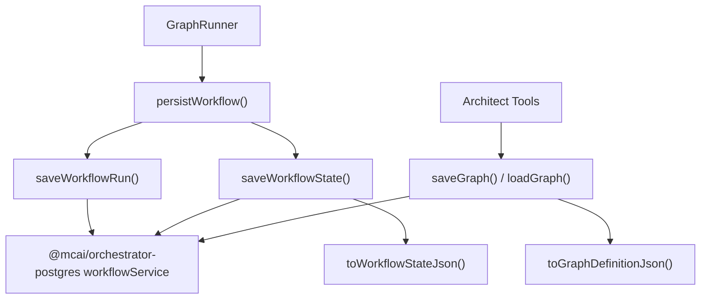
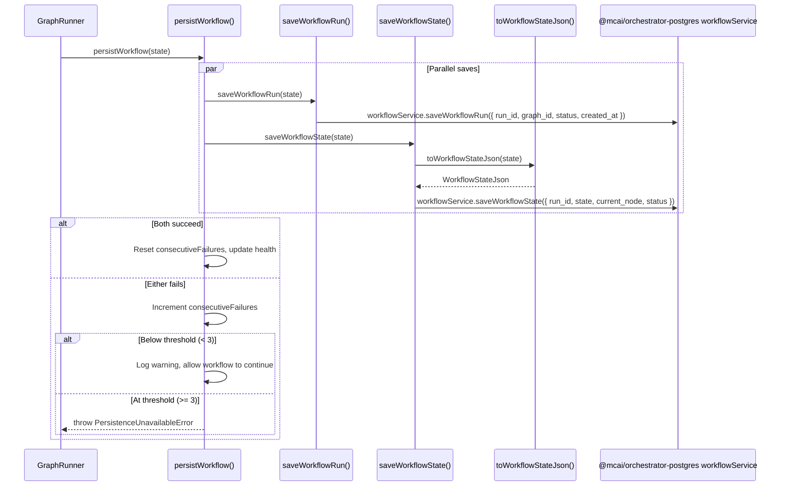
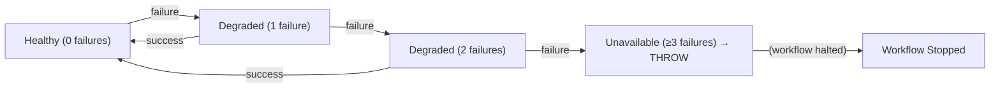
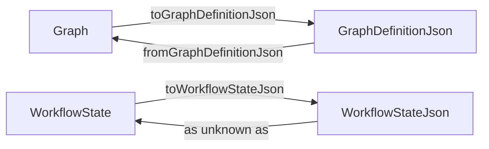
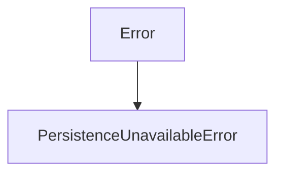

# DB Persistence Layer — Technical Reference

> **Scope**: This document covers the internal architecture of the persistence layer in `@mcai/orchestrator`. It is intended for contributors modifying state persistence, crash recovery, type conversion, or failure handling logic.

---

## Table of Contents

1. [System Overview](#1-system-overview)
2. [Component Roles](#2-component-roles)
3. [Lifecycle: From State to Database](#3-lifecycle-from-state-to-database)
4. [persistWorkflow()](#4-persistworkflow)
5. [CRUD Operations](#5-crud-operations)
6. [Type Conversion Layer](#6-type-conversion-layer)
7. [Failure Handling & Health Tracking](#7-failure-handling--health-tracking)
8. [Type System](#8-type-system)
9. [Event Sourcing & Compaction](#9-event-sourcing--compaction)
10. [Error Taxonomy](#10-error-taxonomy)
11. [Observability](#11-observability)

---

## 1. System Overview

The DB persistence layer is the bridge between the orchestrator's in-memory `WorkflowState` / `Graph` types and the `@mcai/orchestrator-postgres` package (which owns the actual database schema and queries). This layer has three responsibilities:

1. **Type conversion** — Maps between orchestrator domain types and DB-safe JSON types
2. **Failure resilience** — Tracks consecutive persistence failures and degrades gracefully
3. **CRUD operations** — Provides save/load functions for graphs, workflow runs, and state snapshots

The layer exists in two locations:

| Location | Structure | Status |
|----------|-----------|--------|
| `persistence.ts` (root) | Complete file with all functions | **Active** — used by barrel export (`index.ts`) |
| `persistence/` (subdirectory) | Split into `index.ts`, `helpers.ts`, `errors.ts` | Refactored version (not yet wired into barrel) |

The **`persistence.ts`** monolith is the currently active implementation. The subdirectory version is a structural refactor that separates concerns but is functionally equivalent:

| File | Purpose |
|------|---------|
| `persistence/index.ts` | `persistWorkflow()` — the high-level combined persistence function with health tracking |
| `persistence/helpers.ts` | CRUD operations + type converters |
| `persistence/errors.ts` | `PersistenceUnavailableError` class |

### Dependency Graph



---

## 2. Component Roles

### persistWorkflow — "How is state saved during execution?"

The primary entry point called by the `GraphRunner` after each node execution. It:
1. Saves the workflow run record (metadata: run ID, graph ID, status)
2. Saves a state snapshot (full serialized `WorkflowState`)
3. Tracks persistence health and degrades gracefully on transient failures

### CRUD Operations — "How are individual records managed?"

Six functions providing atomic save/load operations:
- `saveGraph()` / `loadGraph()` — Graph definitions (used by architect tools)
- `saveWorkflowRun()` / `loadWorkflowRun()` — Workflow run records (metadata)
- `saveWorkflowState()` / `loadLatestWorkflowState()` — State snapshots (audit trail + crash recovery)

### Type Converters — "How do types cross the boundary?"

Three conversion functions that map between orchestrator domain types and `@mcai/orchestrator-postgres` JSON types:
- `toGraphDefinitionJson()` — `Graph` → `GraphDefinitionJson`
- `fromGraphDefinitionJson()` — `GraphDefinitionJson` → `Graph`
- `toWorkflowStateJson()` — `WorkflowState` → `WorkflowStateJson`

---

## 3. Lifecycle: From State to Database



### Key Lifecycle Points

| Phase | What Happens | Failure Mode |
|-------|-------------|--------------|
| **Parallel Save** | `saveWorkflowRun()` and `saveWorkflowState()` run concurrently via `Promise.all()` | Either failing fails the whole persistence attempt |
| **Health Update (success)** | `consecutiveFailures` reset to 0, counters updated | — |
| **Health Update (failure)** | `consecutiveFailures` incremented, failure logged | — |
| **Threshold Check** | If `consecutiveFailures >= 3` → throw `PersistenceUnavailableError` | Halts the workflow to prevent data loss |
| **Degraded Mode** | If `consecutiveFailures < 3` → warn and continue | Workflow proceeds without persistence (at risk) |

---

## 4. persistWorkflow()

### Function: `persistWorkflow()` ([persistence.ts](persistence.ts))

```typescript
export async function persistWorkflow(state: WorkflowState): Promise<void>
```

| Parameter | Type | Purpose |
|-----------|------|---------|
| `state` | `WorkflowState` | The current workflow state to persist |

The combined persistence function used by the `GraphRunner`. Saves both the run record and a state snapshot in parallel, with failure tracking.

**Algorithm:**

```
1. Promise.all([saveWorkflowRun(state), saveWorkflowState(state)])
2. On success:
   ├─ Reset consecutiveFailures to 0
   ├─ Update lastSuccessAt
   ├─ Increment totalSuccesses
   └─ Log debug "state_persisted"
3. On failure:
   ├─ Increment consecutiveFailures
   ├─ Update lastFailureAt
   ├─ Increment totalFailures
   ├─ Log error "persistence_failed"
   ├─ If consecutiveFailures >= MAX_CONSECUTIVE_FAILURES (3):
   │   └─ throw PersistenceUnavailableError
   └─ Else:
       └─ Log warn "persistence_degraded" (workflow continues)
```

**Why parallel saves:** The workflow run and state snapshot are independent records in different tables. Saving them concurrently halves the persistence latency.

**Why `Promise.all()` instead of `Promise.allSettled()`:** If either save fails, the state is only partially persisted — an inconsistent state that could cause recovery issues. Treating both saves as a single atomic unit (both succeed or both "fail") simplifies the failure model.

---

## 5. CRUD Operations

### File: [persistence.ts](persistence.ts) (CRUD section)

All operations delegate to `@mcai/orchestrator-postgres`'s `workflowService` after type conversion.

### Graph Operations

#### `saveGraph(graph: Graph): Promise<void>`

Persists a graph definition to the registry.

```typescript
await workflowService.saveGraph({
  id: graph.id,
  name: graph.name,
  description: graph.description,
  version: graph.version,
  definition: toGraphDefinitionJson(graph),
});
```

**Used by:** Architect tools (`architect_publish_workflow`), API endpoints.

#### `loadGraph(graph_id: string): Promise<Graph | null>`

Loads a graph definition by ID, converting back from DB format.

**Used by:** Architect tools (`architect_get_workflow`), workflow triggers.

### Workflow Run Operations

#### `saveWorkflowRun(state: WorkflowState): Promise<void>`

Creates or updates a workflow run record (lightweight metadata).

| DB Field | Source |
|----------|--------|
| `run_id` | `state.run_id` |
| `graph_id` | `state.workflow_id` |
| `status` | `state.status` |
| `created_at` | `state.created_at` |

#### `loadWorkflowRun(run_id: string): Promise<DbWorkflowRun | null>`

Loads a workflow run record by ID. Returns the `@mcai/orchestrator-postgres` `WorkflowRun` type directly.

### State Snapshot Operations

#### `saveWorkflowState(state: WorkflowState): Promise<void>`

Saves a complete state snapshot for the audit trail. Each call creates a new snapshot row — the history of all snapshots enables crash recovery and debugging.

| DB Field | Source |
|----------|--------|
| `run_id` | `state.run_id` |
| `state` | `toWorkflowStateJson(state)` |
| `current_node` | `state.current_node` |
| `status` | `state.status` |

#### `loadLatestWorkflowState(run_id: string): Promise<WorkflowState | null>`

Loads the most recent state snapshot for a run. Used for **crash recovery** — if a workflow was interrupted, the `GraphRunner` can resume from the latest persisted state.

**Type safety note:** The DB returns `WorkflowStateJson` (an index-signature type), which is structurally identical to `WorkflowState` (a concrete interface). The double-cast (`as unknown as WorkflowState`) is isolated in this function to keep the rest of the codebase type-safe.

---

## 6. Type Conversion Layer

The persistence layer maintains a strict boundary between orchestrator domain types and DB-safe JSON types. Three conversion functions handle this mapping.

### `toGraphDefinitionJson(graph: Graph): GraphDefinitionJson`

```
Graph (orchestrator)          →  GraphDefinitionJson (DB)
─────────────────────────────────────────────────────────
graph.id                      →  id
graph.name                    →  name
graph.nodes (typed array)     →  nodes (unknown[])
graph.edges (typed array)     →  edges (unknown[])
graph.start_node              →  start_node
graph.end_nodes               →  end_nodes
graph.description             →  description
graph.version                 →  version
```

**Why `as unknown[]` for nodes/edges:** The DB schema uses `unknown[]` for maximum flexibility (the JSON column stores arbitrary structures). The orchestrator's strongly-typed `GraphNode[]` and `GraphEdge[]` must be widened at the persistence boundary.

### `fromGraphDefinitionJson(def: GraphDefinitionJson): Graph`

The reverse conversion uses `as unknown as Graph` — a double-cast. This is safe because the DB only stores values that were originally created by `toGraphDefinitionJson()`, preserving the structural contract.

### `toWorkflowStateJson(state: WorkflowState): WorkflowStateJson`

Explicit field-by-field mapping of all 22 `WorkflowState` fields to the DB-safe format:

| Fields Mapped |
|---------------|
| `workflow_id`, `run_id`, `status`, `current_node`, `memory`, `goal`, `constraints`, `iteration_count`, `visited_nodes`, `supervisor_history`, `total_tokens_used`, `max_token_budget`, `started_at`, `created_at`, `updated_at`, `retry_count`, `max_retries`, `last_error`, `waiting_for`, `waiting_since`, `waiting_timeout_at`, `max_execution_time_ms`, `max_iterations`, `compensation_stack` |

**Why explicit mapping instead of spread:** If `WorkflowState` gains new fields that shouldn't be persisted (e.g., transient runtime state), the explicit mapping ensures they're excluded. A spread (`{ ...state }`) would silently persist everything.

---

## 7. Failure Handling & Health Tracking

### Design Philosophy

The persistence layer implements a **graceful degradation** strategy:



**Why not fail immediately:** Transient database issues (connection blips, brief timeouts) shouldn't kill a workflow that's making good progress. The LLM calls are far more expensive than re-persisting a missed state.

**Why fail at threshold:** After 3 consecutive failures, the database is likely in a sustained outage. Continuing to execute without persistence risks unbounded data loss — the workflow might complete successfully but with no record of its execution.

### PersistenceHealth

Module-level singleton tracking persistence reliability:

```typescript
interface PersistenceHealth {
  consecutiveFailures: number;   // Resets to 0 on any success
  lastSuccessAt: Date | null;    // Timestamp of last successful persist
  lastFailureAt: Date | null;    // Timestamp of last failed persist
  totalFailures: number;         // Lifetime failure count
  totalSuccesses: number;        // Lifetime success count
}
```

### Health API

| Function | Purpose |
|----------|---------|
| `getPersistenceHealth()` | Returns a readonly snapshot of current health metrics |
| `resetPersistenceHealth()` | Resets all counters to zero (for testing) |

### Constants

| Constant | Value | Purpose |
|----------|-------|---------|
| `MAX_CONSECUTIVE_FAILURES` | `3` | Threshold before throwing `PersistenceUnavailableError` |

---

## 8. Type System

### Orchestrator Types (Domain)

| Type | Source | Purpose |
|------|--------|---------|
| `Graph` | `../types/graph.ts` | Full graph definition with typed nodes, edges, dates |
| `WorkflowState` | `../types/state.ts` | Complete runtime state of a workflow execution |

### DB Types (Persistence)

| Type | Source | Purpose |
|------|--------|---------|
| `GraphDefinitionJson` | `@mcai/orchestrator-postgres` | DB-safe graph representation (`unknown[]` for nodes/edges) |
| `WorkflowStateJson` | `@mcai/orchestrator-postgres` | DB-safe state representation (index-signature type) |
| `WorkflowRun` (as `DbWorkflowRun`) | `@mcai/orchestrator-postgres` | Workflow run metadata record |

### Conversion Direction



---

## 9. Event Sourcing & Compaction

Alongside the state snapshot persistence (above), the orchestrator supports an **event log** for durable execution. Events are stored in an append-only log and replayed through pure reducers during crash recovery.

### File: [event-log.ts](event-log.ts)

The `EventLogWriter` interface abstracts the event store with three implementations:

| Implementation | Use Case | Storage |
|---------------|----------|---------|
| `DrizzleEventLogWriter` | Production | PostgreSQL via `@mcai/orchestrator-postgres` |
| `InMemoryEventLogWriter` | Unit tests | In-memory `Map` |
| `NoopEventLogWriter` | Default | Discards all writes |

### Interface Methods

| Method | Signature | Purpose |
|--------|-----------|---------|
| `append()` | `(event: NewWorkflowEvent) => Promise<void>` | Append an event to the log |
| `loadEvents()` | `(run_id: string) => Promise<WorkflowEvent[]>` | Load all events for a run (ordered by sequence_id) |
| `loadEventsAfter()` | `(run_id, afterSeqId) => Promise<WorkflowEvent[]>` | Load events after a checkpoint |
| `getLatestSequenceId()` | `(run_id: string) => Promise<number>` | Get the highest sequence_id (-1 if none) |
| `checkpoint()` | `(run_id, seqId, state) => Promise<void>` | Save a state snapshot at a sequence_id |
| `loadCheckpoint()` | `(run_id: string) => Promise<{...} \| null>` | Load the latest checkpoint |
| `compact()` | `(run_id, beforeSeqId) => Promise<number>` | Delete events at or before a sequence_id |

### Database Tables

#### `workflow_events` — Append-Only Event Log

| Column | Type | Purpose |
|--------|------|---------|
| `id` | `uuid` PK | Event identifier |
| `run_id` | `uuid` FK → `workflow_runs` | Workflow run reference (cascade delete) |
| `sequence_id` | `integer` | Monotonically increasing event order |
| `event_type` | `text` | `workflow_started`, `node_started`, `action_dispatched`, `internal_dispatched` |
| `node_id` | `text` | Node identifier (nullable) |
| `action` | `jsonb` | Full serialized `Action` (for `action_dispatched` events) |
| `internal_type` | `text` | Internal action type (for `internal_dispatched` events) |
| `internal_payload` | `jsonb` | Internal action payload |
| `created_at` | `timestamp` | Event timestamp |

**Indexes:** `(run_id, sequence_id)` for ordered replay, `(run_id, event_type)` for filtered queries.

#### `workflow_checkpoints` — State Snapshots for Compaction

| Column | Type | Purpose |
|--------|------|---------|
| `id` | `uuid` PK | Checkpoint identifier |
| `run_id` | `uuid` FK → `workflow_runs` | Workflow run reference (cascade delete) |
| `sequence_id` | `integer` | Event sequence_id this checkpoint covers |
| `state` | `jsonb` | Full serialized `WorkflowState` |
| `created_at` | `timestamp` | Checkpoint timestamp |

**Index:** `(run_id, sequence_id)` for checkpoint lookup.

### WorkflowService Event Methods

| Method | Purpose |
|--------|---------|
| `appendEvent()` | Insert a row into `workflow_events` |
| `loadEvents()` | Select all events for a run, ordered by `sequence_id` |
| `loadEventsAfter()` | Select events with `sequence_id > afterSeqId` |
| `getLatestSequenceId()` | `MAX(sequence_id)` for a run |
| `saveCheckpoint()` | Insert a row into `workflow_checkpoints` |
| `loadLatestCheckpoint()` | Select the highest-sequence checkpoint for a run |
| `compactEvents()` | Transactional delete of events with `sequence_id <= beforeSeqId` |

---

## 10. Error Taxonomy



| Error Class | Source | Retryable? | Handling |
|-------------|--------|-----------|----------|
| `PersistenceUnavailableError` | `persistWorkflow()` | No — sustained outage | Thrown after 3+ consecutive failures. Halts the workflow to prevent data loss. Includes last success timestamp for diagnostics. |

**Error message format:**
```
Database persistence unavailable after 3 consecutive failures.
Last success: 2026-02-26T12:00:00.000Z.
Halting workflow to prevent data loss.
```

---

## 11. Observability

### Structured Logging

| Namespace | Component |
|-----------|-----------|
| `db.persistence` | `persistWorkflow()` and health tracking |

### Key Log Events

| Event | Level | When | Fields |
|-------|-------|------|--------|
| `state_persisted` | debug | Both saves succeeded | `run_id`, `status`, `iteration` |
| `persistence_failed` | error | Either save threw | `run_id`, `consecutive_failures`, `total_failures` |
| `persistence_degraded` | warn | Failure below threshold, workflow continues | `consecutive_failures`, `max_before_halt` |
