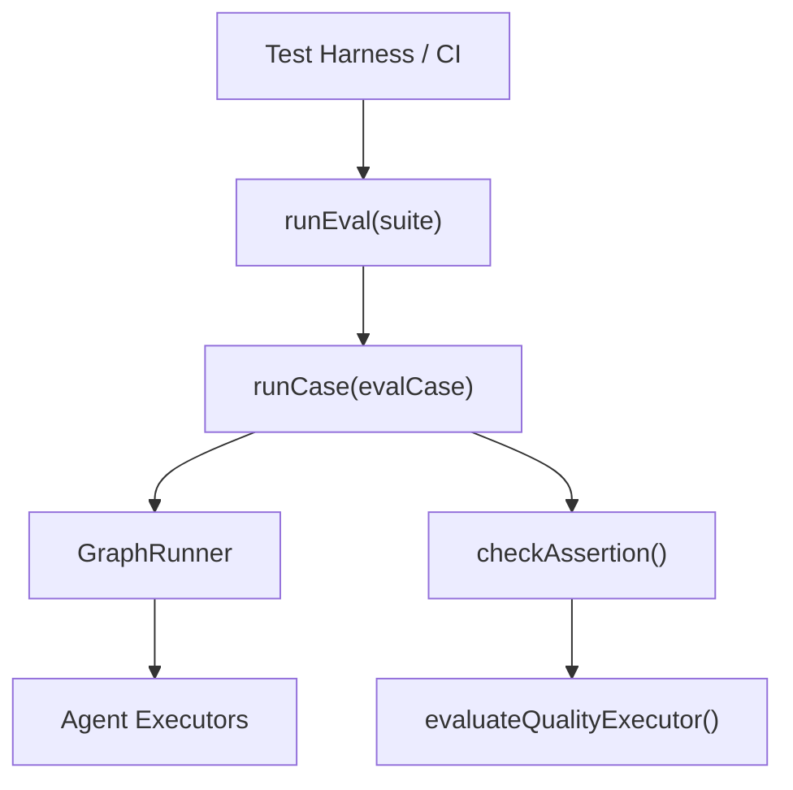
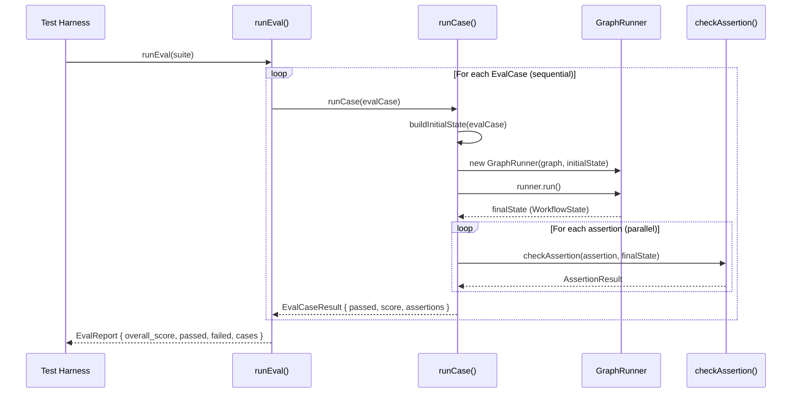

# Eval System — Technical Reference

> **Scope**: This document covers the internal architecture of the eval subsystem in `@mcai/orchestrator`. It is intended for contributors writing eval suites, adding new assertion types, or modifying the eval runner.

---

## Table of Contents

1. [System Overview](#1-system-overview)
2. [Component Roles](#2-component-roles)
3. [Lifecycle: From Suite to Report](#3-lifecycle-from-suite-to-report)
4. [Eval Runner](#4-eval-runner)
5. [Assertion Engine](#5-assertion-engine)
6. [Type System](#6-type-system)
7. [Scoring Model](#7-scoring-model)

---

## 1. System Overview

The eval subsystem provides **automated quality assurance** for workflows. It runs complete workflow graphs against predefined test cases and evaluates the final state using a pluggable assertion system. The subsystem bridges two worlds:

- **Deterministic assertions** — exact value matching, key existence, regex patterns
- **LLM-as-judge assertions** — semantic evaluation via the evaluator executor

| Component | File | Purpose |
|-----------|------|---------|
| **Eval Runner** | `runner.ts` | Orchestrates suite execution: builds initial state → runs `GraphRunner` → checks assertions → aggregates results |
| **Assertion Engine** | `assertions.ts` | Evaluates individual assertions against final `WorkflowState` |
| **Type Definitions** | `types.ts` | `EvalSuite`, `EvalCase`, `EvalAssertion`, `AssertionResult`, `EvalCaseResult`, `EvalReport` |
| **Public API** | `index.ts` | Re-exports `runEval`, `checkAssertion`, and all types |

### Dependency Graph



The eval runner creates a fresh `GraphRunner` per test case, executes the full workflow, then evaluates assertions against the terminal `WorkflowState`. For `llm_judge` assertions, it delegates to the evaluator executor from the agent subsystem.

---

## 2. Component Roles

### Eval Runner — "How are workflows tested?"

The runner takes an `EvalSuite` (named collection of test cases) and:
1. Iterates through each `EvalCase` **sequentially** (not parallel — avoids resource contention)
2. Builds a `WorkflowState` from the case's `input`
3. Instantiates a `GraphRunner` with the case's `graph` and runs it to completion
4. Checks all assertions against the final state
5. Aggregates per-case results into an `EvalReport` with an overall score

### Assertion Engine — "How is output quality measured?"

A dispatch-based evaluator that supports six assertion types:
- **`status_equals`** — Final workflow status matches expected value
- **`memory_contains`** — A specific key exists in final memory
- **`memory_matches`** — A memory value matches via exact, contains, or regex mode
- **`llm_judge`** — An LLM evaluator scores the output against criteria
- **`node_visited`** — A specific graph node was executed during the run
- **`token_budget_respected`** — Total token usage stayed within budget

---

## 3. Lifecycle: From Suite to Report



### Key Lifecycle Points

| Phase | What Happens | Failure Mode |
|-------|-------------|--------------|
| **State Build** | `buildInitialState()` creates a `WorkflowState` from `evalCase.input` | — |
| **Graph Execution** | Full `GraphRunner.run()` against the test graph | Runtime error → case fails with `score: 0`, error captured |
| **Assertion Check** | All assertions evaluated in parallel via `Promise.all()` | Individual assertion failure → `passed: false` with message |
| **Scoring** | `score = passedCount / totalAssertions` per case | No assertions → `score: 1.0` (vacuous truth) |
| **Aggregation** | `overall_score = mean(case scores)` | No cases → `overall_score: 0` |

---

## 4. Eval Runner

### Function: `runEval()` ([runner.ts](runner.ts))

```typescript
export async function runEval(suite: EvalSuite): Promise<EvalReport>
```

| Parameter | Type | Purpose |
|-----------|------|---------|
| `suite` | `EvalSuite` | Named collection of eval cases to execute |

**Returns: `EvalReport`** — Aggregated results with overall score, pass/fail counts, and per-case details.

**Why sequential execution:** Cases are run in a `for...of` loop, not `Promise.all()`. This prevents resource contention — each case spins up a full `GraphRunner` with LLM calls, and parallel execution could hit API rate limits or exhaust memory.

### Function: `runCase()` (internal)

```typescript
async function runCase(evalCase: EvalCase): Promise<EvalCaseResult>
```

Runs a single eval case end-to-end:

```
1. Build initial WorkflowState from evalCase.input
2. Create GraphRunner(evalCase.graph, initialState)
3. Execute runner.run() → finalState
4. Check all assertions in parallel against finalState
5. Compute score = passedAssertions / totalAssertions
6. Return EvalCaseResult

CATCH:
  └─ Any error → return { passed: false, score: 0, error: message }
```

**Error resilience:** If the `GraphRunner` throws (timeout, agent failure, validation error), the case doesn't crash the suite. It returns a zero-score result with the error message captured for debugging.

### Function: `buildInitialState()` (internal)

Constructs a `WorkflowState` from an eval case's input `Record`:

| Field | Source | Default |
|-------|--------|---------|
| `workflow_id` | `evalCase.graph.id` | — |
| `run_id` | `uuidv4()` | Fresh UUID per case |
| `goal` | `evalCase.input.goal` | `"Eval case execution"` |
| `constraints` | `evalCase.input.constraints` | `[]` |
| `memory` | `evalCase.input` (entire input object) | — |
| `max_execution_time_ms` | `evalCase.timeout_ms` | `60000` (1 min) |
| `max_token_budget` | `evalCase.input.max_token_budget` | `undefined` (no limit) |
| `status` | — | `"pending"` |
| `iteration_count` | — | `0` |
| `max_iterations` | — | `50` |

**Why `memory` is set to the entire `input`:** The input object serves double-duty — it contains both control fields (`goal`, `constraints`) and data fields that agents will read. Setting `memory = evalCase.input` makes all input values available to agents via their `read_keys`.

---

## 5. Assertion Engine

### Function: `checkAssertion()` ([assertions.ts](assertions.ts))

```typescript
export async function checkAssertion(
  assertion: EvalAssertion,
  finalState: WorkflowState,
): Promise<AssertionResult>
```

A `switch`-based dispatcher that evaluates a single assertion against the final workflow state.

### Assertion Types

#### `status_equals`

Checks that the workflow terminated with the expected status.

```typescript
{ type: "status_equals", expected: "completed" }
```

| Check | `finalState.status === assertion.expected` |
|-------|-------------------------------------------|
| Actual | `finalState.status` |
| Message | `Expected status "completed", got "failed"` |

**Common use:** Verify a workflow completed successfully rather than timing out or failing.

---

#### `memory_contains`

Checks that a specific key exists in the final memory (value doesn't matter).

```typescript
{ type: "memory_contains", key: "research_output" }
```

| Check | `assertion.key in finalState.memory` |
|-------|--------------------------------------|
| Actual | `Object.keys(finalState.memory)` |

**Common use:** Verify an agent produced its expected output key.

---

#### `memory_matches`

Checks that a memory value matches an expected value or pattern. Supports three modes:

| Mode | Comparison Logic |
|------|-----------------|
| `exact` | `JSON.stringify(actual) === JSON.stringify(expected)` |
| `contains` | String `includes()` (falls back to JSON.stringify for non-strings) |
| `regex` | `new RegExp(pattern).test(value)` (string values only) |

```typescript
{ type: "memory_matches", key: "draft", mode: "contains", expected: "conclusion" }
{ type: "memory_matches", key: "status_code", mode: "exact", expected: 200 }
{ type: "memory_matches", key: "email", mode: "regex", pattern: "^[^@]+@[^@]+$" }
```

**Design note:** The `pattern` field is used for regex mode, while `expected` is used for exact and contains modes. Both fields exist on the type to support all three modes cleanly.

---

#### `llm_judge`

Delegates to the evaluator executor for semantic scoring. This is the most powerful assertion type — it can evaluate subjective quality criteria that deterministic checks cannot.

```typescript
{ type: "llm_judge", criteria: "Is the output well-structured?", threshold: 0.7, evaluator_agent_id: "eval-agent" }
```

| Parameter | Purpose |
|-----------|---------|
| `criteria` | Natural language description of what to evaluate |
| `threshold` | Minimum score (0.0–1.0) to pass |
| `evaluator_agent_id` | Agent ID whose model config to use for the evaluation LLM |

**Flow:**
1. Calls `evaluateQualityExecutor(evaluator_agent_id, criteria, finalState.memory)`
2. If `evalResult.score >= threshold` → pass
3. On failure, includes both the score and the LLM's reasoning in the message

**Error handling:** If the evaluator throws (model unavailable, timeout), the assertion fails with the error message — it does not crash the case.

---

#### `node_visited`

Checks that a specific graph node was executed during the workflow run.

```typescript
{ type: "node_visited", node_id: "research" }
```

| Check | `finalState.visited_nodes.includes(assertion.node_id)` |
|-------|--------------------------------------------------------|
| Actual | `finalState.visited_nodes` |

**Common use:** Verify that a supervisor routed to the expected worker, or that a conditional branch was taken.

---

#### `token_budget_respected`

Checks that total token usage stayed within the configured budget.

```typescript
{ type: "token_budget_respected" }
```

| Check | `!finalState.max_token_budget \|\| finalState.total_tokens_used <= finalState.max_token_budget` |
|-------|-----------------------------------------------------------------------------------------------|
| Actual | `{ used: total_tokens_used, budget: max_token_budget }` |

**Passes if:** No budget was set (`max_token_budget` is undefined/null) OR usage is within budget.

---

### Unknown Assertion Types

The `default` branch returns `{ passed: false, message: "Unknown assertion type: ..." }` — unknown types fail silently rather than throwing, preventing a single misconfigured assertion from crashing the entire suite.

---

## 6. Type System

### `EvalSuite` ([types.ts](types.ts))

A named collection of eval cases:

```typescript
interface EvalSuite {
  name: string;         // "Research Pipeline Tests"
  cases: EvalCase[];    // Individual test cases
}
```

### `EvalCase`

A single test case: a graph, input data, and assertions to verify:

```typescript
interface EvalCase {
  name: string;                          // "Basic research query"
  graph: Graph;                          // The workflow graph to execute
  input: Record<string, unknown>;        // Input data (becomes initial memory + goal)
  assertions: EvalAssertion[];           // What to check after execution
  agent_configs?: Record<string, unknown>; // Optional agent config overrides
  timeout_ms?: number;                   // Per-case timeout (default: 60s)
}
```

### `EvalAssertion`

Discriminated union of six assertion types:

```typescript
type EvalAssertion =
  | { type: "status_equals"; expected: string }
  | { type: "memory_contains"; key: string }
  | { type: "memory_matches"; key: string; pattern: string; mode: "exact" | "contains" | "regex"; expected?: unknown }
  | { type: "llm_judge"; criteria: string; threshold: number; evaluator_agent_id: string }
  | { type: "node_visited"; node_id: string }
  | { type: "token_budget_respected" }
```

### `AssertionResult`

Result of evaluating a single assertion:

```typescript
interface AssertionResult {
  assertion: EvalAssertion;  // The assertion that was run
  passed: boolean;           // Whether it passed
  actual?: unknown;          // The actual value (for debugging)
  message?: string;          // Failure message (undefined on pass)
}
```

### `EvalCaseResult`

Result of running a single eval case:

```typescript
interface EvalCaseResult {
  name: string;                // Case name
  passed: boolean;             // All assertions passed
  score: number;               // 0.0–1.0, fraction of assertions passed
  duration_ms: number;         // Wall-clock time
  assertions: AssertionResult[]; // Per-assertion results
  error?: string;              // Runtime error (if GraphRunner threw)
}
```

### `EvalReport`

Aggregated report from an entire suite:

```typescript
interface EvalReport {
  suite_name: string;       // Suite name
  cases: EvalCaseResult[];  // Per-case results
  overall_score: number;    // Mean of all case scores
  total: number;            // Total cases
  passed: number;           // Cases where all assertions passed
  failed: number;           // Cases with at least one failing assertion
  duration_ms: number;      // Total suite wall-clock time
}
```

---

## 7. Scoring Model

Scoring is two-tiered: per-case and per-suite.

### Per-Case Score

```
score = passedAssertions / totalAssertions
```

- If a case has 5 assertions and 3 pass: `score = 0.6`
- If a case has 0 assertions: `score = 1.0` (vacuous truth)
- If the `GraphRunner` throws: `score = 0.0` regardless of assertions

The `passed` boolean is stricter than the score — a case only passes if **all** assertions pass.

### Per-Suite Score

```
overall_score = mean(case_scores)
```

- Each case contributes equally regardless of its assertion count
- An empty suite produces `overall_score = 0`

**Why mean instead of weighted:** Keeping the scoring model simple makes it interpretable. If one case has 2 assertions and another has 20, they contribute equally to the overall score — this prevents assertion-heavy cases from dominating the report.
