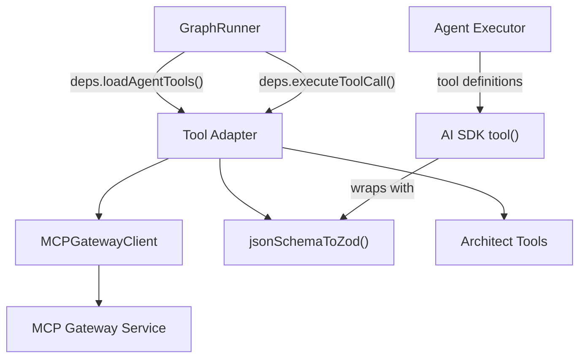
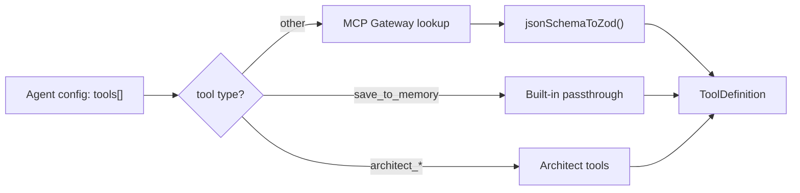
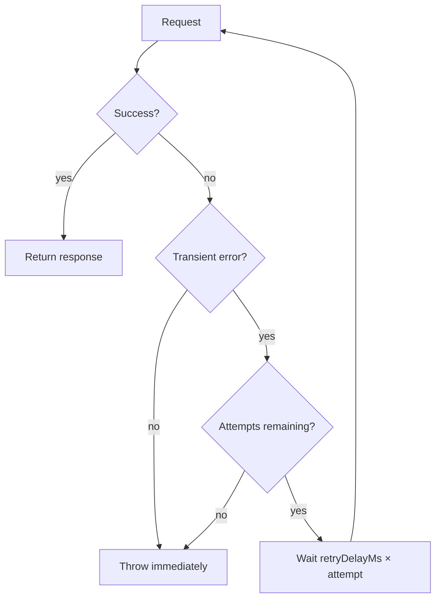

# MCP Tool Integration — Technical Reference

> **Scope**: This document covers the MCP (Model Context Protocol) tool integration layer in `@mcai/orchestrator`. It is intended for contributors modifying tool loading, execution, gateway communication, or schema conversion logic.

---

## Table of Contents

1. [System Overview](#1-system-overview)
2. [Gateway Client](#2-gateway-client)
3. [Tool Adapter](#3-tool-adapter)
4. [JSON Schema Converter](#4-json-schema-converter)
5. [Error Taxonomy](#5-error-taxonomy)
6. [Observability](#6-observability)

---

## 1. System Overview

The MCP module is the bridge between the orchestrator's agent runtime and external tool services. It handles tool discovery, schema conversion, execution, and taint tracking for external data provenance.

| Component | File | Purpose |
|-----------|------|---------|
| **Gateway Client** | `gateway-client.ts` | HTTP client for the MCP gateway service (list tools, execute, health check) |
| **Tool Adapter** | `tool-adapter.ts` | Unified tool loading/execution: built-in tools + MCP tools + architect tools |
| **Schema Converter** | `json-schema-converter.ts` | Converts JSON Schema from MCP tools to Zod schemas for AI SDK compatibility |
| **Errors** | `errors.ts` | `MCPGatewayError`, `MCPToolExecutionError` |

### Dependency Graph



### Tool Resolution Flow



---

## 2. Gateway Client

### Class: `MCPGatewayClient` ([gateway-client.ts](gateway-client.ts))

HTTP client for communicating with the MCP gateway service. Handles request timeouts, retry logic for transient failures, and structured error reporting.

```typescript
const client = new MCPGatewayClient({ baseUrl, timeoutMs, retries, retryDelayMs });
```

### Configuration

| Parameter | Env Var | Default | Purpose |
|-----------|---------|---------|---------|
| `baseUrl` | `MCP_GATEWAY_URL` | `http://localhost:3001` | MCP gateway service URL |
| `timeoutMs` | — | 30,000 (30s) | Per-request timeout |
| `retries` | — | 2 | Max retry attempts for transient failures |
| `retryDelayMs` | — | 1,000 (1s) | Base delay between retries (multiplied by attempt) |

### Public Methods

#### `listTools(): Promise<MCPTool[]>`

Fetches all available tools from the MCP gateway via `GET /tools`. Returns an array of tool definitions with name, description, and JSON Schema input specification.

#### `executeTool(toolName, parameters, agentId?): Promise<unknown>`

Executes a tool via `POST /tools/{toolName}/execute`. The request body includes the parameters and optional agent ID for audit logging. If the gateway returns an error field in the response, throws `MCPToolExecutionError`.

#### `healthCheck(): Promise<boolean>`

Lightweight health probe via `GET /health` with a 5-second timeout. Returns `true` if the gateway responds with HTTP 2xx, `false` on any error. Used for readiness checks — never throws.

#### `getBaseUrl(): string`

Returns the configured gateway URL. Useful for diagnostics and logging.

### Retry Semantics



**Transient error detection** (`isTransientError`):

| Pattern | Error Type |
|---------|-----------|
| `ECONNREFUSED` | Gateway not running |
| `ECONNRESET` | Connection dropped |
| `ETIMEDOUT` | Network timeout |
| `ENOTFOUND` | DNS resolution failure |
| `fetch failed` | General fetch failure |
| `network` | Network-level error |
| `socket hang up` | Unexpected connection close |
| `AbortError` | Request timeout (via `AbortController`) |

Non-transient errors (e.g., HTTP 4xx from the gateway) are thrown immediately without retry.

### Types

```typescript
interface MCPTool {
  name: string;          // Tool identifier (e.g., "web_search")
  description: string;   // Human-readable description
  inputSchema: JSONSchema; // JSON Schema for tool parameters
}

interface JSONSchema {
  type: string;
  properties?: Record<string, JSONSchema>;
  items?: JSONSchema;
  required?: string[];
  description?: string;
  enum?: any[];
}
```

### Singleton vs Factory

Both patterns are exported:

```typescript
// Factory: preferred for testability (pass mock config)
export function createMCPClient(config?: MCPClientConfig): MCPGatewayClient

// Singleton: convenience for production use
export const mcpClient = new MCPGatewayClient()
```

The tool adapter accepts `client` as an optional parameter, defaulting to `mcpClient`. Tests can inject a mock client without affecting the singleton.

---

## 3. Tool Adapter

### Module: [tool-adapter.ts](tool-adapter.ts)

The tool adapter is the unified interface between the runner and all tool systems. It handles three tool categories: built-in tools, architect tools, and MCP gateway tools.

### `loadAgentTools(toolNames?, client?): Promise<Record<string, ToolDefinition>>`

Loads tool definitions for agent execution. The runner calls this before every agent node execution via `ctx.deps.loadAgentTools`.

**Loading pipeline:**

```
1. Always include save_to_memory (built-in)
2. Check toolNames for architect_* prefix → load from architectToolDefinitions
3. Filter remaining names → query MCP gateway via client.listTools()
4. Convert MCP tool inputSchema → Zod via jsonSchemaToZod()
5. Return merged tool map
```

| Tool Category | Prefix | Source | Schema |
|--------------|--------|--------|--------|
| `save_to_memory` | — | Built-in | `z.object({ key: z.string(), value: z.unknown() })` |
| Architect tools | `architect_` | `architect/tools.ts` | Pre-defined Zod schemas |
| MCP tools | — | MCP gateway | JSON Schema → Zod conversion |

**Graceful fallback:** If the MCP gateway is unavailable, the function logs the error and returns only built-in tools. This prevents gateway outages from blocking agent execution.

### `executeToolCall(toolName, args, agentId?, client?): Promise<unknown>`

Executes a tool call with taint tracking for external data provenance.

| Tool Type | Behavior |
|-----------|----------|
| `save_to_memory` | Returns `{ key, value, saved: true }` — passthrough, actual persistence handled by reducer |
| `architect_*` | Delegates to `executeArchitectTool()` |
| MCP tools | Calls `client.executeTool()` → wraps result with `TaintedToolResult` |

### Taint Tagging

All MCP tool results are automatically wrapped with taint metadata:

```typescript
{
  result: <actual tool output>,
  taint: {
    source: 'mcp_tool',
    tool_name: string,
    agent_id: string | undefined,
    created_at: string,   // ISO timestamp
  }
} satisfies TaintedToolResult
```

This enables downstream consumers (node executors, supervisor prompts) to make trust decisions about data originating from external tools. The tool node executor checks for this shape and propagates taint metadata to the `_taint_registry` in workflow memory.

### Types

```typescript
interface ToolDefinition {
  description: string;
  parameters: z.ZodType;   // Zod schema for AI SDK tool() wrapping
}

interface TaintedToolResult {
  result: unknown;
  taint: TaintMetadata;    // Provenance metadata
}
```

---

## 4. JSON Schema Converter

### Function: `jsonSchemaToZod()` ([json-schema-converter.ts](json-schema-converter.ts))

Converts JSON Schema objects (from MCP tool definitions) to Zod schemas that the AI SDK's `tool()` function requires.

```typescript
function jsonSchemaToZod(schema: JSONSchema): z.ZodType
```

### Type Mapping

| JSON Schema Type | Zod Type | Notes |
|-----------------|----------|-------|
| `object` | `z.object({...})` | Recursively converts properties; respects `required` |
| `string` | `z.string()` | Handles `enum` → `z.enum()` |
| `number` | `z.number()` | — |
| `integer` | `z.number()` | Mapped to `z.number()` (no integer constraint) |
| `boolean` | `z.boolean()` | — |
| `array` | `z.array(itemSchema)` | Falls back to `z.array(z.any())` if no `items` |
| Unknown type | `z.any()` | Graceful fallback with warning log |

### Object Schema Conversion

For `type: "object"` schemas:
1. Iterates over `properties`
2. Recursively converts each property schema
3. Attaches `.describe()` if `description` is present
4. Marks non-required properties as `.optional()`
5. Returns `z.object(shape)`

### Error Handling

Schema conversion never throws — on any error, it falls back to `z.any()` with a warning log. This prevents a malformed MCP tool schema from blocking all tool loading.

---

## 5. Error Taxonomy

| Error Class | Thrown By | When | Retryable? |
|-------------|----------|------|-----------|
| `MCPGatewayError` | `MCPGatewayClient` | HTTP errors, timeouts, connection failures | Transient → auto-retried; persistent → thrown |
| `MCPToolExecutionError` | `MCPGatewayClient.executeTool` | Gateway returns error in response body | No — indicates tool-level failure |

Both error classes include descriptive messages with context. `MCPToolExecutionError` additionally stores the `toolName` as a public property for programmatic access.

---

## 6. Observability

### Structured Logging

| Namespace | Component |
|-----------|-----------|
| `mcp.gateway` | Gateway client (HTTP requests, retries, errors) |
| `mcp.tools` | Tool adapter (loading, execution, fallbacks) |
| `mcp.schema` | JSON schema converter (type warnings, conversion errors) |

### Key Log Events

| Event | Level | When |
|-------|-------|------|
| `tool_loaded` | info | MCP tool successfully loaded with schema conversion |
| `builtin_tool_loaded` | info | Architect tool loaded |
| `tool_not_found` | warn | Requested tool name not found in MCP gateway |
| `tool_schema_conversion_failed` | error | JSON Schema → Zod conversion failed |
| `gateway_unavailable` | error | MCP gateway connection failed (all retries exhausted) |
| `fallback_to_builtin` | info | Falling back to built-in tools only |
| `tool_executed` | info | MCP tool execution succeeded |
| `tool_execution_failed` | error | MCP tool execution failed |
| `listTools.retry` | warn | Gateway list request retrying |
| `executeTool.retry` | warn | Gateway execute request retrying |
| `unsupported_schema_type` | warn | JSON Schema type not in converter's type map |
