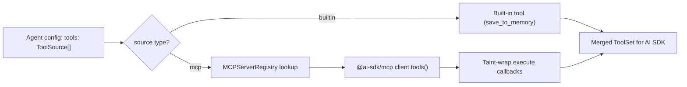

# MCP Tool Integration — Technical Reference

> **Scope**: This document covers the MCP (Model Context Protocol) tool integration layer in `@mcai/orchestrator`. It is intended for contributors modifying tool resolution, MCP connections, or schema conversion logic.

---

## Table of Contents

1. [System Overview](#1-system-overview)
2. [Connection Manager](#2-connection-manager)
3. [JSON Schema Converter](#3-json-schema-converter)
4. [Error Taxonomy](#4-error-taxonomy)

---

## 1. System Overview

The MCP module bridges agent tool declarations (`ToolSource[]`) with actual tool implementations. It uses the `@ai-sdk/mcp` SDK for native MCP client connections and wraps results with taint metadata for data provenance.

| Component | File | Purpose |
|-----------|------|---------|
| **Connection Manager** | `connection-manager.ts` | Manages `@ai-sdk/mcp` client lifecycle, tool resolution, taint wrapping, access control |
| **Schema Converter** | `json-schema-converter.ts` | Converts JSON Schema from MCP tools to Zod schemas for AI SDK compatibility |
| **Errors** | `errors.ts` | `MCPServerNotFoundError`, `MCPAccessDeniedError` |

### Tool Resolution Flow



### Two-Layer Trust Architecture

```
Agent Config (data layer)          MCP Server Registry (infra layer)
┌──────────────────────┐          ┌──────────────────────────┐
│ tools: [              │          │ server: "web-search"      │
│   { type: "mcp",     │ ──ref──▶ │   transport: stdio/http   │
│     server_id: "..." }│          │   allowed_agents: [...]   │
│ ]                     │          │   timeout_ms: 30000       │
└──────────────────────┘          └──────────────────────────┘
```

---

## 2. Connection Manager

### Class: `MCPConnectionManager` ([connection-manager.ts](connection-manager.ts))

Implements the `ToolResolver` interface. Manages `@ai-sdk/mcp` client lifecycle with lazy connection, deduplication, and automatic taint wrapping.

### `resolveTools(sources, agentId?): Promise<Record<string, unknown>>`

Main entry point. Resolves an array of `ToolSource` declarations into AI SDK tools with execute functions.

**Resolution pipeline:**

1. For each `builtin` source: return built-in tool implementation (e.g., `save_to_memory`)
2. For each `mcp` source:
   - Check `allowed_agents` access control
   - Look up server config from `MCPServerRegistry`
   - Create or reuse `@ai-sdk/mcp` client connection
   - Call `client.tools()` to get tool definitions with execute functions
   - Filter by `tool_names` if specified
   - Wrap execute callbacks with taint metadata
3. Detect name collisions across servers → namespace with `serverId__` prefix
4. Return merged tool record

### Access Control

Each `MCPServerEntry` can define `allowed_agents: string[]`. When set:
- Only listed agent IDs can use the server
- Missing or undefined `allowed_agents` means unrestricted access
- Violations throw `MCPAccessDeniedError`

### Connection Lifecycle

- **Lazy**: Clients are created on first `resolveTools()` call for a server
- **Deduplication**: Concurrent calls for the same server share a pending promise
- **Reuse**: Clients are cached for the lifetime of the manager
- **Cleanup**: `closeAll()` closes all clients and clears the cache

### Taint Wrapping

All MCP tool results are automatically wrapped:

```typescript
{
  result: <actual tool output>,
  taint: {
    source: 'mcp_tool',
    tool_name: string,
    server_id: string,
    created_at: string,   // ISO timestamp
  }
}
```

Built-in tools are NOT tainted.

### `closeAll(): Promise<void>`

Closes all open MCP client connections. Errors are caught and logged — never throws.

---

## 3. JSON Schema Converter

### Function: `jsonSchemaToZod()` ([json-schema-converter.ts](json-schema-converter.ts))

Converts JSON Schema objects to Zod schemas for AI SDK `tool()` compatibility.

| JSON Schema Type | Zod Type | Notes |
|-----------------|----------|-------|
| `object` | `z.object({...})` | Recursively converts properties; respects `required` |
| `string` | `z.string()` | Handles `enum` -> `z.enum()` |
| `number`/`integer` | `z.number()` | — |
| `boolean` | `z.boolean()` | — |
| `array` | `z.array(itemSchema)` | Falls back to `z.array(z.any())` if no `items` |
| Unknown | `z.any()` | Graceful fallback with warning log |

Schema conversion never throws — malformed schemas fall back to `z.any()`.

---

## 4. Error Taxonomy

| Error Class | Thrown By | When |
|-------------|----------|------|
| `MCPServerNotFoundError` | `MCPConnectionManager` | Tool source references unregistered server ID |
| `MCPAccessDeniedError` | `MCPConnectionManager` | Agent not in server's `allowed_agents` list |
