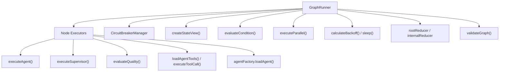
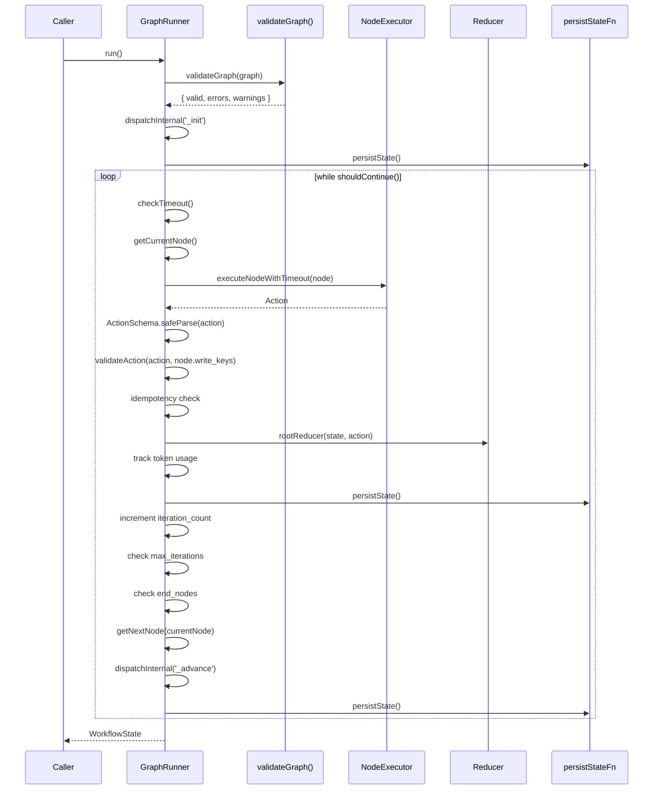
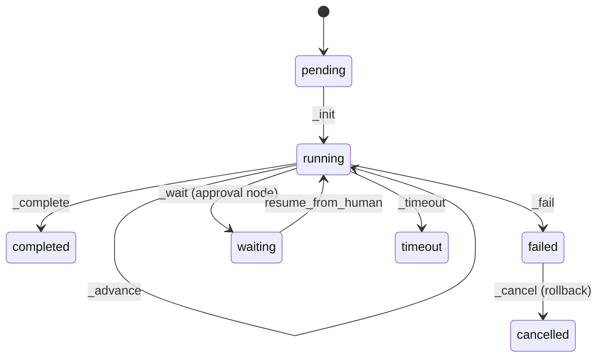
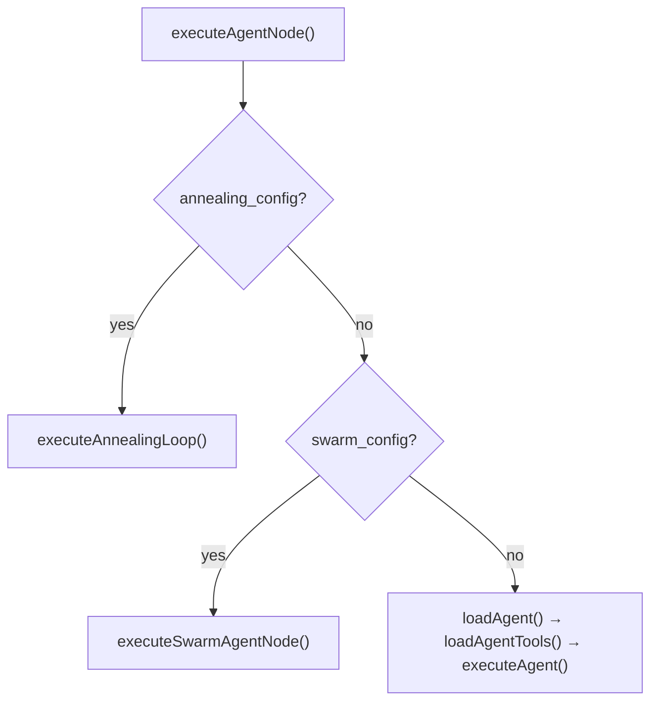
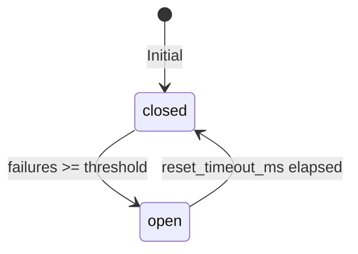
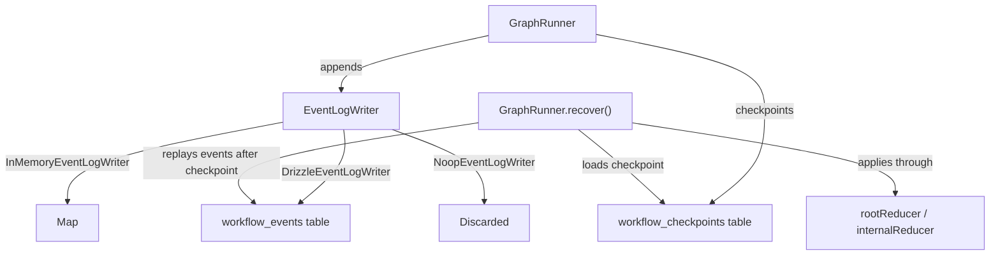
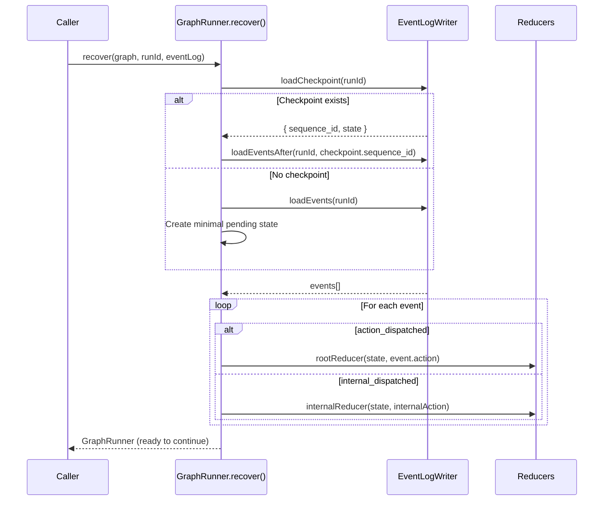

# Runner System — Technical Reference

> **Scope**: This document covers the internal architecture of the graph execution engine in `@mcai/orchestrator`. It is intended for contributors modifying workflow execution, node dispatch, resilience patterns, or state management logic.

---

## Table of Contents

1. [System Overview](#1-system-overview)
2. [Directory Structure](#2-directory-structure)
3. [GraphRunner](#3-graphrunner)
4. [Execution Lifecycle](#4-execution-lifecycle)
5. [Node Executors](#5-node-executors)
6. [Dependency Injection](#6-dependency-injection)
7. [Resilience Patterns](#7-resilience-patterns)
8. [State Management](#8-state-management)
9. [Edge Conditions](#9-edge-conditions)
10. [Parallel Execution](#10-parallel-execution)
11. [Durable Execution](#11-durable-execution)
12. [Error Taxonomy](#12-error-taxonomy)
13. [Observability](#13-observability)
14. [Streaming API](#14-streaming-api)

---

## 1. System Overview

The runner system is the control-flow engine of the orchestrator. It owns the execution loop, node dispatch, resilience (retries, circuit breakers, timeouts), state transitions, and event emission. It does **not** own LLM calls or tool execution — those are delegated to the [agent system](../agent/README.md) and [MCP tool adapter](../mcp/) via dependency injection.

| Component | File | Purpose |
|-----------|------|---------|
| **GraphRunner** | `graph-runner.ts` | Core execution engine: loop, dispatch, retry, state transitions, events, streaming |
| **StreamEvent** | `stream-events.ts` | `StreamEvent` discriminated union and `isTerminalEvent` type guard |
| **Node Executors** | `node-executors/*.ts` | Type-specific node logic (agent, tool, router, supervisor, etc.) |
| **Circuit Breaker** | `circuit-breaker.ts` | Tracks per-node failures and trips breakers at configured thresholds |
| **State View** | `state-view.ts` | Creates read-filtered memory views for Zero Trust enforcement |
| **Conditions** | `conditions.ts` | Evaluates edge conditions (filtrex expressions) for graph routing |
| **Parallel Executor** | `parallel-executor.ts` | Concurrency-controlled parallel task execution with error strategies |
| **Helpers** | `helpers.ts` | Backoff calculation and sleep utility |
| **Errors** | `errors.ts` | `BudgetExceededError`, `WorkflowTimeoutError` |

### Dependency Graph



All external runtime dependencies (LLM executors, tool adapters, agent factory) are imported in `graph-runner.ts` and injected into node executors via `ExecutorDependencies`. This design ensures test mocks applied at the `GraphRunner` level propagate to all node executors without each executor needing its own imports.

---

## 2. Directory Structure

```
runner/
├── graph-runner.ts          # Core engine: loop, dispatch, retry, events, stream()
├── stream-events.ts         # StreamEvent discriminated union + isTerminalEvent guard
├── circuit-breaker.ts       # Per-node failure tracking + breaker trips
├── state-view.ts            # Read-filtered StateView construction
├── conditions.ts            # Edge condition evaluation (filtrex)
├── parallel-executor.ts     # Concurrency-controlled parallel execution
├── helpers.ts               # Backoff calculation + sleep
├── errors.ts                # BudgetExceededError, WorkflowTimeoutError
└── node-executors/
    ├── context.ts           # NodeExecutorContext + ExecutorDependencies
    ├── agent.ts             # Agent node dispatch (→ annealing, swarm)
    ├── tool.ts              # Tool node execution + taint tracking
    ├── router.ts            # Conditional branching (no-op pass-through)
    ├── supervisor.ts        # LLM-powered dynamic routing
    ├── approval.ts          # Human-in-the-Loop gate
    ├── annealing.ts         # Self-annealing iterative improvement
    ├── map.ts               # Fan-out parallel workers (map-reduce)
    ├── synthesizer.ts       # Merge parallel results
    ├── subgraph.ts          # Nested workflow composition
    ├── voting.ts            # Parallel voters + consensus strategies
    ├── swarm.ts             # Agent peer delegation
    ├── evolution.ts         # Population-based DGM selection
    └── index.ts             # Barrel re-exports
```

---

## 3. GraphRunner

### Class: `GraphRunner` ([graph-runner.ts](graph-runner.ts))

Extends `EventEmitter`. The single public entry point for executing a workflow graph.

```typescript
// Options object (preferred)
const runner = new GraphRunner(graph, initialState, {
  persistStateFn?,
  loadGraphFn?,
  eventLog?,       // EventLogWriter for durable execution
});

// Positional args (backward compatible)
const runner = new GraphRunner(graph, initialState, persistStateFn?, loadGraphFn?);
```

| Parameter | Type | Purpose |
|-----------|------|---------|
| `graph` | `Graph` | The graph definition (nodes, edges, start/end nodes) |
| `initialState` | `WorkflowState` | Starting state (goal, constraints, memory, limits) |
| `options.persistStateFn` | `(state) => Promise<void>` | Optional — called after every step for resumability |
| `options.loadGraphFn` | `(graphId) => Promise<Graph \| null>` | Optional — required for subgraph nodes |
| `options.eventLog` | `EventLogWriter` | Optional — enables event sourcing for durable execution |

### Public Methods

| Method | Signature | Purpose |
|--------|-----------|---------|
| `stream()` | `(options?: { signal?: AbortSignal }) => AsyncGenerator<StreamEvent>` | Stream execution events in real-time (canonical execution path) |
| `run()` | `() => Promise<WorkflowState>` | Execute graph until completion, failure, or HITL pause (consumes `stream()` internally) |
| `applyHumanResponse()` | `(response: HumanResponse) => void` | Apply HITL decision before resuming with `run()` |
| `rollback()` | `() => Promise<void>` | Execute compensation stack in LIFO order (saga pattern) |
| `compactEvents()` | `() => Promise<number>` | Checkpoint current state and delete preceding events |
| `getEventLog()` | `() => EventLogWriter` | Access the event log writer (testing/diagnostics) |

### Static Factory Methods

| Method | Signature | Purpose |
|--------|-----------|---------|
| `recover()` | `(graph, runId, eventLog, options?) => Promise<GraphRunner>` | Reconstruct state from event log and return a ready-to-continue runner |

### Internal State

| Field | Type | Purpose |
|-------|------|---------|
| `graph` | `Graph` | Immutable graph definition |
| `state` | `WorkflowState` | Mutable workflow state — all mutations go through reducers |
| `circuitBreakers` | `CircuitBreakerManager` | Per-node failure tracking |
| `executedActions` | `Set<string>` | Idempotency keys for deduplication |
| `startTime` | `number?` | Wallclock start for global timeout enforcement |

---

## 4. Execution Lifecycle



### Execution Phase Details

| Phase | What Happens | Failure Mode |
|-------|-------------|--------------|
| **Validation** | `validateGraph()` checks node refs, edge targets, duplicates | Throws immediately; state set to `failed` |
| **Init** | `_init` dispatched; resume detection via `visited_nodes.length > 0` | N/A |
| **Node Execute** | Per-node timeout wraps retry loop which wraps executor dispatch | `executeNodeWithRetry` handles retries; timeout wraps everything |
| **Action Validate** | Zod schema + `write_keys` permission check | Invalid/unauthorized → throws, state set to `failed` |
| **Idempotency** | `${node.id}:${iteration_count}` key checked against `executedActions` | Duplicate → skipped with warning log |
| **Reduce** | `rootReducer(state, action)` applies state mutation | Reducer errors propagate up |
| **Budget Check** | Compare `total_tokens_used` against `max_token_budget` | Throws `BudgetExceededError` |
| **Advance** | `getNextNode()` evaluates edge conditions | No matching edge → workflow completes |
| **Persist** | `persistStateFn(state)` called after every step | Persistence errors logged but don't stop execution |

### State Transitions (via `dispatchInternal`)



---

## 5. Node Executors

Each node type has a dedicated executor function in `node-executors/`. All executors share the same signature:

```typescript
async function execute*Node(
  node: GraphNode,
  stateView: StateView,
  attempt: number,
  ctx: NodeExecutorContext,
): Promise<Action>
```

### Executor Summary

| Executor | File | Action Type | Key Behavior |
|----------|------|-------------|--------------|
| **Agent** | `agent.ts` | `update_memory` | Loads agent config → loads tools → calls `executeAgent()`. Dispatches to annealing or swarm if configured |
| **Tool** | `tool.ts` | `update_memory` | Calls `executeToolCall()` → stores result in `{node_id}_result`. Propagates taint from MCP tools |
| **Router** | `router.ts` | `noop` | Pass-through; actual routing handled by `getNextNode()` via edge conditions |
| **Supervisor** | `supervisor.ts` | `handoff` / `set_status` | Delegates to `executeSupervisor()` for LLM-powered routing |
| **Approval** | `approval.ts` | `noop` | Pauses workflow with `waiting` status; stores `_pending_approval` in memory |
| **Annealing** | `annealing.ts` | `update_memory` | Iterative improvement loop with temperature interpolation and quality evaluation |
| **Map** | `map.ts` | `merge_parallel_results` | Fans out items to parallel workers via `executeParallel()` |
| **Synthesizer** | `synthesizer.ts` | `update_memory` | Merges `_results` keys or delegates to an agent for LLM-based synthesis |
| **Subgraph** | `subgraph.ts` | `update_memory` | Spawns a child `GraphRunner` with mapped I/O; cycle detection via `_subgraph_stack` |
| **Voting** | `voting.ts` | `merge_parallel_results` | Parallel voter agents + consensus (majority, weighted, or LLM judge) |
| **Swarm** | `swarm.ts` | `handoff` / `update_memory` | Agent with peer delegation; validates handoff targets and enforces `max_handoffs` |
| **Evolution** | `evolution.ts` | `merge_parallel_results` | Population-based DGM: N candidates per generation, fitness evaluation, stagnation detection, temperature scheduling |

### Agent Executor Flow



### Annealing Loop

The self-annealing executor iterates to improve output quality:

```
for iter in 0..max_iterations:
  1. Interpolate temperature: T = initial + (final - initial) * progress
  2. Inject annealing context (_annealing_iteration, _annealing_temperature, _annealing_feedback)
  3. Execute agent with temperature override
  4. Evaluate quality (via evaluator agent or JSONPath score extraction)
  5. Track best result by score
  6. Break if: threshold met OR diminishing returns (delta < threshold)
```

### Evolution Loop (DGM)

The evolution executor implements population-based Darwinian selection:

```
for gen in 0..max_generations:
  1. Interpolate temperature: T = initial + (final - initial) * (gen / (max_generations - 1))
  2. Create N parallel tasks (one per population_size)
     - Gen 0: no parent context
     - Gen 1+: inject _evolution_parent (winner output), _evolution_parent_fitness
     - Always inject: _evolution_generation, _evolution_candidate_index, _evolution_population_size
  3. executeParallel(tasks) — fan out candidate agents with temperature_override
  4. For each successful candidate, call evaluateQualityExecutor → fitness score
  5. Sort by fitness descending
  6. Update bestCandidate if improvement
  7. Break if: fitness_threshold met OR stagnation detected OR abort signal
```

Output action (`merge_parallel_results`):
- `{nodeId}_winner` — best candidate output
- `{nodeId}_winner_fitness` — best fitness score (0-1)
- `{nodeId}_winner_reasoning` — evaluator reasoning
- `{nodeId}_generation` — total generations executed
- `{nodeId}_fitness_history` — array of per-generation best scores
- `{nodeId}_population` — final generation's scored candidates

### Approval Node (HITL)

The approval executor implements a human-in-the-loop gate:

1. Extracts `review_data_path` from memory (if configured)
2. Stores `_pending_approval` in memory with `node_id`, `rejection_node_id`, review data
3. Sets workflow status to `waiting` via `_wait` internal dispatch
4. Returns a `noop` action — the workflow pauses until `applyHumanResponse()` is called

### Subgraph Executor

The subgraph executor enables nested workflow composition:

1. **Cycle detection** — checks `_subgraph_stack` to prevent `A → B → A` cycles
2. **Graph loading** — calls `loadGraphFn(subgraph_id)` to resolve the child graph
3. **State isolation** — builds a fresh `WorkflowState` with mapped inputs from `input_mapping`
4. **Budget inheritance** — passes remaining token budget to child runner
5. **Lazy import** — uses `await import('../graph-runner.js')` to avoid circular dependency
6. **Output mapping** — maps child memory keys back to parent via `output_mapping`

---

## 6. Dependency Injection

External runtime dependencies are injected through `ExecutorDependencies` rather than imported directly by each node executor. This pattern exists for **test compatibility** — vitest mock hoisting is file-scoped, and splitting imports across multiple executor files would break test mocks that intercept at the `GraphRunner` level.

### `NodeExecutorContext` ([context.ts](node-executors/context.ts))

```typescript
interface NodeExecutorContext {
  state: WorkflowState;         // Current workflow state (read-only snapshot)
  graph: Graph;                 // The graph definition
  loadGraphFn?: (...) => ...;   // Optional graph loader (for subgraphs)
  createStateView: (...) => StateView;  // State view factory
  deps: ExecutorDependencies;   // Injected runtime dependencies
}
```

### `ExecutorDependencies`

| Dependency | Source | Used By |
|-----------|--------|---------|
| `executeAgent` | `agent-executor/executor.ts` | agent, annealing, map, synthesizer, voting, swarm, evolution |
| `executeSupervisor` | `supervisor-executor/executor.ts` | supervisor |
| `evaluateQualityExecutor` | `evaluator-executor/executor.ts` | annealing, voting (LLM judge), evolution |
| `loadAgentTools` | `mcp/tool-adapter.ts` | agent, annealing, map, synthesizer, voting, swarm, evolution |
| `executeToolCall` | `mcp/tool-adapter.ts` | tool, map, + all agent-calling executors (via `executeAgent` options) |
| `loadAgent` | `agent-factory` | agent, annealing, map, synthesizer, voting, swarm, evolution |
| `getTaintRegistry` | `utils/taint.ts` | tool |

All dependencies are wired in `GraphRunner.buildExecutorContext()` and passed to every node executor call.

---

## 7. Resilience Patterns

### Retry with Backoff

Every node has a `failure_policy` that controls retry behavior:

```typescript
{
  max_retries: number;           // Max attempts (1 = no retry)
  backoff_strategy: 'linear' | 'exponential' | 'fixed';
  initial_backoff_ms: number;
  max_backoff_ms: number;
  timeout_ms?: number;           // Per-node timeout
  circuit_breaker?: { enabled, failure_threshold, reset_timeout_ms };
}
```

**Retry flow** (`executeNodeWithRetry`):

```
for attempt in 1..max_retries:
  1. Check circuit breaker (if enabled)
  2. Execute node logic
  3. On success: update breaker, return action
  4. On failure: update breaker, calculate backoff, sleep, retry
```

### Backoff Strategies ([helpers.ts](helpers.ts))

| Strategy | Formula | Example (initial=100ms) |
|----------|---------|------------------------|
| `fixed` | `initial_ms` | 100, 100, 100, ... |
| `linear` | `initial_ms × attempt` | 100, 200, 300, ... |
| `exponential` | `initial_ms × 2^(attempt-1)` | 100, 200, 400, ... |

All capped at `max_backoff_ms`.

### Circuit Breaker ([circuit-breaker.ts](circuit-breaker.ts))

The `CircuitBreakerManager` maintains per-node failure state:



| State | Behavior |
|-------|----------|
| **Closed** | Normal execution; failures increment counter |
| **Open** | Throws immediately without executing; checks if reset timeout elapsed |

**Fallback behavior**: When a breaker trips, the manager checks for a `fallback_node` in the graph. If one exists, it maps the fallback node to the broken node so future calls can be redirected. If no fallback exists, execution throws with a circuit breaker error.

### Per-Node Timeout

Nodes with `failure_policy.timeout_ms` are wrapped in a `Promise.race`:

```typescript
Promise.race([
  this.executeNode(node),
  new Promise((_, reject) =>
    setTimeout(() => reject(new Error(`timeout after ${timeout}ms`)), timeout)
  ),
]);
```

This wraps the entire retry loop — the timeout applies to the total execution time, not individual attempts.

### Global Workflow Timeout

The runner checks `max_execution_time_ms` against wallclock time on every iteration. Timeout sets status to `timeout` and throws `WorkflowTimeoutError`.

### Token Budget Enforcement

After each action is applied, the runner checks cumulative `total_tokens_used` against `max_token_budget`. Exceeding the budget throws `BudgetExceededError`.

### Saga Rollback

Nodes with `requires_compensation: true` can include a `compensation` field in their actions. These are pushed onto the `compensation_stack`. On `rollback()`, compensations are applied in **LIFO order** (most recent first), then status is set to `cancelled`.

---

## 8. State Management

### StateView ([state-view.ts](state-view.ts))

Creates a read-filtered view of workflow state for Zero Trust enforcement:

```typescript
function createStateView(state: WorkflowState, node: GraphNode): StateView
```

**Rules:**
- `read_keys: ['*']` → full memory access
- `read_keys: ['key1', 'key2']` → only those keys visible
- Workflow-level fields (`workflow_id`, `run_id`, `goal`, `constraints`) are always included

### State Mutations

All state mutations go through one of two reducers:

| Reducer | Purpose | Caller |
|---------|---------|--------|
| `rootReducer` | Applies node actions (`update_memory`, `handoff`, `set_status`, etc.) | After node execution |
| `internalReducer` | Lifecycle transitions (`_init`, `_advance`, `_complete`, `_fail`, etc.) | `dispatchInternal()` |

The runner **never** mutates `this.state` directly (except `iteration_count++`). All transitions go through `dispatchInternal()`.

### Idempotency

Each action gets a deterministic key: `${node.id}:${iteration_count}`. If a key appears in `executedActions`, the action is skipped. On resume, previously completed iteration keys are reconstructed from `visited_nodes`.

### Persistence

`persistStateFn` is called after every step (init, action apply, advance, complete, fail). Persistence errors are **logged but never thrown** — a transient DB failure should not kill a running workflow.

---

## 9. Edge Conditions

### `evaluateCondition()` ([conditions.ts](conditions.ts))

Evaluates edge conditions to determine which edge the runner follows after a node completes.

| Condition Type | Behavior |
|---------------|----------|
| `always` | Unconditionally true |
| `conditional` | Evaluated via [filtrex](https://github.com/joewalnes/filtrex) expression against workflow state |
| `map` | Delegates to `conditional` evaluation (syntactic sugar for post-map routing) |

### Filtrex Expression Examples

```
memory.decision == 'A'
memory.confidence > 0.8 and memory.source == 'trusted'
length(memory.items) > 5
memory.retries < 3 or memory.force_continue == 1
```

### Built-in Functions

| Function | Signature | Purpose |
|----------|-----------|---------|
| `length(val)` | `(string \| array) → number` | Returns length of string or array |
| `lower(val)` | `(string) → string` | Lowercase conversion |
| `upper(val)` | `(string) → string` | Uppercase conversion |
| `typeof(val)` | `(unknown) → string` | Type checking (null-safe) |
| `includes(arr, val)` | `(array, unknown) → boolean` | Array membership check |

### Expression Caching

Compiled expressions are cached in an LRU-style `Map` (max 256 entries) to avoid recompiling the same filtrex expression on every edge evaluation.

### Legacy JSONPath Compat

Expressions starting with `$.` (JSONPath prefix) are automatically converted by stripping the leading `$.` to work with filtrex's dot-access syntax.

---

## 10. Parallel Execution

### `executeParallel()` ([parallel-executor.ts](parallel-executor.ts))

```typescript
async function executeParallel(
  tasks: ParallelTask[],
  executeFn: (task: ParallelTask) => Promise<Action>,
  config: ParallelExecutionConfig,
): Promise<ParallelResult[]>
```

| Parameter | Type | Purpose |
|-----------|------|---------|
| `tasks` | `ParallelTask[]` | Tasks to execute (node + stateView pairs) |
| `executeFn` | `(task) => Promise<Action>` | Execution function for each task |
| `config.max_concurrency` | `number` | Max simultaneous tasks per batch |
| `config.error_strategy` | `'fail_fast' \| 'best_effort'` | How to handle task failures |

### Error Strategies

| Strategy | Behavior |
|----------|----------|
| `fail_fast` | `Promise.all` — first failure aborts remaining tasks and throws |
| `best_effort` | `Promise.allSettled` — collects all results including failures |

### Batching

Tasks are chunked into batches of `max_concurrency`. Batches are executed sequentially; tasks within a batch execute concurrently. This provides bounded parallelism without overwhelming external services.

### Used By

- **Map node** — fans out items to parallel worker nodes
- **Voting node** — runs voter agents concurrently
- **Evolution node** — fans out candidate agents per generation

---

## 11. Durable Execution

The runner supports **event sourcing** for crash-recoverable workflow execution. When an `EventLogWriter` is provided, every significant state transition is recorded as an immutable event. On crash, `GraphRunner.recover()` replays these events through the same pure reducers to reconstruct the exact pre-crash state — **zero LLM calls during replay**.

### Architecture



### Events Logged

| Event Type | When Appended | Data Stored |
|------------|---------------|-------------|
| `workflow_started` | After `_init` dispatch | Marker (no payload) |
| `node_started` | Before `executeNodeWithTimeout()` | `node_id` |
| `action_dispatched` | After `rootReducer(state, action)` | Full `Action` JSON |
| `internal_dispatched` | Every `dispatchInternal()` call | `internal_type`, `internal_payload` |

### Recovery Flow



### Compaction

Long-running workflows accumulate many events. `compactEvents()` creates a **checkpoint** (full state snapshot at a `sequence_id`) and then **deletes all events** at or before that point:

```typescript
const result = await runner.run();
const deleted = await runner.compactEvents();
// Future recover() loads checkpoint first, replays only events after it
```

### EventLogWriter Implementations

| Implementation | Use Case | Storage |
|---------------|----------|---------|
| `DrizzleEventLogWriter` | Production | PostgreSQL (`workflow_events` + `workflow_checkpoints` tables) |
| `InMemoryEventLogWriter` | Unit tests | `Map<string, Event[]>` + `Map<string, Checkpoint>` |
| `NoopEventLogWriter` | Default (backward compat) | Discards all writes; reads return empty |

---

## 12. Error Taxonomy

| Error Class | Source | Retryable? | Handling |
|-------------|--------|-----------|----------|
| `BudgetExceededError` | `graph-runner.ts` | No | Workflow fails; state persisted with `budget_exceeded` |
| `WorkflowTimeoutError` | `graph-runner.ts` | No | Workflow status set to `timeout`; thrown to caller |
| Graph validation error | `graph-runner.ts` | No | Workflow fails before any node executes |
| Node timeout | `graph-runner.ts` | Yes | Retry via `failure_policy`; wrapped in `Promise.race` |
| Circuit breaker open | `circuit-breaker.ts` | Deferred | Throws immediately; re-checked after `reset_timeout_ms` |
| Action schema invalid | `graph-runner.ts` | No | Throws; indicates node executor bug |
| Permission denied | `graph-runner.ts` | No | Throws; indicates misconfigured `write_keys` |

---

## 13. Observability

### Events

`GraphRunner` extends `EventEmitter` and emits typed events throughout the lifecycle:

| Event | When | Payload |
|-------|------|---------|
| `workflow:start` | Execution begins | `{ workflow_id, run_id }` |
| `workflow:complete` | All nodes finish successfully | `{ workflow_id, run_id, duration_ms }` |
| `workflow:failed` | Unrecoverable error | `{ workflow_id, run_id, error }` |
| `workflow:timeout` | Global timeout exceeded | `{ workflow_id, run_id, elapsed_ms }` |
| `workflow:waiting` | HITL approval node pauses execution | `{ workflow_id, run_id, waiting_for }` |
| `workflow:rollback` | Saga rollback completed | `{ workflow_id, run_id }` |
| `node:start` | Node execution begins | `{ node_id, type, timestamp }` |
| `node:complete` | Node execution succeeds | `{ node_id, type, duration_ms }` |
| `node:failed` | Node exhausts all retries | `{ node_id, type, error, attempt }` |
| `node:retry` | Node failed, retrying | `{ node_id, attempt, backoff_ms }` |
| `action:applied` | Action processed by reducer | `{ action_id, type, node_id }` |
| `state:persisted` | State saved to database | `{ run_id, iteration }` |

### Structured Logging

| Namespace | Component |
|-----------|-----------|
| `runner.graph` | GraphRunner core |
| `runner.conditions` | Edge condition evaluation |
| `runner.parallel` | Parallel executor |
| `runner.node.agent` | Agent node executor |
| `runner.node.tool` | Tool node executor |
| `runner.node.supervisor` | Supervisor node executor |
| `runner.node.annealing` | Annealing loop executor |
| `runner.node.map` | Map node executor |
| `runner.node.synthesizer` | Synthesizer node executor |
| `runner.node.subgraph` | Subgraph node executor |
| `runner.node.voting` | Voting node executor |
| `runner.node.swarm` | Swarm node executor |
| `runner.node.evolution` | Evolution node executor |

### OpenTelemetry Tracing

The runner creates spans via `withSpan()` for:
- `workflow.run` — top-level span covering the entire execution
- `node.execute.{type}` — per-node span with `node.id` and `node.type` attributes

Span attributes include: `workflow.id`, `graph.id`, `run.id`, `workflow.duration_ms`, `workflow.status`, `workflow.iterations`.

---

## 14. Streaming API

### Overview

`GraphRunner.stream()` is the canonical execution path — it returns an `AsyncGenerator<StreamEvent>` that yields typed events as they occur, including real-time token deltas from LLM agents. `run()` is implemented as a thin wrapper that consumes `stream()` internally.

### `stream()` vs `run()`

| | `stream()` | `run()` |
|-|------------|---------|
| **Return type** | `AsyncGenerator<StreamEvent>` | `Promise<WorkflowState>` |
| **Token streaming** | Real-time `agent:token_delta` events | Not exposed (use `onToken` callback instead) |
| **Error handling** | Errors surface as `workflow:failed` events (never throws) | Re-throws original typed errors (`BudgetExceededError`, `WorkflowTimeoutError`, etc.) |
| **Cancellation** | `AbortSignal` via options | `runner.cancel()` |
| **Use case** | Real-time UIs, SSE bridges, observability pipelines | Background workers, simple scripts |

### StreamEvent Types ([stream-events.ts](stream-events.ts))

Discriminated union on the `type` field. Uses `node_type` and `action_type` to avoid collision with the `type` discriminant.

**Non-terminal events** (lightweight, no state cloning):

| Type | Key Fields | Emitted When |
|------|-----------|--------------|
| `workflow:start` | `workflow_id`, `run_id` | Execution begins |
| `workflow:rollback` | `workflow_id`, `run_id` | Saga rollback completes |
| `node:start` | `node_id`, `node_type` | Node execution begins |
| `node:complete` | `node_id`, `node_type`, `duration_ms` | Node execution succeeds |
| `node:failed` | `node_id`, `node_type`, `error`, `attempt` | Node exhausts retries |
| `node:retry` | `node_id`, `attempt`, `backoff_ms` | Node retry with backoff |
| `action:applied` | `action_id`, `action_type`, `node_id` | Reducer applied action |
| `state:persisted` | `run_id`, `iteration` | State saved to storage |
| `agent:token_delta` | `run_id`, `node_id`, `token` | Real-time LLM token |
| `budget:threshold_reached` | `threshold_pct`, `cost_usd`, `budget_usd` | Cost threshold crossed |

**Terminal events** (carry full `state: WorkflowState`):

| Type | Key Fields | Emitted When |
|------|-----------|--------------|
| `workflow:complete` | `duration_ms`, `state` | All nodes finish successfully |
| `workflow:failed` | `error`, `state` | Unrecoverable error |
| `workflow:timeout` | `elapsed_ms`, `state` | Global timeout exceeded |
| `workflow:waiting` | `waiting_for`, `state` | HITL approval pause |

All events include a `timestamp: number` (milliseconds since epoch).

### Type Guard

```typescript
import { isTerminalEvent } from '@mcai/orchestrator';

for await (const event of runner.stream()) {
  if (isTerminalEvent(event)) {
    // TypeScript narrows: event.state is WorkflowState
    console.log('Final status:', event.state.status);
  }
}
```

### Real-Time Token Streaming

When `stream()` is active, token deltas from LLM agents are yielded as `agent:token_delta` events interleaved with the node execution. This uses a Promise.race channel pattern — the generator races between node completion and incoming tokens, yielding each token as it arrives without waiting for the full response.

```typescript
for await (const event of runner.stream()) {
  if (event.type === 'agent:token_delta') {
    process.stdout.write(event.token); // Character-by-character output
  }
}
```

### Cancellation

Pass an `AbortSignal` to cancel the stream:

```typescript
const controller = new AbortController();

// Cancel after 30 seconds
setTimeout(() => controller.abort(), 30_000);

for await (const event of runner.stream({ signal: controller.signal })) {
  // Events stop after abort
}
```

An already-aborted signal stops execution immediately.

### Internal Architecture

The streaming implementation is structured as follows:

1. **`executeLoop()`** — Private async generator containing the full execution logic. Both `stream()` and `run()` consume this.
2. **`executeNodeAndDrainTokens()`** — Private async generator that races between node completion and incoming token deltas via the `tokenChannel`/`tokenNotify` pattern.
3. **`drainPendingEvents()`** — Synchronous generator that yields buffered events from helper methods (`persistState`, `checkBudgetThresholds`, etc.).
4. **`stream()`** — Sets `isStreaming = true`, wires up `AbortSignal`, and delegates to `executeLoop()`.
5. **`run()`** — Consumes `executeLoop()`, discards events, re-throws `lastRunError` if set.

**Zero overhead when not streaming**: The `tokenChannel`, `tokenNotify`, and `pendingEvents` arrays are only populated when `isStreaming` is true. `run()` does not set `isStreaming`, so these code paths are skipped entirely.

### Backward Compatibility

- `run()` still returns `Promise<WorkflowState>` and throws original typed errors
- `run()` still emits all `EventEmitter` events (`workflow:start`, `node:complete`, etc.)
- `run()` still cleans up listeners via `removeAllListeners()` on completion
- Existing `onToken` callback and `EventEmitter` listeners continue to work
- The `EventEmitter` interface is preserved — `stream()` also emits the same events
